# CSM 用户手册

## 关于本手册

本手册包含 CSM 脚本执行引擎的完整功能文档，涵盖所有已完成的功能模块。当前版本：**0.3.2**


## 目录

- [第一章 概述](#第一章-概述)
  - [1.1 CSM 简介](#11-csm-简介)
  - [1.2 版本对比](#12-版本对比)
  - [1.3 操作系统支持](#13-操作系统支持)
- [第二章 CSM 接口](#第二章-csm-接口)
  - [2.1 CSM Engine](#21-csm-engine-enginecsmvi)
  - [2.2 CSM 界面组件](#22-csm-界面组件)
  - [2.3 CSMApp](#23-csmapp-csmappvi)
- [第三章 执行引擎](#第三章-执行引擎)
  - [3.1 脚本结构](#31-脚本结构)
  - [3.2 基础功能](#32-基础功能)
  - [3.3 返回值保存传递](#33-返回值保存传递)
  - [3.4 变量空间支持](#34-变量空间支持)
  - [3.5 扩充的指令集](#35-扩充的指令集)
  - [3.6 表达式支持](#36-表达式支持)
  - [3.7 锚点跳转](#37-锚点跳转)
  - [3.8 返回值范围判断](#38-返回值范围判断)
  - [3.9 分支逻辑支持](#39-分支逻辑支持)
  - [3.10 循环支持](#310-循环支持)
  - [3.11 脚本引用功能](#311-脚本引用功能)
  - [3.12 授权说明](#312-授权说明)
- [第四章 界面显示](#第四章-界面显示)
  - [4.1 执行界面](#41-执行界面-executionviewcsmvi)
  - [4.2 ECHO信息窗口](#42-echo信息窗口-echoviewcsmvi)
  - [4.3 版本信息界面](#43-版本信息界面-versiondialogcsmvi)
- [第五章 案例](#第五章-案例)
  - [5.1 PCB 电路板自动化测试](#51-pcb-电路板自动化测试)
  - [5.2 总线类自动化测试（CAN/AI 同步采集）](#52-总线类自动化测试canai-同步采集)
  - [5.3 泵出厂测试（实时状态驱动 + 多场景脚本）](#53-泵出厂测试实时状态驱动--多场景脚本)
- [附录](#附录)


---

# 第一章 概述

## 1.1 CSM 简介

CSM 是一款基于 Communicable State Machine (CSM) 框架的脚本执行引擎，旨在提供强大的脚本执行能力，支持复杂的测试逻辑和流程控制。通过 CSM，用户可以编写灵活的测试脚本，实现自动化测试。

CSM 分为两个版本：

- **CSM-Lite**: 提供基础的脚本执行功能，适用于简单的测试需求，开源且免费使用。
- **CSM**: 提供完整的脚本执行功能，支持复杂的逻辑控制和扩展功能，适用于高级测试需求，需获取授权使用。

## 1.2 版本对比

| 功能说明             | 具体说明                                     | CSM-Lite | CSM |
| -------------------- | -------------------------------------------- | ------------- | -------- |
| 脚本执行功能         |                                              | ✅            | ✅       |
| [脚本返回变量传递功能](#33-返回值保存传递) | 支持返回值保存到临时变量当中                 | ✅            | ✅       |
| [脚本返回变量传递功能](#33-返回值保存传递) | 分号 `;` 分隔语法糖                          | ❌            | ✅       |
| [脚本引用功能](#311-脚本引用功能)         | 支持在脚本中引用其他脚本文件的内容           | ❌            | ✅       |
| [变量空间支持](#34-变量空间支持)         | ${variable} 支持解析返回值保存的变量         | ✅            | ✅       |
| [变量空间支持](#34-变量空间支持)         | ${variable} 支持解析 TagDB 数据空间的变量    | ❌            | ✅       |
| [变量空间支持](#34-变量空间支持)         | ${variable} 支持解析 INI-Variable 空间的变量 | ❌            | ✅       |
| [表达式支持](#36-表达式支持)           | 算术运算符和逻辑运算符                       | ❌            | ✅       |
| [表达式支持](#36-表达式支持)           | 范围运算符 ∈ 和 !∈                           | ❌            | ✅       |
| [锚点跳转支持](#37-锚点跳转)         | 执行错误跳转到指定的锚点                     | ✅            | ✅       |
| [锚点跳转支持](#37-锚点跳转)         | 支持定义锚点                                 | ✅            | ✅       |
| [锚点跳转支持](#37-锚点跳转)         | 变量逻辑判断后的脚本中锚点跳转               | ❌            | ✅       |
| [分支逻辑支持](#39-分支逻辑支持)         | if/else/endif 语句                           | ❌            | ✅       |
| [循环支持](#310-循环支持)             | while/do_while/foreach 语句                  | ❌            | ✅       |
| [扩充的指令集](#35-扩充的指令集)         | 常用指令集（如 GOTO/WAIT 等）                | ✅            | ✅       |
| [扩充的指令集](#35-扩充的指令集)         | 自动错误处理                                 | ✅            | ✅       |
| [扩充的指令集](#35-扩充的指令集)         | TagDB 变量空间支持                           | ❌            | ✅       |
| [扩充的指令集](#35-扩充的指令集)         | TagDB 数据操作（TAGDB_GET_VALUE 等）         | ❌            | ✅       |
| [扩充的指令集](#35-扩充的指令集)         | 配置变量空间支持                             | ❌            | ✅       |
| [扩充的指令集](#35-扩充的指令集)         | 表达式计算（EXPRESSION）                     | ❌            | ✅       |
| [扩充的指令集](#35-扩充的指令集)         | 随机数生成（RANDOM/RANDOMDBL/RANDOMINT）     | ❌            | ✅       |
| [扩充的指令集](#35-扩充的指令集)         | 对话框指令（ONE_BUTTON_DIALOG 等）           | ❌            | ✅       |
| [扩充的指令集](#35-扩充的指令集)         | 循环控制（BREAK/CONTINUE）                   | ❌            | ✅       |
| [扩充的指令集](#35-扩充的指令集)         | 自定义指令集映射（COMMAND_ALIAS）            | ❌            | ✅       |
| [返回值范围判断支持](#38-返回值范围判断)   | 对返回值进行范围判断                         | ❌            | ✅       |
| 脚本预检测功能           | 脚本执行前的语法和错误检查                   | ❌            | ✅       |
| [UI 界面支持](#41-执行界面-executionviewcsmvi) | 脚本载入查看                                 | ✅            | ✅       |
| [UI 界面支持](#41-执行界面-executionviewcsmvi) | 脚本高亮                                     | ❌            | ✅       |
| [UI 界面支持](#41-执行界面-executionviewcsmvi) | 运行过程监控                                 | ✅            | ✅       |
| [UI 界面支持](#41-执行界面-executionviewcsmvi) | 脚本编辑修改                                 | ❌            | ✅       |
| [UI 界面支持](#41-执行界面-executionviewcsmvi) | 代码补全提示                                 | ❌            | ✅       |
| 报表生成模块         | 支持通过脚本生成测试报表                     | ❌            | ✅       |

---

## 1.3 操作系统支持

发布版本的 CSM 主要支持 **Windows** 操作系统。大部分使用场景均基于 Windows，且授权（license）功能依赖 Windows 相关的系统 API。

> [!NOTE]
>
> 如需在 **Linux** 或 **NI RT** 等系统上使用 CSM，请联系 [NEVSTOP-LAB](https://github.com/NEVSTOP-LAB) 获取定制支持。

---

# 第二章 CSM 接口

## 2.1 CSM Engine (`Engine(CSM).vi`)

CSM Engine 是 CSM 的核心组件，负责解析和执行 CSM 脚本。它提供了一个强大的脚本执行环境，支持各种功能和特性，使得 CSM 脚本能够高效地完成测试任务。

### 消息(Message)

| 消息(Message)            | 说明                                   | 参数                                         | 返回值                                       |
| ------------------------ | -------------------------------------- | -------------------------------------------- | -------------------------------------------- |
| "TS: Load Sequence File" | 载入csm 文件                     | 文件路径，可以使用相对路径                   | N/A                                          |
| "TS: Load Sequence"      | 载入csm 脚本                     | 脚本字符串，格式支持 MASSDATA,SAFESTR,HEXSTR | N/A                                          |
| "TS: Set MainUI Ref"     | 设置主程序VIRef                        | 1. VIRef(HEXStr) 或 MainUI CSM 名称          | N/A                                          |
| "TS: Unload Sequence"    | 释放脚本                               | N/A                                          | N/A                                          |
| "TS: SinglePass"         | 单次运行,没有载入的情况下无操作        | N/A                                          | N/A                                          |
| "TS: Terminate"          | 终止运行                               | N/A                                          | N/A                                          |
| "TS: Highlight Exec"     | 高亮执行步骤(添加每一步的等待)         | 步骤间的时间间隔(ms),默认为 500ms,-1表示不等待 | N/A                                          |
| "TS: ForcePass"          | 强制当前步骤通过                       | N/A                                          | N/A                                          |
| "TS: ForceFail"          | 强制当前步骤失败                       | N/A                                          | N/A                                          |
| "TS: StepInfo"           | 获取当前步骤信息(参数、错误、返回值等) | 步骤Index空表示当前运行步骤                  | APISTRING(Def-Exec-Step-Info -- Cluster.ctl) |
| "TS: Set Display Mode"   | 设置显示模式,engine运行是否与界面同步  | Async/Sync (默认为Async)                     | N/A                                          |
| "TS: RawLicense"         | 获取原始证书码                         | N/A                                          | 原始证书码字符串                             |

### 广播(Broadcast)

| 广播(Broadcast)          | 说明                  | 参数                                         |
| ------------------------ | --------------------- | -------------------------------------------- |
| "SequenceLoaded Event"   | csm 脚本被载入  | 脚本字符串，格式支持 MASSDATA,SAFESTR,HEXSTR |
| "SequenceUnloaded Event" | csm 脚本被卸载  | N/A                                          |
| "Error Occurred"         | 错误发生(CSM模板内置) | 错误信息(ERRSTR)                             |

## 2.2 CSM 界面组件

### `ExecutionView(CSM).vi`

ExecutionView 是测试执行视图组件，负责显示测试序列的执行状态和步骤信息。

#### 消息(Message)

| 消息(Message)               | 说明             | 参数     | 返回值 |
| --------------------------- | ---------------- | -------- | ------ |
| "TS: Load Sequence"         | 载入测试序列     | 序列数据 | N/A    |
| "TS: Link to Engine"        | 链接到执行引擎   | 引擎引用 | N/A    |
| "TS: Reset Style of Rows"   | 重置行显示样式   | N/A      | N/A    |
| "TS: Step Complete Handler" | 处理步骤完成事件 | 步骤结果 | N/A    |
| "TS: Step Start Handler"    | 处理步骤开始事件 | 步骤信息 | N/A    |
| "TS: Test Complete Handler" | 处理测试完成事件 | 测试结果 | N/A    |
| "TS: Refresh View"          | 刷新视图显示     | N/A      | N/A    |
| "TS: Test Started Handler"  | 处理测试开始事件 | 测试信息 | N/A    |


#### 广播(Broadcast)

| 广播(Broadcast)                | 说明     | 参数     |
| ------------------------------ | -------- | -------- |
| "Error Occurred@Error Handler" | 错误发生 | 错误信息 |

### `EchoView(CSM).vi`

EchoView 是回显视图组件，用于记录和显示系统输出信息。收到 [ECHO 指令](#echo-指令) 广播后自动显示对应输出内容。

#### 消息(Message)

| 消息(Message) | 说明     | 参数     | 返回值 |
| ------------- | -------- | -------- | ------ |
| "API: Record" | 记录数据 | 数据内容 | N/A    |
| "API: Reset"  | 重置记录 | N/A      | N/A    |


#### 广播(Broadcast)

| 广播(Broadcast)   | 说明     | 参数     |
| ----------------- | -------- | -------- |
| "Error Occurred@" | 错误发生 | 错误信息 |

## 2.3 CSMApp (`CSMApp.vi`)

CSMApp 是 CSM 的主程序，在 Engine 组件和 UI 组件基础上构建。


### 消息(Message)

| 消息(Message)               | 说明                                | 参数 | 返回值 |
| --------------------------- | ----------------------------------- | ---- | ------ |
| "UI: Show Version Dialog"   | 显示版本对话框                      | N/A  | N/A    |
| "UI: Show Debug Window"     | 显示调试窗口                        | N/A  | N/A    |
| "UI: Show Echo View"        | 显示回显信息窗口                    | N/A  | N/A    |
| "API: Load Script File"     | 弹出对话框，选择csm文件并载入 | N/A  | N/A    |
| "API: Unload Sequence File" | 卸载csm文件                   | N/A  | N/A    |

### 广播(Broadcast)

| 广播(Broadcast)  | 说明                  | 参数             |
| ---------------- | --------------------- | ---------------- |
| "Error Occurred" | 错误发生(CSM模板内置) | 错误信息(ERRSTR) |

### 配置项

| 配置项(Configuration) | 说明(Description)    | 默认值(Default) |
| --------------------- | -------------------- | --------------- |
| EnableDebugWindow     | 是否启用调试窗口 | FALSE           |
| DefaultScriptFile     | 默认脚本文件路径     | N/A             |

> [!NOTE]
> 默认脚本路径支持相对路径，相对于 Application Directory。

> [!NOTE]
> 配置项指的是 CSM 原生的 INI 配置支持，假如 CSMApp 实例化的 csm 模块名为 app, 那么配置项类似于：
>
> ```ini
> [app]
> EnableDebugWindow=TRUE
> DefaultScriptFile=C:\path\to\script.csm
> ```

---

# 第三章 执行引擎

## 3.1 脚本结构

CSM 脚本由两部分组成：**预定义区域（Pre-definition Section）** 和 **脚本区域（Script Section）**。

```
┌─────────────────────────────────────────────┐
│        预定义区域 (Pre-definition Section)   │
│  格式：INI 文件规范（键值对格式）             │
│                                             │
│  [SECTION_NAME]                             │
│  key = value                                │
│  ...                                        │
├─────────────────────────────────────────────┤
│           脚本区域 (Script Section)          │
│  格式：CSM 指令 + 扩充指令集                  │
│                                             │
│  instruction >> arguments -@ Module         │
│  ...                                        │
└─────────────────────────────────────────────┘
```

- **预定义区域**：位于脚本文件的 **开头位置**，格式遵循 INI 文件规范。用于在脚本执行前配置脚本的运行参数，如指令别名、错误处理方式、变量空间等。
- **脚本区域**：位于预定义区域之后，包含基于 CSM 消息语法和扩充指令集的脚本内容，是脚本的主体执行部分。

---

### 预定义区域

预定义区域必须位于脚本文件的开头，使用 INI 文件格式（`[节名称]` + 键值对）进行配置。各配置节的顺序无要求，但所有预定义区域节（Section）必须在脚本指令之前声明。

预定义区域在脚本加载时生效，为脚本执行提供初始配置。

#### 可配置项目

| 配置节（Section）              | 说明                   | 详细文档                                                                          |
| ------------------------------ | ---------------------- | --------------------------------------------------------------------------------- |
| `[CMD-Alias]`                  | 定义指令别名，将 CSM 指令映射为简短的自定义名称 | [扩充的指令集 - 拓展指令集方案](#拓展指令集方案) |
| `[AUTO_ERROR_HANDLE]`          | 配置自动错误处理开关和错误跳转锚点 | [扩充的指令集 - 自动错误处理](#自动错误处理相关指令) |
| `[INI_VAR_SPACE]`              | 开启 INI 配置变量空间支持 | [变量空间支持 - 配置变量空间](#配置变量空间ini-variable) |
| `[TAGDB_VAR_SPACE]`            | 开启 TagDB 变量空间支持并指定 TagDB 名称 | [变量空间支持 - TagDB 变量空间](#tagdb-变量空间) |

#### 配置覆盖逻辑

CSM 的配置存在多个层级，优先级从高到低如下：

| 优先级 | 配置来源                   | 说明                                                         |
| ------ | -------------------------- | ------------------------------------------------------------ |
| 1（最高） | **脚本区域运行时指令**  | 执行时动态生效，覆盖所有下层配置，例如 `AUTO_ERROR_HANDLE_ENABLE >> TRUE` |
| 2      | **预定义区域配置**         | 脚本加载时生效，作为脚本执行的初始配置状态                   |
| 3（最低） | **系统全局配置**        | 引擎启动时加载的全局默认配置，被上层配置覆盖                 |

> [!NOTE]
> 预定义区域适合用于设置脚本的"**初始/默认配置**"，确保脚本在开始执行前处于预期的配置状态——无论系统全局配置或之前运行过的脚本是否改动过相关配置。

| 预定义区域配置节       | 对应的脚本区域运行时指令                                      |
| ---------------------- | ------------------------------------------------------------- |
| `[AUTO_ERROR_HANDLE]`  | `AUTO_ERROR_HANDLE_ENABLE >> TRUE/FALSE`<br>`AUTO_ERROR_HANDLE_ANCHOR >> <anchor>` |
| `[INI_VAR_SPACE]`      | `INI_VAR_SPACE_ENABLE >> TRUE/FALSE`                          |
| `[TAGDB_VAR_SPACE]`    | `TAGDB_VAR_SPACE_ENABLE >> TRUE/FALSE`<br>`TAGDB_VAR_SPACE_NAME >> name` |

---

### 脚本区域

脚本区域是 CSM 的主体部分，紧随预定义区域之后，包含所有要执行的脚本指令。脚本区域使用 CSM 消息语法（参见[CSM 基本语法](#32-基础功能)）以及 CSM 扩充指令集（参见[扩充的指令集](#35-扩充的指令集)）编写。

---

### 完整示例

```ini
//=================================================
// 预定义区域：配置脚本运行参数
//=================================================

// 定义指令别名
[CMD-Alias]
DAQ-Init  = API: Initialize -@ DAQ
DAQ-Read  = API: fetch Data -@ DAQ
DAQ-Close = API: Close      -@ DAQ

// 开启自动错误处理，错误时跳转到 <cleanup>
[AUTO_ERROR_HANDLE]
enable = TRUE
anchor = <cleanup>
```

```c
//=================================================
// 脚本区域：使用别名和运行时指令执行脚本
//=================================================

<setup>
DAQ-Init >> device: "Dev1"

<main>
DAQ-Read >> num_samples: 100 => data

// 运行时可覆盖预定义区域的配置（如需要）
AUTO_ERROR_HANDLE_ANCHOR >> <error_handler>

<error_handler>
echo >> Error occurred, redirecting to custom handler

<cleanup>
DAQ-Close
```

## 3.2 基础功能

可通信状态机（CSM）是一个基于 JKI 状态机（JKISM）的 LabVIEW 应用框架。它遵循 JKISM 的设计模式，扩展了关键词以描述模块间的消息通信机制，包括同步消息、异步消息、状态订阅/取消订阅等关键概念——这些都是创建可重用代码模块不可或缺的要素。

CSM 基于 CSM 框架的消息语法，在脚本中描述对各 CSM 模块的调用和交互。

### 脚本执行功能

支持 CSM 全部的命令，包括同步消息、异步消息、广播订阅等。

#### 基本语法

```c
// CSM 状态语法
    // 本地消息示例
    DoSth: DoA >> 参数

    // 同步调用示例
    API: xxxx >> 参数 -@ TargetModule

    // 异步调用示例
    API: xxxx >> 参数 -> TargetModule

    // 无应答异步调用示例
    API: xxxx >> 参数 ->| TargetModule

    // 广播正常状态:
    Status >> StatusArguments -><status>

    // 广播中断状态:
    Interrupt >> StatusArguments -><interrupt>

    // 将源模块的状态注册到处理程序模块
    Status@Source Module >> API@Handler Module -><register>

    // 将源模块的中断注册为状态并关联到处理程序模块的 API
    Interrupt@Source Module >> API@Handler Module -><register as Status>

    // 将源模块的状态注册为中断并关联到处理程序模块的 API
    Status@Source Module >> API@Handler Module -><register as Interrupt>

    // 取消注册源模块的状态
    Status@Source Module >> API@Handler Module -><unregister>
```

| 语法 | 说明 |
| ---- | ---- |
| `DoSth: DoA >> 参数` | 本地消息，在状态 `DoSth` 中向自身模块发送消息 `DoA`（通用形式：`StateName: Message >> Args`） |
| `API: xxxx >> 参数 -@ TargetModule` | 同步调用，发送消息到目标模块并等待返回 |
| `API: xxxx >> 参数 -> TargetModule` | 异步调用，发送消息到目标模块，不等待返回 |
| `API: xxxx >> 参数 ->| TargetModule` | 无应答异步调用，发送消息到目标模块，不等待应答 |
| `Status >> StatusArguments -><status>` | 广播正常状态 |
| `Interrupt >> StatusArguments -><interrupt>` | 广播中断状态 |
| `Status@Source Module >> API@Handler Module -><register>` | 注册订阅：将源模块的状态注册到处理程序模块 |
| `Interrupt@Source Module >> API@Handler Module -><register as Status>` | 注册订阅：将源模块的中断注册为状态并关联处理程序 |
| `Status@Source Module >> API@Handler Module -><register as Interrupt>` | 注册订阅：将源模块的状态注册为中断并关联处理程序 |
| `Status@Source Module >> API@Handler Module -><unregister>` | 取消注册：取消订阅源模块的状态 |

#### 注释支持

```c
    // 要添加注释，请使用 "//"，右边的所有文本将被忽略。
    UI: Initialize // 初始化 UI
    // Another comment line
```

CSM 脚本支持使用 `//` 添加注释，`//` 之后的所有文本将被忽略。

#### CSM 参数支持

CSM/CSM 默认只支持 STRING 作为参数（继承自 JKISM），但实际应用中需要传输的数据种类繁多。下表列出了当前支持不同数据类型的几种方式，其中部分是 CSM 内置的，其他则需要安装额外的支持插件。

| 参数 | 类型 | 描述 |
| ---- | ---- | ---- |
| SafeStr | 内置 | ``->|  ->  -@  &  ，；  []{}  ` `` 将被替换为 %[HEXCODE] |
| HexStr | 内置 | 数据将被转换为十六进制字符串作为参数 |
| [MassData](https://github.com/NEVSTOP-LAB/CSM-MassData-Parameter-Support) | 插件 | 数据将被保存在循环缓冲区中，传递时包含起始地址和数据长度 |
| [API Arguments](https://github.com/NEVSTOP-LAB/CSM-API-String-Arugments-Support) | 插件 | 支持将纯字符串作为 CSM API 参数 |
| [INI Static Variable](https://github.com/NEVSTOP-LAB/CSM-INI-Static-Variable-Support) | 插件 | 为 CSM 提供 `${variable}` 变量支持 |

更多信息请访问 CSM 文档：[Communicable-State-Machine README(zh-cn)](https://github.com/NEVSTOP-LAB/Communicable-State-Machine/blob/main/README(zh-cn).md) | [Syntax.md](https://github.com/NEVSTOP-LAB/Communicable-State-Machine/blob/main/.doc/Syntax.md)

---

## 3.3 返回值保存传递

### 功能描述

在脚本执行过程中，支持将指令的返回值保存到变量中，并在后续的指令中引用这些变量作为输入参数。这样可以实现数据的传递和复用，提升脚本的灵活性和可维护性。

|                                    | CSM-Lite | CSM |
| ---------------------------------- | ------------- | -------- |
| 脚本运行返回变量保存到一个临时变量 | ✅            | ✅       |
| 分号 `;` 分隔语法糖                | ❌            | ✅       |

### 语法规则

- 使用 `=> 变量名` 语法保存指令返回值
- 变量名中可以包含变量引用，在保存名称前，会先解析变量引用，解析后的结果作为最终的变量名使用
  - 例如： `RandomDBL => ${varPrefix}Value`，假设 `${varPrefix}` 的值为 "test"，则最终保存的变量名为 "testValue"
  - 主要常用于[循环](#310-循环支持)中保存每次循环的返回值到不同变量中，例如循环执行 `RandomDBL => var${_iter}` 将产生的随机数保存到 var0, var1, var2 等变量中
- 解析后的变量名必须符合以下规则：
  - 变量名检查规则：`^[_a-zA-Z-_][_a-zA-Z0-9-_\r\s;]*[_a-zA-Z0-9-_]*$`
  - 变量名大小写不敏感
  - 变量名中不允许包含点号 `.`
- 使用 `${变量名:默认值}` 语法引用之前保存的返回值（变量查找规则详见[变量空间支持](#34-变量空间支持)）
- 变量空间：返回值保存的变量存储在脚本的[临时变量空间](#临时变量空间)中，仅在脚本执行期间有效

#### 语法糖

- 支持使用分号 `;` 分隔多个变量名，保存或解析多个变量
  - 返回值是 APIString 且为键值对格式的返回值，将会依次将各键值拆分保存到对应变量中，按照顺序填充，多余键值忽略，缺少键值则不赋值
  - 其他情况，返回值会被复制多份到不同变量中

> [!WARNING]
> 返回值保存传递功能可以理解为字符串的替换功能，实际上不会进行数据类型的检查，需要由编写脚本的用户确保数据类型的正确性。

### 示例

示例 1: 保存返回值到变量 returnValueVar

```c
RandomDBL -@ csm => returnValueVar // 假设返回随机数：1.23456
echo >> ${returnValueVar} // returnValueVar 保存 1.23456
```

示例 2：保存返回值到多个变量 var1, var2, var3，
随机产生的双精度浮点数会复制保存到 var1, var2, var3 中

```c
RandomDBL -@ csm => var1;var2;var3 // 假设返回随机数：1.23456
echo >> ${var1} // var1 保存 1.23456
echo >> ${var2} // var2 保存 1.23456
echo >> ${var3} // var3 保存 1.23456
```

示例 3：(语法糖)保存 APIString 格式的返回值到多个变量 key1, key2，
APIString 格式的返回值会被拆分成多个键值保存到对应变量中

```c
// 假设返回 {Element1:no.1;Element2:no.2}
2ElementsCluster -@ csm => key1;key2
echo >> ${key1} // key1 保存 Element1 的值 no.1
echo >> ${key2} // key2 保存 Element2 的值 no.2
```

示例 4：保存返回值到变量中，变量名包含变量引用

```c
echo >> [a,b,c] => list

<foreach var in ${list}>

echo >> ${_iter} => ${var}${_iter}
// 第一次循环：_iter=0, var=a，保存 a0 到变量 a0, a0的值为 0
// 第二次循环：_iter=1, var=b，保存 b1 到变量 b1, b1的值为 1
// 第三次循环：_iter=2, var=c，保存 c2 到变量 c2, c2的值为 2

<end_foreach>
```

---

## 3.4 变量空间支持

### 概述

脚本运行中，需要变量支持的功能。例如条件判断、循环控制、变量传递等。

变量引用方式：`${变量名:默认值}`

|                                     | 优先级     | CSM-Lite | CSM |
| ----------------------------------- | ---------- | ------------- | -------- |
| 脚本运行临时变量空间                | 优先级最高 | ✅            | ✅       |
| TagDB 变量空间                      |            | ❌            | ✅       |
| 其他变量空间(可扩展，TestStand etc) |            | ❌            | ✅       |
| 配置变量空间                        | 优先级最低 | ❌            | ✅       |

- 解析变量时，支持从脚本的临时变量空间 + INI-Variable 空间中查找，优先级为：临时变量空间 > INI-Variable 空间
- 支持嵌套解析，例如 `${var1_${var2}}`，会先解析 `${var2}` 的值，然后将结果作为变量名继续解析 `${var1_解析结果}`

> [!WARNING]
> 当变量名包含连字符（`-`）时，在表达式中直接使用变量名会被解析为减法运算，而非变量引用。
> 例如，若存在变量 `my-var`，表达式 `my-var == 99` 会被解析为 `(my) - (var) == 99`（即 `my` 变量减去 `var` 变量），而非引用名为 `my-var` 的变量，导致判断结果错误。
> 必须使用 `${my-var}` 的形式来引用该变量，例如 `${my-var} == 99`。
>
> 如果不确定变量名是否会在表达式中引起歧义，建议始终使用 `${变量名}` 的全写方式引用变量。

### 变量空间类型

#### 临时变量空间

脚本运行过程中，CSM 会维护一个临时变量空间，用于存储脚本执行过程中产生的变量值。

- 如果返回值是 APIString 且为键值对格式的返回值：通过 `${变量名.键名}` 可引用具体的键值

临时变量空间主要通过指令的返回值进行赋值，详细内容参考[返回值保存传递](#33-返回值保存传递)。

#### TagDB 变量空间

TagDB 变量空间用于存储从 TagDB 模块获取的变量值。全局的 TagDB 变量空间可以在脚本中直接引用。

- **TAGDB_VAR_SPACE_ENABLE** 选项开启后可用（相关指令详见[扩充的指令集 - TagDB 变量空间相关指令](#tagdb-变量空间相关指令)）
- **TAGDB_VAR_SPACE_NAME** 用于指定 TagDB 变量空间名称，参数支持数组，默认为 "csm"

> [!NOTE]
> 在不使用 TAGDB_VAR_SPACE_ENABLE 选项的情况下，TagDB 变量空间不可用。

> [!NOTE]
> `TAGDB_VAR_SPACE_ENABLE` 和 `TAGDB_VAR_SPACE_NAME` 也可以通过[脚本预定义区域或系统全局配置](#31-脚本结构)进行初始化设置，确保脚本在执行前处于预期的配置状态。

> [!NOTE]
>
> 1. 可以使用 `${tagdb.变量名}` 方式引用指定 TagDB 变量空间中的变量值。
> 2. TAGDB_VAR_SPACE_NAME 指定的 TagDB 列表为搜索的顺序
> 3. 如果指定了 TagDB 名称，则使用指定的 TagDB 名称，没有找到的情况下，按照顺序继续查找变量的全名，直到找到为止。

#### 配置变量空间(INI-Variable)

配置变量空间用于存储从配置文件中读取的变量值。配置文件中的变量可以在脚本中直接引用。

- **INI_VAR_SPACE_ENABLE** 选项开启后可用（相关指令详见[扩充的指令集 - 配置变量空间相关指令](#配置变量空间相关指令)）

> [!NOTE]
> 在不使用 INI_VAR_SPACE_ENABLE 选项的情况下，配置变量空间不可用。

> [!NOTE]
> `INI_VAR_SPACE_ENABLE` 也可以通过[脚本预定义区域或系统全局配置](#31-脚本结构)进行初始化设置，确保脚本在执行前处于预期的配置状态。

> [!NOTE]
>
> 1. 配置变量空间的优先级最低，当临时变量空间和 TagDB 变量空间中都没有找到对应的变量时，才会从配置变量空间中查找。
> 2. 在使用 `${变量名}` 时，默认在 `[LabVIEW]` 节内搜索
> 3. 在使用 `${section.变量名}` 时，会先定位到指定的 section 节内，再查找对应的变量名。

更多信息请参考 [CSM-INI-Static-Variable-Support](https://github.com/NEVSTOP-LAB/CSM-INI-Static-Variable-Support)。

### 示例代码

示例 1：TagDB 变量空间使用示例

```c
// 预处理：在名为 tagdb 的 TagDB 中创建变量 var，并赋值 123

// 此语句并不能读出 tagdb 中的变量 var 的值，因为默认并没有开启 TagDB 变量空间支持
echo >> ${var} => retValue

// 开启 TagDB 变量空间支持，并指定 TagDB 变量空间名称为 tagdb
TAGDB_VAR_SPACE_ENABLE >> TRUE
TAGDB_VAR_SPACE_NAME >> tagdb

// 此时能够正确读出 tagdb 中的变量 var 的值
echo >> ${var} => retValue  // retValue = 123
```

示例 2：多个 TagDB 变量空间使用示例

```c
// 预处理：
// 1. 在名为 tagdb1 的 TagDB 中创建变量 var，并赋值 123
// 2. 在名为 tagdb1 的 TagDB 中创建变量 notdb.var，并赋值 789
// 3. 在名为 tagdb2 的 TagDB 中创建变量 var，并赋值 456

// 开启 TagDB 变量空间支持，并指定 TagDB 变量空间名称为 tagdb1 和 tagdb2
TAGDB_VAR_SPACE_ENABLE >> TRUE
TAGDB_VAR_SPACE_NAME >> tagdb1,tagdb2

// 读取数据
echo >> ${var} => v1          // v1 = 123，从 tagdb1 中读取
echo >> ${tagdb1.var} => v2   // v2 = 123，从 tagdb1 中读取
echo >> ${tagdb2.var} => v3   // v3 = 456，从 tagdb2 中读取
echo >> ${notdb.var} => v4    // v4 = 789，从 tagdb1 中读取
```

示例 3：优先级示例

```c
// 预处理：
// 1. 在 CSM INI-Variable 空间中创建变量 var，并赋值 111
// 2. 在名为 tagdb 的 TagDB 中创建变量 var，并赋值 222

// 开启 TagDB 变量空间支持，并指定 TagDB 变量空间名称为 tagdb
TAGDB_VAR_SPACE_ENABLE >> TRUE
TAGDB_VAR_SPACE_NAME >> tagdb

// 此时能够正确读出 tagdb 中的变量 var 的值，优先级高于 INI-Variable 空间
echo >> ${var} => v1  // v1 = 222，从 tagdb 中读取

// 在脚本运行过程中，创建临时变量 var，并赋值 333
echo >> 000 => var

// 此时能够正确读出脚本临时变量空间中的变量 var 的值，优先级最高
echo >> ${var} => v2  // v2 = 000，从脚本临时变量空间中读取
```

---

## 3.5 扩充的指令集

### 概述

CSM 内置了一些非 CSM 提供的扩充指令，用于实现一些基本的功能。例如：goto 指令等。格式为 `指令 >> 参数`。

CSM 还提供了扩展指令集的方案，用户可以根据需要定义新的指令集接口，映射到已有模块的指令集上，从而实现新的指令集功能。

| feature           | 说明                                         | CSM-lite | CSM |
| ----------------- | -------------------------------------------- | ------------- | -------- |
| 常用指令集        | 提供一些常用的指令集，例如跳转、等待等       | ✅            | ✅       |
| 自动错误处理      | 提供自动错误处理功能                         | ✅            | ✅       |
| TagDB变量空间支持 | 提供 TagDB 变量空间支持                      | ❌            | ✅       |
| 配置变量空间支持  | 提供配置变量空间支持                         | ❌            | ✅       |
| 模块指令集映射    | 定义新的指令集接口，映射到已有模块的指令集上 | ❌            | ✅       |
| 循环相关          | 提供跳出当前循环等指令                       | ❌            | ✅       |

### CSM 内置指令集

| 指令                           | 说明                                                                      | CSM-lite | CSM |
| ------------------------------ | ------------------------------------------------------------------------- | ------------- | -------- |
| GOTO/JUMP                      | 跳转到指定的 `<anchor>`                                                   | ✅            | ✅       |
| WAIT/SLEEP                     | 等待指定的时间，默认为秒(s)，支持分钟(min)、秒(s)、毫秒(ms)               | ✅            | ✅       |
| WAIT(s)/SLEEP(s)               | 等待指定的时间，单位为秒，参数为 Float 类型                               | ✅            | ✅       |
| WAIT(ms)/SLEEP(ms)             | 等待指定的时间，单位为毫秒，参数为 NUMERIC 类型                           | ✅            | ✅       |
| AUTO_ERROR_HANDLE_ENABLE       | 开启或关闭自动的错误处理功能                                              | ✅            | ✅       |
| AUTO_ERROR_HANDLE_ANCHOR       | 设置自动的错误跳转的锚点，默认为 `<cleanup>`                              | ✅            | ✅       |
| RANDOM/RANDOMDBL/RANDOMINT     | 生成一个随机数，参数为APISTRING，MAX 为最大值，MIN 为最小值，默认值为 0,1 | ❌            | ✅       |
| ECHO                           | 在脚本执行结果输出指定的信息                                              | ❌            | ✅       |
| EXPRESSION                     | 计算指定的表达式结果                                                      | ❌            | ✅       |
| INI_VAR_SPACE_ENABLE           | 开启配置变量空间支持                                                      | ❌            | ✅       |
| ONE_BUTTON_DIALOG              | 弹出单按钮对话框，用于控制脚本流程，等待用户操作后继续执行                | ❌            | ✅       |
| TWO_BUTTON_DIALOG              | 弹出双按钮对话框，用于控制脚本流程，等待用户选择后继续执行                | ❌            | ✅       |
| CONFIRM_DIALOG                 | 弹出信息确认对话框，等待用户确认后继续执行脚本                            | ❌            | ✅       |
| INPUT_DIALOG                   | 弹出输入对话框，等待用户输入后继续执行脚本                                | ❌            | ✅       |
| BREAK                          | 跳出当前循环                                                              | ❌            | ✅       |
| CONTINUE                       | 继续下一次循环                                                            | ❌            | ✅       |
| TAGDB_VAR_SPACE_ENABLE         | 开启 TagDB 变量空间支持                                                   | ❌            | ✅       |
| TAGDB_VAR_SPACE_NAME           | 指定 TagDB 变量空间名称，参数支持数组                                     | ❌            | ✅       |
| TAGDB_GET_VALUE                | 从 TagDB 中获取数据                                                       | ❌            | ✅       |
| TAGDB_SET_VALUE                | 向 TagDB 中设置数据                                                       | ❌            | ✅       |
| TAGDB_SWEEP                    | 扫描 TagDB 中的数据                                                       | ❌            | ✅       |
| TAGDB_WAIT_FOR_EXPRESSION      | 等待 TagDB 中的数据满足特定条件                                           | ❌            | ✅       |
| TAGDB_START_MONITOR_EXPRESSION | 监控 TagDB 中的数据变化, 当数据变化时触发相应的操作                       | ❌            | ✅       |
| TAGDB_STOP_MONITOR_EXPRESSION  | 停止监控 TagDB 中的数据变化                                               | ❌            | ✅       |
| TAGDB_WAIT_FOR_STABLE          | 等待 TagDB 中的数据稳定下来                                               | ❌            | ✅       |

### 跳转指令

用于跳转到脚本中的指定[锚点](#37-锚点跳转)位置继续执行脚本。

> [!NOTE]
> 在没有参数时：
>
> - GOTO 指令如果不在循环内，会直接跳转到脚本末尾，结束运行
> - GOTO 指令如果在循环内，会跳转到循环的末尾，与 CONTINUE 效果相同
> - JUMP 指令如果不在循环内，会跳转到循环的末尾，与 CONTINUE 效果相同

```c
<if condition == TRUE>
goto >> <dest> //条件成立时，将跳过下面的脚本，直接跳转到 <dest> 锚点处继续执行
<end_if>
// some scripts
// ...
// some scripts
<dest>
// ...
// some scripts
```

但是如果跳转语句在循环体内使用时，跳转的目标锚点必须在当前循环体内，否则会报错。例如：

```c

<if condition == TRUE>
goto >> <dest> // 正确，目前没有在循环体内，所以 dest 锚点有效
<end_if>

<while condition == TRUE>

<if condition2 == TRUE>
goto >> <dest> // 错误：dest 锚点不在当前循环体内
<end_if>

<end_while>

<dest>
```

### 等待指令

用于在脚本中等待指定的时间后继续执行脚本。默认时间单位为秒(s)，也支持其他时间单位，如分钟(min)、毫秒(ms)。

指令包含：

- WAIT,WAIT(ms),WAIT(s)：等待指定的时间后继续执行脚本

```c
message1 >> arguments -@ csm
wait >> 1min 20s 500ms  // 等待 1 分钟 20 秒 500 毫秒

message1 >> arguments -@ csm
wait(ms) >> 100  // 等待 100 毫秒

message1 >> arguments -@ csm
wait(s) >> 1.5  // 等待 1.5 秒
```

### 自动错误处理相关指令

- **AUTO_ERROR_HANDLE_ENABLE**: 用于开启或关闭自动的错误处理功能。
- **AUTO_ERROR_HANDLE_ANCHOR**: 用于设置自动的错误跳转的[锚点](#37-锚点跳转)位置。默认锚点名称为 `<cleanup>`

> [!NOTE]
> 默认情况下，脚本在执行过程中遇到错误会继续往下运行。开启自动错误处理后，
> 当脚本执行过程中遇到错误时，会自动跳转到指定的锚点位置继续执行脚本。

> [!NOTE]
> GOTO 指令和 AUTO_ERROR_HANDLE_ANCHOR 指令参数中可以携带 `<>` 符号，也可以不携带，例如 `GOTO >> cleanup` 和 `GOTO >> <cleanup>` 效果相同。

> [!NOTE]
> `AUTO_ERROR_HANDLE_ENABLE` 和 `AUTO_ERROR_HANDLE_ANCHOR` 也可以通过[脚本预定义区域或系统全局配置](#31-脚本结构)进行初始化设置，确保脚本在执行前处于预期的配置状态。

```c
AUTO_ERROR_HANDLE_ENABLE >> TRUE // 开启自动错误处理功能
AUTO_ERROR_HANDLE_ANCHOR >> <error> // 设置自动错误跳转的锚点为 <error>
generate_error_command -@ hardware // 假设这是一个会产生错误的指令，由于开启了自动错误处理，脚本会跳转到指定的锚点继续执行
// some scripts
// ...
// some scripts

<error> // 设置错误跳转锚点为 <error> 时会跳转到这里继续执行
// some error handling scripts
// ...

<cleanup> // 未指定时会跳转到这里继续执行
close -@ hardware
```

### TagDB 变量空间相关指令

TagDB 可以作为一个中间数据池，作为流程控制和设备的数据交换媒介。例如将设备的状态与 TagDB 进行绑定，当设备状态变化时，TagDB 中的数据也会随之更新; 并将 TagDB 中的数据与设备操作进行绑定，当 TagDB 中的数据变化时，设备也会随之操作。这样，流程控制器就可以通过读写 TagDB 来实现对设备的控制和监控。

- **TAGDB_VAR_SPACE_ENABLE** 选项开启后可用（详见[变量空间支持 - TagDB 变量空间](#tagdb-变量空间)）
- **TAGDB_VAR_SPACE_NAME** 用于指定 TagDB 变量空间名称，参数支持数组，默认为 "csm"

> [!NOTE]
> 在不使用 TAGDB_VAR_SPACE_ENABLE 选项的情况下，TagDB 变量空间不可用。

> [!NOTE]
> `TAGDB_VAR_SPACE_ENABLE` 和 `TAGDB_VAR_SPACE_NAME` 也可以通过[脚本预定义区域或系统全局配置](#31-脚本结构)进行初始化设置，确保脚本在执行前处于预期的配置状态。

> [!NOTE]
>
> 1. 可以使用 `${tagdb.变量名}` 方式引用指定 TagDB 变量空间中的变量值。
> 2. TAGDB_VAR_SPACE_NAME 指定的 TagDB 列表为搜索的顺序
> 3. 如果指定了 TagDB 名称，则使用指定的 TagDB 名称，没有找到的情况下，按照顺序继续查找变量的全名，直到找到为止。

```c
// 开启 TagDB 变量空间支持
TAGDB_VAR_SPACE_ENABLE >> TRUE
// 指定 TagDB 变量空间名称为 tagdb1 和 tagdb2
TAGDB_VAR_SPACE_NAME >> tagdb1,tagdb2

// 引用默认 TagDB 变量空间中的 variable_name1 变量值
echo >> ${variable_name1}
// 引用 tagdb1 变量空间中的 variable_name1 变量值
echo >> ${tagdb1.variable_name1}
// 引用 tagdb2 变量空间中的 variable_name2 变量值
// 如果没有找到，则继续在 tagdb1 中查找 tagdb2.variable_name2 变量值
// 如果还没有找到，则继续在 tagdb2 中查找 tagdb2.variable_name2 变量值
echo >> ${tagdb2.variable_name2}
```

#### TAGDB_VAR_SPACE_ENABLE

用于开启 TagDB 变量空间支持。

- 输入参数：TRUE 或 FALSE，表示开启或关闭 TagDB 变量空间支持
- 输出参数：无

#### TAGDB_VAR_SPACE_NAME

用于指定 TagDB 变量空间名称，参数支持数组，默认为 "csm"。

- 输入参数：TagDB 变量空间名称，支持数组形式。例如: `tagdb1,tagdb2`
- 输出参数：无

#### TAGDB_GET_VALUE

读取 TagDB 中的浮点数类型的数据。

- 输入参数：TagDB 变量名称，支持数组形式。例如: `tag1,tag2`
- 输出参数：读取到的数据值对。例如: `tag1=10.5,tag2=20.3`

#### TAGDB_SET_VALUE

向 TagDB 中写入浮点数类型的数据。

- 输入参数：数据值对，支持数组形式。例如: `tag1=10.5,tag2=20.3`
- 输出参数：无

#### TAGDB_SWEEP

根据输入的参数，扫描 TagDB 中的数据。

- 输入参数 -`tag`: 要扫描的 TagDB 变量名称, 例如: `tag1`
  - `Start`: 扫描的起始值, 例如: `0`
  - `Stop`: 扫描的结束值, 例如: `100`
  - `Step`: 扫描的步长, 例如: `10`
  - `Points`: 扫描的点数, 例如: `10`, 其中 `Step` 和 `Points` 只能指定一个，另一个会根据指定的参数自动计算。
  - `interval`: 扫描的时间间隔, 例如: `1000` (单位: 毫秒)
  - `Async`: 是否异步扫描, 默认为 FALSE。
- 输出参数：无

#### TAGDB_WAIT_FOR_EXPRESSION

等待 TagDB 中的数据满足特定条件。

- 输入参数
  - `exp`: [表达式](#36-表达式支持)字符串, 例如: `tag1 > 10 && tag2 < 20`
  - `timeout`: 等待的超时时间, 默认单位为 ms
  - `settlingTime`: 稳定时间, 默认单位为 ms，当表达式满足条件后，等待指定的稳定时间，以确保数据稳定下来。
- 输出参数：Boolean 类型的结果，表示表达式是否满足条件。

> [!NOTE]
> `timeout` 和 `settlingTime` 支持 `WAIT` 指令的时间格式，例如 `1min 20s 500ms`，表示等待 1 分钟 20 秒 500 毫秒。

#### TAGDB_START_MONITOR_EXPRESSION

监控 TagDB 中的数据变化, 当表达式成立时，产生错误，常用于后台监控。

- 输入参数
  - `exp`: [表达式](#36-表达式支持)字符串, 例如: `tag1 > 10 && tag2 < 20`
  - `settlingTime`: 稳定时间, 默认单位为 ms，当表达式满足条件后，等待指定的稳定时间，以确保数据稳定下来。
- 输出参数：无

> [!NOTE]
> `settlingTime` 支持 `WAIT` 指令的时间格式，例如 `1min 20s 500ms`，表示等待 1 分钟 20 秒 500 毫秒。

#### TAGDB_STOP_MONITOR_EXPRESSION

停止监控 TagDB 中的数据变化。输入为已启动的表达式字符串。

- 输入参数
  - `exp`: [表达式](#36-表达式支持)字符串, 例如: `tag1 > 10 && tag2 < 20`
- 输出参数：无

#### TAGDB_WAIT_FOR_STABLE

等待 TagDB 中的数据稳定下来。

`判断逻辑`: 在指定的时间内，TagDB 中的周期平均数据单调增或单调减的趋势发生变化，则认为数据已经稳定下来。

- 输入参数
  - `tag`: 要监控的 TagDB 变量名称, 支持数组形式, 例如: `tag1,tag2`
  - `timeout`: 等待的超时时间, 默认单位为 ms
  - `Period`: 检查步长，默认单位为 ms，这段时间内的数据将被平均化处理，避免短时间内的数据波动导致误判。
- 输出参数：Boolean 类型的结果，表示数据是否稳定下来。

> [!NOTE]
> `timeout`和`Period` 支持 `WAIT` 指令的时间格式，例如 `1min 20s 500ms`，表示等待 1 分钟 20 秒 500 毫秒。

### 配置变量空间相关指令

- **INI_VAR_SPACE_ENABLE** 选项开启后可用（详见[变量空间支持 - 配置变量空间](#配置变量空间ini-variable)）

> [!NOTE]
> 在不使用 INI_VAR_SPACE_ENABLE 选项的情况下，配置变量空间不可用。

> [!NOTE]
> `INI_VAR_SPACE_ENABLE` 也可以通过[脚本预定义区域或系统全局配置](#31-脚本结构)进行初始化设置，确保脚本在执行前处于预期的配置状态。

> [!NOTE]
>
> 1. 配置变量空间的优先级最低，当临时变量空间和 TagDB 变量空间中都没有找到对应的变量时，才会从配置变量空间中查找。
> 2. 在使用 `${变量名}` 时，默认在 `[LabVIEW]` 节内搜索
> 3. 在使用 `${section.变量名}` 时，会先定位到指定的 section 节内，再查找对应的变量名。

更多信息请参考 [CSM-INI-Static-Variable-Support](https://github.com/NEVSTOP-LAB/CSM-INI-Static-Variable-Support)。

### ECHO 指令

用于在脚本执行界面输出指定的信息，方便用户调试脚本或查看参数状态，给参数赋值。ECHO 指令会同时广播一个同名的广播，参数为 ECHO 指令的输出内容，方便订阅该广播进行处理。可以订阅 ECHO 广播，将输出内容保存到日志文件中。CSM UI 提供了一个 [EchoView](#42-echo信息窗口-echoviewcsmvi) 显示窗口供使用。

ECHO 指令名称可以是 ECHO, ECHO0、ECHO1、... ECHO9，表示不同的输出通道，功能是相同的，但是广播的名称不同, 例如 ECHO0 指令会广播 ECHO0 广播，ECHO1 指令会广播 ECHO1 广播，以此类推。

```c
ECHO >> "Starting data acquisition..." // 输出字符串信息
echo >> ${variable_name}               // 输出变量的当前值
echo >> 3.14159 => pi_value            // 输出数值并赋值给变量 pi_value
```

> [!NOTE]
> 若要将空字符串保存到变量，应写成 `echo >> => var` 或 `echo =>var`，而**不应**写成 `echo >> "" => var`（后者不被支持）。

> [!NOTE]
> ECHO 和 EXPRESSION 指令区别：
>
> - ECHO 指令做的是**全字符串替换**：将参数中的变量占位符替换为变量值后，整体作为字符串输出，不计算表达式，最终结果始终是字符串。
> - EXPRESSION 指令做的是**求表达式的值**：对参数中的表达式进行计算，最终结果始终是数值（1/0 或 DBL）。
> - ECHO 指令输出的内容会通过与指令同名的广播通道发送，EXPRESSION 指令不会触发广播。
>
> 例如：
>
> ```c
> ECHO >> 3 + 5 * (2 - 1) => result1        //结果是字符串 "3 + 5 * (2 - 1)"
> EXPRESSION >> 3 + 5 * (2 - 1) => result2  //结果是数值 8
> ```

### EXPRESSION 指令

用于计算指定的表达式结果，结果为数值类型。可以通过 `=> 变量名` 将结果赋值给指定的变量。表达式格式详见[表达式支持](#36-表达式支持)。

EXPRESSION 指令根据参数内容自动识别表达式类型，处理方式如下：

- **情况 1：范围表达式**（包含 `∈` 或 `!∈` 关键字）：判断变量值是否在指定范围内，返回结果为 1（成立）或 0（不成立）。
- **情况 2：字符串表达式**（形如 `<字符串变量> <字符串比较函数>(...)`，即"变量 + 空格 + 字符串比较函数调用"，例如 `str equal("hello")`）：对字符串进行比较操作，返回结果为 1（成立）或 0（不成立）。
- **其他情况**：作为普通算术/逻辑表达式处理，返回结果为该表达式计算的 DBL 数值。

```c
EXPRESSION >> 3 + 5 * (2 - 1) => result1       // 普通表达式：结果为数值 8
EXPRESSION >> SIN(0.7854) => result2            // 普通表达式：结果约为 0.7071
EXPRESSION >> (var1 + var2) / var3 => average   // 普通表达式：计算平均值
EXPRESSION >> var ∈ [0, 100] => in_range        // 范围表达式：结果为 1 或 0
ECHO >> "hello" => str                          // 先得到字符串变量 str
EXPRESSION >> str equal("hello") => matched     // 字符串表达式：结果为 1 或 0
```

> [!WARNING]
> EXPRESSION 指令不支持直接处理字符串内容输出。若需要输出字符串或拼接字符串，请使用 ECHO 指令。
> 字符串表达式（情况 2）仅用于对字符串变量进行比较判断，返回 1/0，而非字符串本身。

### 随机数指令

用于生成随机数，参数为APISTRING，MAX 为最大值，MIN 为最小值，默认值为 0,1。

指令包含：

- RANDOM,RANDOMDBL,RANDOM(DBL)：生成一个随机浮点数
- RANDOMINT,RANDOM(INT)：生成一个随机整数

```c
// 生成一个随机数，范围为 0 到 1
RANDOM >> result1

// 生成一个随机数，范围为 10 到 100
RANDOM(DBL) >> max:100;min:10 >> result2

// 生成一个随机整数，范围为 0 到 100
RANDOM(INT) >> min:0;max:100 >> result3
```

### 循环相关指令

#### BREAK 指令

用于跳出当前[循环](#310-循环支持)，继续执行循环后面的脚本内容。可以使用在 FOREACH/WHILE/DO_WHILE 循环中。不在循环中使用时，不会有任何效果。

如果当前是嵌套循环，则只会跳出当前的一层循环，继续执行外层循环的内容。

```c
// 示例：在 WHILE 循环中使用 BREAK 指令
// 假设 var 初始值为 1
echo >> 1 =>  var

// 开始 WHILE 循环
<while var<100 >
// 增加 var 的值
expression >> var+1 => var
wait >> 10ms

<if var>30>
break // 当 var 大于 30 时，跳出循环
<end_if>

<end_while>
// BREAK 指令跳出循环后，将到达这里继续执行
// ...
```

#### CONTINUE 指令

用于结束当前[循环](#310-循环支持)的本次迭代，继续下一次循环的执行。可以使用在 FOREACH/WHILE/DO_WHILE 循环中。不在循环中使用时，不会有任何效果。

```c
// 示例：在 WHILE 循环中使用 CONTINUE 指令
// 假设 var 初始值为 1
echo >> 1 =>  var
echo >> TRUE => print_flag

// 开始 WHILE 循环
<while var<100 >
// 增加 var 的值
expression >> var+1 => var
wait >> 10ms

<if !print_flag>
continue
<end_if>

echo >> var // 仅当 print_flag 为 TRUE 时，才打印 var 的值

<end_while>
```

### 对话框指令

#### ONE_BUTTON_DIALOG 指令

用于弹出单按钮对话框，显示指定的信息，等待用户点击按钮后继续执行脚本。

可选择参数：

1. Message: 对话框显示的信息内容
2. Btn: 按钮文本，默认为引用 global-rc-strings 中的 Dialog.OKButton 字符串
3. Timeout: 超时时间，单位为秒，默认为 -1，表示不超时，时间到达后等效于用户点击按钮继续执行脚本

```c
// 弹出单按钮对话框，显示信息 "Are you OK?"，等待用户点击按钮后继续执行脚本
ONE_BUTTON_DIALOG >> Message: Are you OK?; timeout:5 => retvar1
```


#### TWO_BUTTON_DIALOG 指令

用于弹出双按钮对话框，显示指定的信息，等待用户点击其中一个按钮后继续执行脚本。

可选择参数：

1. Message: 对话框显示的信息内容
2. OKBtn: 确认按钮文本，默认为引用 global-rc-strings 中的 Dialog.OKButton 字符串
3. CancelBtn: 取消按钮文本，默认为引用 global-rc-strings 中的 Dialog.CancelButton 字符串
4. OKTMO: 确认按钮超时时间，单位为秒，默认为 -1，表示不超时，时间到达后等效于用户点击确认按钮继续执行脚本
5. CancelTMO: 取消按钮超时时间，单位为秒，默认为 -1，表示不超时，时间到达后等效于用户点击取消按钮继续执行脚本

```c
// 弹出双按钮对话框，显示信息 "Are you OK?"，等待用户点击其中一个按钮后继续执行脚本
// 默认在10s后自动点击取消按钮继续执行脚本
// 点击确认按钮时，retvar2 变量值为 TRUE; 点击取消按钮时，retvar2 变量值为 FALSE
TWO_BUTTON_DIALOG >> Message: Are you OK?; CancelTMO:10 => retvar2
```


#### CONFIRM_DIALOG 指令

用于弹出信息确认对话框，显示指定的信息，等待用户点击确认按钮后继续执行脚本。

可选择参数：

1. 数据信息对, 格式为 Key:Value; Key:Value; ...

> [!NOTE]
> 显示的信息可以修改 global-rc-strings 中的 ConfirmWindow.Prompt 字符串,
> 默认为 "Please Confirm this following lot information:"
>
> 按钮文字可以修改 global-rc-strings 中的 Dialog.OKButton 和 Dialog.CancelButton 字符串

```c
// retvar1, retvar2, retvar3 为数据空间中的数据，可以来源于脚本返回值、TagDB 变量空间、配置变量空间等

// 弹出信息确认对话框，显示信息 "Please confirm the operation."，等待用户点击确认按钮后继续执行脚本
CONFIRM_DIALOG >> retvar1:${retvar1};retvar2:${retvar2};retvar3:${retvar3}
```


#### INPUT_DIALOG 指令

用于弹出输入对话框，显示指定的信息，等待用户输入内容后继续执行脚本。

单个输入项目的信息见以下列表，可缺省输入项的以下字段：

1. Label: 输入项标签
2. Name: 输入项变量名
3. Regex: 输入项正则表达式，用于验证用户输入内容是否合法
4. BarScanner: 是否启用条码扫描功能，TRUE 或 FALSE
5. Prompt: 提示信息，显示在输入框内
6. Disable: 是否禁用该输入项，TRUE 或 FALSE

- 输入参数：输入参数为多个输入项目的信息，条目1,条目2, 条目3, ...
- 输出参数：数据信息对, 格式为 Name1:用户输入内容; Name2:用户输入内容; ...

```c
// 弹出输入对话框，包含两个输入项，等待用户输入内容后继续执行脚本
// 第一个输入项标签为 abc，提示信息为 TEST
// 第二个输入项标签为 def，使用默认提示信息
INPUT_DIALOG >> {Label:abc;Prompt:TEST},{Label:def}  => retvar3
```


> [!NOTE]
>
> 按钮文字可以修改 global-rc-strings 中的 Dialog.OKButton 和 Dialog.CancelButton 字符串

### 拓展指令集方案

使用模块指令集映射的方式，定义新的指令集接口，映射到已有模块的指令集上，从而实现新的指令集功能。

CSM Script 分为两部分： 预定义区域（predefined section）和脚本区域（script section）。

- 预定义区域用于定义新的指令集接口等配置信息，只能放在脚本的开头位置，格式类似 ini 文件的节(section)定义。
- 脚本区域用于编写脚本内容，使用定义好的指令集接口执行脚本。

拓展指令集方案在预定义区域定义新的指令集接口，格式如下：

```ini
[COMMAND_ALIAS]
接口别名1 = 原指令集接口名称1 >> 参数 -@ 模块名称
接口别名2 = 原指令集接口名称2 >> 参数 ->| 模块名称
```

> [!NOTE]
> 可以被识别的Section包括：
> Command_Alias,CommandAlias,Command-Alias,Command Alias,CMD_Alias,CMDAlias,CMD-Alias,CMD Alias

> [!NOTE]
> 指令别名只能在[脚本预定义区域](#31-脚本结构)中配置，不支持通过运行时指令动态修改。

说明：

1. 消息和订阅都支持重新定义
2. 消息支持预定于参数，但是当别名在使用时指定了参数，则以使用时的参数为准
3. 订阅不支持预定义参数

经过预定义区域的定义后，在脚本区域就可以使用新的指令集接口来执行脚本，效果相同与使用csm 同步模块的原指令集接口。例如：

```c
// 这两种写法是等效的
接口别名1 >> 新参数
原指令集接口名称1 >> 新参数 -@ 模块名称
```

#### 示例代码

```c
// 预定义区域：定义新的指令集接口
//----------------------------
[CommandAlias]
DAQ-Initialize = API: Initialize -@ DAQ
DAQ-Configure = API: Configure -@ DAQ
DAQ-Read = API: fetch Data -@ DAQ
DSQ-Stop = API: Stop -@ DAQ
DAQ-Close = API: Close -@ DAQ

// 脚本区域：使用新的指令集接口执行脚本
//----------------------------

DAQ-Initialize >> device_name: "Dev1"
DAQ-Configure >> sample_rate: 1000; channels: "ai0,ai1"
DAQ-Read >> num_samples: 100 => data_array
DSQ-Stop
DAQ-Close

// 等效写法
API: Initialize >> device_name: "Dev1" -@ DAQ
API: Configure >> sample_rate: 1000; channels: "ai0,ai1" -@ DAQ
API: fetch Data >> num_samples: 100 => data_array -@ DAQ
API: Stop -@ DAQ
API: Close -@ DAQ
```
---

## 3.6 表达式支持

### 概述

支持在脚本中使用表达式进行条件判断，表达式支持常见的算术运算符和逻辑运算符。表达式主要用于[锚点跳转](#37-锚点跳转)、[分支逻辑](#39-分支逻辑支持)、[循环控制](#310-循环支持)以及[返回值范围判断](#38-返回值范围判断)中。

1. **算术运算符格式**：支持常见的算术运算符和逻辑运算符，例如：`!(${x} > 10 && ${x} == 5)`
2. **范围运算符**：支持范围运算符 `∈` 和 `!∈`，用于判断变量值是否在指定范围内，例如：`value ∈ [0, 100],[200,)`
3. **字符串比较**：支持字符串的相等、正则表达式匹配、开头、结尾、包含和属于某字符串集合的比较操作，例如：`string equal(hello)`

|                | CSM-Lite | CSM |
| -------------- | ------------- | -------- |
| 算术运算符格式 | ❌            | ✅       |
| 范围运算符     | ❌            | ✅       |
| 字符串比较     | ❌            | ✅       |

典型的应用示例如下：

```c
// 锚点跳转中：判断 value 是否大于 0.5，成立的话跳转到 high_value_anchor 锚点
// 方式1:
random_value >> -@ csm => value ?${value} > 0.5? goto >> <high_value_anchor>
// 方式2:
random_value >> -@ csm => value ?${value} ∈ (0.5,)? goto >> <high_value_anchor>

// 条件判断中：当 value 大于 10 且小于 20 时执行的指令
// 方式1:
<if ${value} > 10 && ${value} < 20>
    // 当 value 大于 10 且小于 20 时执行的指令
<end_if>
// 方式2:
<if ${value} ∈ (10, 20)>
    // 当 value 大于 10 且小于 20 时执行的指令
<end_if>

// 应用在测试指令的返回值范围判断中：判断返回值是否在 0 到 50 之间，不在范围内则认为此行测试指令执行失败
// 方式1:
random_value >> -@ csm => value ? ${value} >= 0 && ${value} <= 50
// 方式2:
random_value >> -@ csm => value ∈ [0, 50]
```

### 算术运算符

表达式支持常见的算术运算符和逻辑运算符，使用 muparser 库实现，详情见 [muparser](https://beltoforion.de/en/muparser/)。

注意：你既可以使用 `${变量名}` 方式引用变量，也可以直接使用变量名，例如 `${var1} + ${var2}` 或者 `var1 + var2`。
但是，muparser 不支持变量名中包含点号(.)，也不支持变量名中包含空格，因此如果变量中包含点号(.)或者空格，则必须使用 `${变量名}` 方式引用变量。

> [!NOTE]
> 临时变量的命名规范中不允许使用点号(.)和空格，因此临时变量可以直接使用变量名引用。
> 但在 tagdb 和 ini-variable 变量空间中，变量名是可以包含点号(.)和空格的，因此在引用这些变量时，注意使用 `${变量名}` 方式引用。

> [!WARNING]
> 变量名中包含连字符（`-`）时，在表达式中直接使用变量名会被解析为减法运算，而非变量引用。
> 例如 `my-var == 99` 会被解析为 `(my) - (var) == 99`，而非引用名为 `my-var` 的变量。
> 对于含连字符的变量名，必须使用 `${my-var}` 方式引用。
>
> 如果不确定变量名是否会引起歧义，建议始终使用 `${变量名}` 的全写方式引用变量。

#### 运算符

| Operator | Description               | Priority |
| -------- | ------------------------- | -------- |
| =        | assignment \*             | 0        |
| \|\|     | logical or                | 1        |
| &&       | logical and               | 2        |
| \|       | bitwise or                | 3        |
| &        | bitwise and               | 4        |
| <=       | less or equal             | 5        |
| >=       | greater or equal          | 5        |
| !=       | not equal                 | 5        |
| ==       | equal                     | 5        |
| >        | greater than              | 5        |
| <        | less than                 | 5        |
| +        | addition                  | 6        |
| -        | subtraction               | 6        |
| \*       | multiplication            | 7        |
| /        | division                  | 7        |
| ^        | raise x to the power of y | 8        |

#### 函数

| Name  | Argc. | Explanation                              |
| ----- | ----- | ---------------------------------------- |
| sin   | 1     | sine function                            |
| cos   | 1     | cosine function                          |
| tan   | 1     | tangens function                         |
| asin  | 1     | arcus sine function                      |
| acos  | 1     | arcus cosine function                    |
| atan  | 1     | arcus tangens function                   |
| sinh  | 1     | hyperbolic sine function                 |
| cosh  | 1     | hyperbolic cosine                        |
| tanh  | 1     | hyperbolic tangens function              |
| asinh | 1     | hyperbolic arcus sine function           |
| acosh | 1     | hyperbolic arcus tangens function        |
| atanh | 1     | hyperbolic arcur tangens function        |
| log2  | 1     | logarithm to the base 2                  |
| log10 | 1     | logarithm to the base 10                 |
| log   | 1     | logarithm to base e (2.71828...)         |
| ln    | 1     | logarithm to base e (2.71828...)         |
| exp   | 1     | e raised to the power of x               |
| sqrt  | 1     | square root of a value                   |
| sign  | 1     | sign function -1 if x<0; 1 if x>0        |
| rint  | 1     | round to nearest integer                 |
| abs   | 1     | absolute value                           |
| min   | var.  | min of all arguments                     |
| max   | var.  | max of all arguments                     |
| sum   | var.  | sum of all arguments                     |
| avg   | var.  | mean value of all arguments              |

> [!WARNING]
> 1. 经过测试，muparser 声明支持的 rnd() 函数无法正常使用，因此在表达式中不支持使用 rnd() 函数生成随机数。
> 2. `pi` 和 `e` 是 muparser 支持的常量，但在表达式中无法直接使用。

#### 示例

```c
// 示例：var1 大于 10 且 var2 等于 5 时成立
${var1} > 10 && ${var2} == 5
```

### 范围运算符

- 范围运算符 1：属于某个范围: `∈`
- 范围运算符 2：不属于某个范围: `!∈`

> [!NOTE]
> ∉ 符号在 LabVIEW 中无法直接输入，因此使用 !∈ 代替。

数值范围表示法：

- [最小值, 最大值]：表示闭区间，包含最小值和最大值。
- (最小值, 最大值)：表示开区间，不包含最小值和最大值。
- [最小值, 最大值)：表示左闭右开区间，包含最小值但不包含最大值。
- (最小值, 最大值]：表示左开右闭区间，不包含最小值但包含最大值。
- 最小值或最大值可以使用负无穷或正无穷表示，分别用符号 `-inf` 和 `inf` 表示。
- 最小值和最大值也可以用 `-∞` 和 `+∞` 表示。
- 最小值缺省表示无穷小，最大值缺省表示无穷大。
- 可以使用; 分隔多个范围，表示"或"的关系。

布尔类型表示法：
- TRUE: 表示返回值为真，表达式成立。
- FALSE: 表示返回值为假，表达式不成立。

> [!NOTE]
>
> 范围运算符主要用于简化 Pass/Fail 类型测试和 Numeric 范围类型测试的测试结果判断逻辑

> [!WARNING]
>
> 1. 表达式大小值不能写反，否则将抛出错误
> 2. 左右区间符号不能缺省，否则将抛出错误

```c
// 示例：value 在 0 到 100 或 200 以上时成立
random >> max:400;min:0 => value ∈ [0, 100];[200,)

// 示例：temp 在 -40 到 85 之外成立
random >> max:100;min:0 => temp ∈ (,-40);(85,inf)
// 或
random >> max:100;min:0 => temp !∈ [-40,85]

// 示例：返回值为真时成立
random >> max:1;min:0 => value ∈ TRUE
expression >> value>0.5 => is_valid ∈ TRUE
```

### 字符串比较

字符串的比较也是一种常见的表达式操作，支持以下的字符串比较方法：

| 功能             | 大小写不敏感 | 大小写敏感   |
| ---------------- | ------------ | ------------ |
| 字符串相等       | equal        | equal_s      |
| 正则表达式匹配   | match        | match_s      |
| 以某字符串开头   | start_with   | start_with_s |
| 以某字符串结尾   | end_with     | end_with_s   |
| 包含某字符串     | contain      | contain_s    |
| 属于某字符串集合 | belong       | belong_s     |

表达式格式为 ${String} 函数名(参数1, 参数2, ...)，例如：

```c
string equal(hello)
string match("^HE[l]+O$")
string start_with(he)
string end_with(lo)
string contain(el)
string belong(hello, he, lo, abc)
string equal_s(hello)
string match_s("^HE[l]+O$")
string start_with_s(he)
string end_with_s(lo)
string contain_s(el)
string belong_s(hello, he, lo, abc)
```

> [!NOTE]
> 字符串比较表达式中的参数**不需要**使用引号（`""`）包裹，直接写字符串即可。例如 `string equal(hello)` 而非 `string equal("hello")`。

> [!NOTE]
> `belong()` 和 `belong_s()` 的参数为以逗号（`,`）分隔的字符串集合，每个参数代表集合中的一个成员。
> 例如 `fruit belong(banana, apple, cherry)` 检查变量 `fruit` 的值是否属于 {banana, apple, cherry} 集合。
> `belong()` 不区分大小写，`belong_s()` 区分大小写。

> [!WARNING]
>
> 字符串比较表达式与算术运算符表达式**不能混用**。例如，以下写法是**错误**的：
>
> ```c
> // ❌ 错误：字符串比较不能与 && 混用
> expression >> a equal(55) && b equal(55) && c equal(55) => check
> ```
>
> 正确做法是将每个字符串比较单独写成一行表达式，将结果保存到临时变量，再用算术表达式组合判断：
>
> ```c
> // ✅ 正确：分开写，再用算术表达式组合
> expression >> a equal(55) => a_equal_55
> expression >> b equal(55) => b_equal_55
> expression >> c equal(55) => c_equal_55
> expression >> a_equal_55 && b_equal_55 && c_equal_55 => check
> ```

---

## 3.7 锚点跳转

### 功能概述

支持在脚本中定义锚点，并通过错误跳转或变量逻辑判断跳转到指定锚点继续执行脚本。

锚点定义格式：`<anchor_name>`, 例如 `<setup>`, `<main>`, `<error_handler>`, `<cleanup>` 等。

| 功能说明         | CSM-Lite | CSM |
| ---------------- | ------------- | -------- |
| 错误跳转         | ✅            | ✅       |
| 变量逻辑判断跳转 | ❌            | ✅       |

> [!NOTE]
> 最常见的锚点主要用于定义脚本运行阶段，例如可以定义类似 TestStand 序列的 `<setup>`, `<main>`, `<cleanup>` 等锚点。

> [!WARNING]
> [返回值判断](#38-返回值范围判断)与锚点跳转功能不能同时在一行使用。

### 1. 错误跳转语法格式

通过 `?? goto <anchor_name>` 语法, 在指令执行错误时跳转到指定锚点继续执行脚本。

> [!NOTE] **相关的配置指令**
>
> - [AUTO_ERROR_HANDLE_ANCHOR](#自动错误处理相关指令) 指令可以设置自动错误跳转的锚点，缺省为 <cleanup>。
> - [AUTO_ERROR_HANDLE_ENABLE](#自动错误处理相关指令) 指令可以开启自动错误处理功能，当指令执行错误时，自动跳转到预设的锚点继续执行脚本。
>
> 默认的情况下，自动错误处理的是不打开的，需要通过 `AUTO_ERROR_HANDLE_ENABLE` 指令开启。
> 此时当发生错误时，将继续执行之后的指令。

### 2. 变量逻辑判断跳转语法格式

通过 `?expression? goto <anchor_name>` 语法，在条件满足时跳转到指定锚点继续执行脚本。缺省 expression 表示指令执行错误时跳转。

逻辑判断表达式的编写可以参考[表达式判断支持](#36-表达式支持)。

> [!NOTE] **命名规范**
>
> 锚点名称建议使用字母、数字及下划线组成，且以字母开头，避免使用特殊字符和空格，以确保脚本的可读性和兼容性。
>
> 正则表达式：`^[A-Za-z][A-Za-z0-9_-]*$`

### 示例

示例 1：错误时跳转到 `<error_handler>` 锚点进行错误处理，并继续执行。

```c
<setup> // ----- setup anchor ----
initialize >> daq1 -@ ai

<main> // ----- main anchor ----

// 如果发生错误，跳转到 error_handler
configure >> OnboardClock;10,-10,RSE -@ ai ?? goto >> <error_handler>
acquire >> Channel:ch0;Num:1000 -@ ai

<error_handler> // ----- error handler anchor ----
stop -@ ai

<cleanup> // ----- cleanup anchor ----
close -@ ai
```

示例 2：根据变量值跳转到不同的锚点执行不同的逻辑。

```c
RandomDBLValue >> Min:0;Max:1 -@ algorithm => randValue ?${randValue}<0.5? goto >> <low_value_handler>

<high_value_handler>
Do_something_for_high_value -@ csm
goto >> <Continue>

<low_value_handler>
Do_something_for_low_value -@ csm

<Continue>
// 继续处理
// ...
```

示例 3：综合使用自动错误处理和锚点跳转功能，实现更复杂的脚本控制逻辑。

```c
// 开启自动错误处理
AUTO_ERROR_HANDLE_ENABLE >> TRUE
// 设置自动错误跳转锚点为 error_handler，不再使用默认的 cleanup 锚点
AUTO_ERROR_HANDLE_ANCHOR >> <error_handler>

<setup> // ----- setup anchor ----

// 逻辑上，如果初始化失败，则无需执行 stop 命令
// 因此这里显式添加错误时跳转到 cleanup 锚点
// 如果此命令失败，将跳转到 cleanup 锚点
initialize >> daq1 -@ ai ?? goto >> <cleanup>

<main> // ----- main anchor ----

// 后续所有命令，如果失败，将跳转到 error_handler 锚点
configure >> Onboard Clock;10,-10,RSE -@ ai

start -@ ai

acquire >> Channel:ch0;Num:1000 -@ ai

<error_handler> // ----- error handler anchor ----
stop -@ ai

<cleanup> // ----- cleanup anchor ----
close -@ ai
```

---

## 3.8 返回值范围判断

### 概述

普通 CSM 脚本运行只有成功和失败两种状态，不会对返回值进行范围判断。因此只有 ERROR 和 NO_ERROR 两种返回状态。但是脚本通常承担着测试的任务，测试通常需要对返回值进行范围判断，从而决定测试是否通过。

| 功能说明       | CSM-Lite | CSM |
| -------------- | ------------- | -------- |
| 返回值范围判断 | ❌            | ✅       |

对于同步测试的返回值，可以在指令后面添加范围判断语句，如果返回值不在指定范围内，则认为指令执行失败。

### 判断语句格式

判断语句的表达式格式有两种：

1. **常规写法**：在临时变量赋值的语法后添加范围判断表达式，用于检查此变量是否在指定范围内，作为本行执行是否通过的判断条件。格式如下：

```c
// VariableName 变量在 Min Value 和 Max Value 之间，执行的结果为 Pass，否则为 Fail
CSM Command with argument => VariableName ∈ [Min Value, Max Value]
```

2. **全功能写法**：在临时变量赋值的语法后添加 "?" 分隔表达式，表达式支持算术运算符和范围运算符格式，表达式是否成立作为本行执行是否通过的判断条件。格式如下：

```c
// VariableName 变量在 Min Value 和 Max Value 之间，执行的结果为 Pass，否则为 Fail
CSM Command with argument => VariableName ? VariableName ∈ [Min Value, Max Value] // 是常规写法的全功能写法
CSM Command with argument => VariableName ? VariableName >= Min Value && VariableName <= Max Value
// 相比常规写法，可以添加更加复杂的判断
CSM Command with argument => var ? var >= 12 && sqrt(var) < 20
```

表达式支持的算术运算符和逻辑运算符，详情见[表达式支持](#36-表达式支持)。

> [!WARNING]
> 返回值判断与[锚点跳转](#37-锚点跳转)功能不能同时在一行使用。

### 执行结果状态

> [!NOTE]
> **CSM 脚本行的执行结果状态**
>
> - COMPLETE：指令正常执行
> - ERROR：指令执行失败
> - PASS：指令执行成功且返回值在指定范围内（仅当使用返回值范围判断时出现）
> - FAIL：指令执行成功但返回值不在指定范围内（仅当使用返回值范围判断时出现）

### 默认变量行为

默认变量行为定义：

- 返回值默认将保存在 `=> ${variable}` 变量之中（详见[返回值保存传递](#33-返回值保存传递)）
- 如果进行返回值判断，返回结果将保存在 `${variable_check}` 变量之中，值为 1 或 0，表示 true 或 false
- 重名的情况下，后定义的变量覆盖前定义的变量
- 必须要定义变量名，才能进行返回值范围判断，这样才能保存返回值和判断结果

### 示例

```c
// 指令 >> 参数 -@ 模块 => 变量名 ∈ [最小值, 最大值]
GetValue >> -@ sensor => value ∈ [0, 100]
// 之后可以通过 ${value} 获取测试结果；${value_check} 变量判断返回值是否在范围内
// 例如报表生成工具可以使用这些变量在模板中

ReadTemperature >> -@ device => temp ∈ [-40, 85]
// 之后可以通过 ${temp} 获取测试结果；${temp_check} 变量判断返回值是否在范围内
// 例如报表生成工具可以使用这些变量在模板中

// 复杂表达式判断示例
Check Ready -@ hardware => status ? ${status} == TRUE
Check Ready -@ hardware => status ? ${status} == FALSE
Check Ready -@ hardware => status ? ${status} && ${another_status} == FALSE
```

---

## 3.9 分支逻辑支持

### 概述

分支逻辑的支持是脚本中的重要功能之一。CSM 的分支逻辑支持通过[表达式支持](#36-表达式支持)中支持的表达式来进行条件判断，从而实现不同条件下执行不同指令的功能。

| 功能                | 说明           | CSM-Lite | CSM |
| ------------------- | -------------- | ------------- | -------- |
| if/end_if 语句      | 基础的分支语句 | ❌            | ✅       |
| if/else/end_if 语句 | 复杂分支语句   | ❌            | ✅       |

### 语法格式

脚本中使用 if/else/endif 格式如下：

```c
// ----- IF/END_IF 语句 ----//
<if expression>
    // 当 expression 为真时执行的指令
<end_if>

// ----- IF/ELSE/END_IF 语句 ----//
<if expression>
    // 当 expression 为真时执行的指令
<else>
    // 当 expression 为假时执行的指令
<end_if>
```

### 实现思路

分支语句的实现思路是通过解析脚本中的分支语句标记 `<if>`, `<else>`, `<end_if>` 来识别分支结构，并根据条件表达式的结果决定执行哪一部分指令。

当遇到 `<if expression>` 时，脚本引擎会计算 `expression` 的值。如果结果为真，则执行紧随其后的指令，直到遇到 `<else>` 或 `<end_if>`。如果结果为假，则跳过这些指令，直接跳转到 `<else>`（如果存在）或 `<end_if>`。

### 示例

举例 1：当随机值大于 0.5 时执行某指令

```c
<if ${randValue}>0.5>
// 当 expression 为真时执行的指令
Do_something_for_high_value -@ csm
<end_if>
```

举例 2：随机值大于 0.5 时执行某指令，否则执行另一指令

```c
<if ${randValue}>0.5>
// 当 expression 为真时执行的指令
Do_something_for_high_value -@ csm
<else>
Do_something_for_low_value -@ csm
<end_if>
```

举例 3：随机值大于 0.5 时执行某指令，小于等于 0.5 时也分情况讨论，小于 0.3 时执行低值处理，介于 0.3 和 0.5 之间时执行中值处理

```c
<if ${randValue}>0.5>
    // 当 expression 为真时执行的指令
    Do_something_for_high_value -@ csm
<else>
    <if ${randValue}<0.3>
    // 当 expression 为真时执行的指令
    Do_something_for_low_value -@ csm
    <else>
    // 当 expression 为假时执行的指令
    Do_something_for_medium_value -@ csm
    <end_if>
<end_if>
```

---

## 3.10 循环支持

### 概述

循环支持是脚本中的重要功能之一。CSM 的循环支持通过[表达式支持](#36-表达式支持)中支持的表达式来进行条件判断，从而实现重复执行指令的功能。可以在循环体内使用 [BREAK 和 CONTINUE](#break-指令) 指令控制循环流程。

| 功能                  | 说明            | CSM-Lite | CSM |
| --------------------- | --------------- | ------------- | -------- |
| while/end_while语句   | while循环语句   | ❌            | ✅       |
| do_while/end_do_while | dowhile循环语句 | ❌            | ✅       |
| foreach/end_foreach   | foreach循环语句 | ❌            | ✅       |

### 语法格式

脚本中使用 while/end_while、do_while/end_do_while 和 foreach/end_foreach 格式如下：

```c
<while expression>
    // 当 expression 为真时重复执行的指令
<end_while>

<do_while>
    // 先执行一次指令，然后当 expression 为真时重复执行的指令
<end_do_while expression>

<foreach var in ${variable_list}>
    // 对 variable_list 中的每个元素执行的指令，当前元素存储在 var 变量中
<end_foreach>
```

### 实现思路

循环语句的实现思路是通过解析脚本中的循环语句标记 `<while>`, `<do_while>`, `<foreach>`, `<end_while>`, `<end_do_while>`, `<end_foreach>` 来识别循环结构，并根据条件表达式的结果决定是否继续执行循环体内的指令。

当遇到 `<while expression>` 时，脚本引擎会计算 `expression` 的值。如果结果为真，则执行紧随其后的指令，直到遇到 `<end_while>`，然后再次计算 `expression`，决定是否继续循环。

对于 `<do_while>`，脚本引擎会先执行循环体内的指令一次，然后计算 `expression` 的值，决定是否继续循环。

对于 `<foreach var in ${variable_list}>`，脚本引擎会遍历 `variable_list` 中的每个元素，将当前元素赋值给变量 `var`，并执行循环体内的指令，直到遍历完所有元素。

### 示例

示例 1: 使用 while/do_while 循环打印 1 到 100 的数字

```c
// 示例：使用 while 循环打印 1 到 100 的数字

// 利用 echo 给 var 赋初值
echo >> 1 => var

<while var<100>

// 计算表达式 var+1，将结果重新赋值给 var
expression >> var+1 => var
// 输出当前 var 的值
echo >> ${var}
// 等待 10ms
wait >> 10ms

<end_while>

// 示例：使用 do_while 循环打印 1 到 100 的数字
// 利用 echo 给 var 赋初值
echo >> 1 => var

<do_while>

// 计算表达式 var+1，将结果重新赋值给 var
expression >> var+1 => var
// 输出当前 var 的值
echo >> ${var}
// 等待 10ms
wait >> 10ms

// 继续循环条件
<end_do_while var<100>

```

示例 2: 使用 foreach 循环遍历列表并显示每个元素

```c
// 示例：使用 foreach 循环遍历列表并显示每个元素
// 利用 ECHO 给 list 赋值，list 是一个列表变量
echo >> [a,b,c] => list

// 使用 foreach 循环遍历 list 列表
<foreach var in ${list}>

// 使用 one_button_dialog 指令显示当前元素 var 的值，并设置显示时间为 3 秒
one_button_dialog >> message:${var};timeout:3

// foreach 结束标记
<end_foreach>

```

---

## 3.11 脚本引用功能

### 概述

脚本引用功能主要用于定义一组通用的脚本逻辑，并在多个脚本中复用，避免重复编写相同的脚本内容，提高脚本的可维护性和可读性。
例如：硬件的初始化、配置释放等操作，可以编写成一个独立的脚本文件，然后在需要使用这些操作的脚本中引用该文件。

> [!NOTE]
> 可以理解为使用 CSM - Run Script.vi 来执行被引用的脚本文件，并且将当前脚本的变量空间传递给被引用的脚本文件。
> 被引用的脚本文件执行完成后，返回值变量会合并回当前脚本的变量空间。

| 功能         | 说明                               | CSM-Lite | CSM |
| ------------ | ---------------------------------- | ------------- | -------- |
| 脚本引用功能 | 支持在脚本中引用其他脚本文件的内容 | ❌            | ✅       |

### 格式

通过 `<include 文件路径>` 语法, 支持在脚本中引用其他脚本文件的内容，实现脚本的模块化和复用。路径只能使用相对路径，且相对于当前脚本文件所在目录。

文件路径可以是全路径或相对路径。相对路径时，路径是相对于当前脚本文件所在目录，如果时内存加载的脚本，则相对于 CSM 的工作目录。

#### 注意事项

- 被引用的脚本文件路径必须正确，否则会导致脚本执行失败。
- 被引用的脚本文件中的变量会与当前脚本的[变量空间](#34-变量空间支持)合并，注意变量命名冲突的问题。
- 如果发生了错误，被引用的脚本文件中的错误信息会传递回当前脚本，需进行相应的[错误处理](#37-锚点跳转)。

### 示例

```c
// 定义一组通用的脚本逻辑，保存为 SEQ-Hardware-startup.csm 文件
initialize >> daq1 -@ ai
initialize >> daq2 -@ ao
initialize >> COM5;9600;8;1 -@ serial
```

在其他脚本中引用该脚本文件：

```c
<include SEQ-Hardware-startup.csm>
```

---

## 3.12 授权说明

CSM 分为两个版本：

- **CSM-Lite**: 提供基础的脚本执行功能，适用于简单的测试需求，可免费使用。
- **CSM**: 提供完整的脚本执行功能，支持复杂的逻辑控制和扩展功能，适用于高级测试需求，需获取授权使用。

> [!NOTE]
>
> 授权（license）功能依赖 Windows 系统 API，发布版本仅支持 **Windows** 操作系统。如需在 **Linux** 或 **NI RT** 系统上使用，请联系 [NEVSTOP-LAB](https://github.com/NEVSTOP-LAB) 获取定制支持。

### 认证过程

CSM 采用离线认证的方式进行授权。本地根据机器信息生成原始证书码，用户将原始证书码发送给授权方进行验证。授权方对原始证书码进行签名，并以 `.lic` 文件格式或证书信息的形式返回给用户，用于激活软件。

#### 配置修改（可选）

可以通过修改配置信息来调整认证过程中的一些参数，例如证书保存路径、证书名称等。相关信息描述如下：

```ini
[csm-lic]
# 证书文件保存路径，默认为应用程序根目录（<app>），可以修改为其他路径
licRoot = <app>
# 证书文件名称，默认为 *.lic，匹配所有以 .lic 结尾的文件，第一个匹配的文件将被使用
licName = *.lic
# 缓存的原始证书码，用于验证和激活（示例占位值，请替换为实际证书码）
rawLic = "YOUR_RAW_LICENSE_KEY_HERE"
# 原始证书码的MD5值，用于快速验证原始证书码是否被篡改（示例占位值）
rawLicMD5 = "MD5_HASH_OF_RAW_LICENSE"
```

> [!NOTE]
>
> `licName` 的值可以是一个具体的文件名（例如 `my_license.lic`）或者一个通配符（例如 `*.lic`）。如果使用通配符，软件将会在指定路径下查找所有匹配的文件，并使用第一个找到的文件进行验证。

#### 原始证书码

原始证书码是由机器信息生成的唯一标识符，通常是一个长字符串。它包含与机器相关的信息，用于唯一标识一台计算机。

可以通过以下两种方式获取：

1. 向 [Engine](#21-csm-engine-enginecsmvi) 发送 `"TS: RawLicense"` 命令获取原始证书码。
2. 在[版本信息界面](#43-版本信息界面-versiondialogcsmvi)中查看原始证书码。

#### 激活过程

联系 NEVSTOP-LAB，使用原始证书码生成一个签名的证书文件（`.lic`）。用户将这个证书文件放置在指定的路径下，软件在启动时会读取证书文件进行验证。

可以通过[版本信息界面](#43-版本信息界面-versiondialogcsmvi)查看证书的位置和激活状态。

> [!NOTE]
>
> 未激活的 CSM 将以试用模式运行，license 相关行为：
>
> - 10 分钟后，将向所有 CSM 模块发送 "Macro: Exit" 命令，退出全部模块
> - 所有 script 载入后，自动在脚本后加入 ECHO 试用版本的相关信息
> - CSMAPP 的 Title 上将显示 "CSM (Un-Licensed Version)" 的字样
> - 一些主要的界面上将显示 "Un-Licensed Version" 的字样及倒计时相关信息

---

# 第四章 界面显示

## 4.1 执行界面 (`ExecutionView(CSM).vi`)

`ExecutionView(CSM).vi` 是一个用于显示 CSM 脚本执行状态的界面组件。

.png)

## 4.2 ECHO信息窗口 (`EchoView(CSM).vi`)

`EchoView(CSM).vi` 是一个用于显示运行时ECHO信息的界面组件。

.png)

> [!NOTE]
> [ECHO](#echo-指令) 包含多个ECHO指令，如 ECHO0,ECHO1...,可以对应不同的输出级别或不同类型的信息。
> 具体的ECHO指令和它们的用途可以根据实际需求进行定义和使用。
> 你可以通过 ECHOView 来查看这些ECHO信息，以便调试和监控系统的运行状态。

## 4.3 版本信息界面 (`VersionDialog(CSM).vi`)

`VersionDialog(CSM).vi` 是一个用于显示软件版本信息和授权状态的界面组件。它提供了查看原始证书码、证书信息以及激活状态的功能。

.png)

你可以在这里：

1. 查看软件的版本信息。
2. 查看原始证书码，并拷贝到剪贴板。
3. 查看证书的期望路径，可以点击打开文件所在的文件夹。
4. 查看当前的授权状态，如果未授权，将显示相关的提示信息。

---

---

# 第五章 案例

## 5.1 PCB 电路板自动化测试

本文档以一个 **IoT 电源管理板 (Power Management Board)** 自动化测试场景为例，演示如何使用 CSM 构建完整的自动化测试系统，涵盖从需求分析、模块设计、流程编排到脚本实现的全流程。

---

## 1. 测试场景概述

### 被测单元 (UUT)

**某型 IoT 电源管理板**，主要功能：

- 将 12V 输入转换为 3.3V 和 5V 输出
- 集成 MCU（低功耗睡眠模式）
- 提供 ADC 参考电压（1.25V）
- 多路 GPIO 接口

### 测试目标

确保每块电路板出厂前符合电气性能规格，测试覆盖：

| 测试阶段 | 测试项目 | 说明 |
| -------- | -------- | ---- |
| ① 上电前检测 | 元器件电阻测量 | 开路/短路检测，关键电阻值验证 |
| ② 上电检测 | 各路电源电压测量 | 验证电压调节精度 |
| ③ 负载测试 | 带载电流测量 | 验证供电能力和效率 |
| ④ 功能测试 | MCU 睡眠电流测量 | 验证低功耗性能 |

---

## 2. 测试需求细化

### 2.1 电阻测量规格

| 测试点 | 参考值 | 允差 | 功能说明 |
| ------ | ------ | ---- | -------- |
| R1 | 1 kΩ | ±5% | 电源轨上拉电阻 |
| R2 | 10 kΩ | ±5% | I²C 总线上拉电阻 |
| R3 | 100 Ω | ±1% | 电流采样电阻（精密） |
| R4 | 4.7 kΩ | ±5% | 电压分压器（上桥） |
| R5 | 10 kΩ | ±5% | 电压分压器（下桥） |

### 2.2 电源电压规格（上电后测量）

| 测试点 | 标称值 | 允差 | 最大纹波 | 测试条件 |
| ------ | ------ | ---- | -------- | -------- |
| VCC_3V3 | 3.300 V | ±2% | 50 mV | 无负载 |
| VCC_5V | 5.000 V | ±2% | 80 mV | 无负载 |
| VREF_ADC | 1.250 V | ±1% | 10 mV | 无负载 |
| VGPIO | 3.300 V | ±3% | 50 mV | 无负载 |

### 2.3 电流测量规格（带载测试）

| 测试点 | 范围 | 条件 | 说明 |
| ------ | ---- | ---- | ---- |
| I_3V3_LOAD | 50–300 mA | 标准负载 100 mA | 3.3V 轨带载电流 |
| I_5V_LOAD | 100–500 mA | 标准负载 200 mA | 5V 轨带载电流 |
| I_STANDBY | < 5 mA | MCU 休眠 | 整板待机电流 |

### 2.4 测试顺序约束

1. **电阻测量必须在上电之前完成**（避免带电测量损坏仪器）
2. **上电检测必须在电阻测量通过后进行**（故障板不上电）
3. **电流测量需要等待电源稳定后进行**（最少等待 500 ms）
4. **异常发生时必须立即关断电源并释放所有继电器**（安全联锁）

---

## 3. CSM 模块设计

本测试系统由 4 个 CSM 后台模块构成，各模块通过 CSM 消息总线通信，CSM 脚本作为测试流程的"指挥官"，统一调度各模块执行操作。

### 3.1 DMM 模块 `DMM(CSM).vi`

**职责**：驱动数字万用表（Digital Multimeter），完成电阻、电压、电流的精密测量。

#### 消息(Message)

| 消息 | 说明 | 参数 | 返回值 |
| ---- | ---- | ---- | ------ |
| `"Open"` | 初始化仪器连接 | 资源名称，例如 `GPIB::22::INSTR` | N/A |
| `"Close"` | 释放仪器连接 | N/A | N/A |
| `"Config"` | 配置测量模式 | `Mode:Resistance\|Voltage_DC\|Current_DC;Range:Auto\|<数值>` | N/A |
| `"Measure"` | 执行一次测量并返回数值 | N/A | 测量值（单位：Ω / V / A） |
| `"MeasureResistance"` | 配置为电阻模式并测量 | `Range:Auto` | 测量值（Ω） |
| `"MeasureVoltage"` | 配置为直流电压模式并测量 | `Range:Auto` | 测量值（V） |
| `"MeasureCurrent"` | 配置为直流电流模式并测量 | `Range:Auto` | 测量值（A） |

#### 广播(Broadcast)

| 广播 | 说明 | 参数 |
| ---- | ---- | ---- |
| `"MeasureCompleted Event"` | 测量完成事件 | 测量值字符串 |
| `"Error Occurred"` | 仪器通信错误 | 错误信息（ERRSTR） |

---

### 3.2 PSU 模块 `PSU(CSM).vi`

**职责**：驱动可编程电源（Programmable Power Supply），为 UUT 提供受控的供电，并测量实际输出电压/电流。

#### 消息(Message)

| 消息 | 说明 | 参数 | 返回值 |
| ---- | ---- | ---- | ------ |
| `"Open"` | 初始化仪器连接 | 资源名称 | N/A |
| `"Close"` | 释放仪器连接 | N/A | N/A |
| `"SetOutput"` | 设置输出通道的电压和电流限制 | `Ch:<通道>;Volt:<电压V>;Curr:<电流限制A>` | N/A |
| `"EnableOutput"` | 使能指定通道输出 | `Ch:<通道>` | N/A |
| `"DisableOutput"` | 关闭指定通道输出 | `Ch:<通道>` | N/A |
| `"MeasureVoltage"` | 测量指定通道实际输出电压 | `Ch:<通道>` | 电压值（V） |
| `"MeasureCurrent"` | 测量指定通道实际输出电流 | `Ch:<通道>` | 电流值（A） |
| `"DisableAllOutputs"` | 关闭所有通道输出（安全联锁） | N/A | N/A |

#### 广播(Broadcast)

| 广播 | 说明 | 参数 |
| ---- | ---- | ---- |
| `"OverCurrent Event"` | 过流保护触发事件 | 通道号 |
| `"Error Occurred"` | 仪器通信错误 | 错误信息（ERRSTR） |

---

### 3.3 SwitchMatrix 模块 `SwitchMatrix(CSM).vi`

**职责**：控制继电器切换矩阵，根据测试步骤将测量仪器连接到 UUT 的不同测试点，实现多路复用测量。

#### 消息(Message)

| 消息 | 说明 | 参数 | 返回值 |
| ---- | ---- | ---- | ------ |
| `"Open"` | 初始化继电器矩阵 | 设备资源名，例如 `PXI1Slot4` | N/A |
| `"Close"` | 释放继电器矩阵 | N/A | N/A |
| `"Connect"` | 闭合指定继电器，连接测试点 | `Channel:<通道名>` | N/A |
| `"Disconnect"` | 断开指定继电器 | `Channel:<通道名>` | N/A |
| `"Reset"` | 断开所有继电器（安全复位） | N/A | N/A |
| `"GetStatus"` | 查询指定继电器状态 | `Channel:<通道名>` | `Open` 或 `Closed` |

#### 继电器通道映射（示例）

| 通道名 | 测试点 | 用途 |
| ------ | ------ | ---- |
| `CH_R1` | R1 两端 | 电阻测量 |
| `CH_R2` | R2 两端 | 电阻测量 |
| `CH_R3` | R3 两端 | 电阻测量 |
| `CH_R4` | R4 两端 | 电阻测量 |
| `CH_R5` | R5 两端 | 电阻测量 |
| `CH_VCC_3V3` | VCC_3V3 测试点 | 电压测量 |
| `CH_VCC_5V` | VCC_5V 测试点 | 电压测量 |
| `CH_VREF` | VREF_ADC 测试点 | 电压测量 |
| `CH_VGPIO` | VGPIO 测试点 | 电压测量 |
| `CH_I_3V3` | 3.3V 电流采样点 | 电流测量 |
| `CH_I_5V` | 5V 电流采样点 | 电流测量 |
| `CH_I_STBY` | 整板电源输入 | 待机电流测量 |

#### 广播(Broadcast)

| 广播 | 说明 | 参数 |
| ---- | ---- | ---- |
| `"Error Occurred"` | 继电器控制错误 | 错误信息（ERRSTR） |

---

### 3.4 TestReport 模块 `TestReport(CSM).vi`

**职责**：汇总测试步骤的测量值和判断结果，生成结构化的测试报告文件（CSV / HTML）。

#### 消息(Message)

| 消息 | 说明 | 参数 | 返回值 |
| ---- | ---- | ---- | ------ |
| `"Init"` | 初始化报告，记录序列号和测试时间 | `UUT_SN:<序列号>;Operator:<操作员>` | N/A |
| `"AddResult"` | 添加一条测试结果记录 | `Step:<步骤名>;Value:<测量值>;Min:<下限>;Max:<上限>;Unit:<单位>;Status:PASS\|FAIL` | N/A |
| `"GetSummary"` | 获取当前整体通过/失败状态 | N/A | `PASS` 或 `FAIL` |
| `"GenerateReport"` | 生成并保存测试报告文件 | `FilePath:<路径>` | 实际保存路径 |

#### 广播(Broadcast)

| 广播 | 说明 | 参数 |
| ---- | ---- | ---- |
| `"ReportSaved Event"` | 报告文件保存完成 | 文件路径 |
| `"Error Occurred"` | 报告生成错误 | 错误信息（ERRSTR） |

---

## 4. 测试流程图

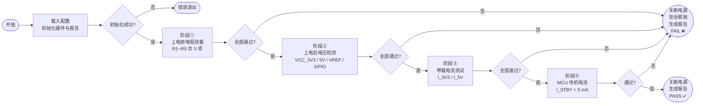

---

## 5. CSM 测试序列

本案例使用 **2 个子脚本** + **1 个主脚本** 的结构。硬件初始化和硬件关闭作为可复用的子脚本，各测试阶段直接展开在主脚本中，便于阅读和逐步调试。

### 5.1 硬件初始化子脚本 `SEQ-PCB-Init.csm`

```c
// ============================================================
// SEQ-PCB-Init.csm
// 硬件初始化公共脚本 - 被主脚本通过 <include> 引用
// ============================================================

echo >> [INIT] 开始初始化测试硬件...

// 初始化数字万用表
Open >> GPIB::22::INSTR -@ DMM ?? goto >> <init_error>
echo >> [INIT] DMM 初始化完成

// 初始化可编程电源 (初始化后确保输出关闭)
Open >> USB::0x2184::0x0018::INSTR -@ PSU ?? goto >> <init_error>
DisableAllOutputs >> -@ PSU ?? goto >> <init_error>
echo >> [INIT] PSU 初始化完成

// 初始化继电器切换矩阵
Open >> PXI1Slot4 -@ SwitchMatrix ?? goto >> <init_error>
Reset >> -@ SwitchMatrix ?? goto >> <init_error>
echo >> [INIT] SwitchMatrix 初始化完成

echo >> [INIT] 所有硬件初始化成功
goto >> <init_done>

<init_error>
echo >> [INIT] *** 硬件初始化失败，终止测试 ***

<init_done>
```

---

### 5.2 硬件关闭子脚本 `SEQ-PCB-Close.csm`

```c
// ============================================================
// SEQ-PCB-Close.csm
// 硬件资源释放公共脚本 - 被主脚本通过 <include> 引用
// ============================================================

echo >> [CLOSE] 关闭所有硬件连接...

Close >> -@ DMM
Close >> -@ PSU
Close >> -@ SwitchMatrix

echo >> [CLOSE] 所有硬件连接已关闭
```

---

### 5.3 主测试脚本 `SEQ-PCB-Main.csm`

```c
// ============================================================
// SEQ-PCB-Main.csm
// PCB 电路板自动化测试 - 主控脚本
// ============================================================

// ---- 指令别名定义（可选，简化脚本书写）----
[CommandAlias]
SafeShutdown = DisableAllOutputs >> -@ PSU

AUTO_ERROR_HANDLE_ENABLE >> TRUE
AUTO_ERROR_HANDLE_ANCHOR >> <emergency_stop>

echo >> ============================================================
echo >> PCB 电路板自动化测试系统
echo >> ============================================================

// ---- 初始化测试报告 ----
Init >> UUT_SN:${UUT_SN:SN_UNKNOWN};Operator:${OPERATOR:AutoTest} -@ TestReport

// ============================================================
// 阶段 0：硬件初始化
// ============================================================
<init>
echo >> [MAIN] 阶段 0：硬件初始化
<include SEQ-PCB-Init.csm>

// ============================================================
// 阶段 1：上电前电阻测量
// ============================================================
<resistance_test>
echo >> [MAIN] 阶段 1：上电前电阻测量（${UUT_SN:SN_UNKNOWN}）

// 配置 DMM 为电阻测量模式
Config >> Mode:Resistance;Range:Auto -@ DMM

// ----- 测量 R1: 1 kΩ ±5% (950Ω ~ 1050Ω) -----
Connect >> Channel:CH_R1 -@ SwitchMatrix
wait >> 50ms
MeasureResistance >> Range:Auto -@ DMM => R1 ∈ [950, 1050]
Disconnect >> Channel:CH_R1 -@ SwitchMatrix
AddResult >> Step:R1_Resistance;Value:${R1};Min:950;Max:1050;Unit:Ohm;Status:${R1_check:FAIL} -@ TestReport
echo >> [R] R1 = ${R1} Ω  (${R1_check})

// ----- 测量 R2: 10 kΩ ±5% (9500Ω ~ 10500Ω) -----
Connect >> Channel:CH_R2 -@ SwitchMatrix
wait >> 50ms
MeasureResistance >> Range:Auto -@ DMM => R2 ∈ [9500, 10500]
Disconnect >> Channel:CH_R2 -@ SwitchMatrix
AddResult >> Step:R2_Resistance;Value:${R2};Min:9500;Max:10500;Unit:Ohm;Status:${R2_check:FAIL} -@ TestReport
echo >> [R] R2 = ${R2} Ω  (${R2_check})

// ----- 测量 R3: 100 Ω ±1% (99Ω ~ 101Ω) 精密电阻 -----
Connect >> Channel:CH_R3 -@ SwitchMatrix
wait >> 50ms
MeasureResistance >> Range:Auto -@ DMM => R3 ∈ [99, 101]
Disconnect >> Channel:CH_R3 -@ SwitchMatrix
AddResult >> Step:R3_Resistance;Value:${R3};Min:99;Max:101;Unit:Ohm;Status:${R3_check:FAIL} -@ TestReport
echo >> [R] R3 = ${R3} Ω  (${R3_check})

// ----- 测量 R4: 4.7 kΩ ±5% (4465Ω ~ 4935Ω) -----
Connect >> Channel:CH_R4 -@ SwitchMatrix
wait >> 50ms
MeasureResistance >> Range:Auto -@ DMM => R4 ∈ [4465, 4935]
Disconnect >> Channel:CH_R4 -@ SwitchMatrix
AddResult >> Step:R4_Resistance;Value:${R4};Min:4465;Max:4935;Unit:Ohm;Status:${R4_check:FAIL} -@ TestReport
echo >> [R] R4 = ${R4} Ω  (${R4_check})

// ----- 测量 R5: 10 kΩ ±5% (9500Ω ~ 10500Ω) -----
Connect >> Channel:CH_R5 -@ SwitchMatrix
wait >> 50ms
MeasureResistance >> Range:Auto -@ DMM => R5 ∈ [9500, 10500]
Disconnect >> Channel:CH_R5 -@ SwitchMatrix
AddResult >> Step:R5_Resistance;Value:${R5};Min:9500;Max:10500;Unit:Ohm;Status:${R5_check:FAIL} -@ TestReport
echo >> [R] R5 = ${R5} Ω  (${R5_check})

expression >> ${R1_check:0} && ${R2_check:0} && ${R3_check:0} && ${R4_check:0} && ${R5_check:0} => resistance_all_pass

<if resistance_all_pass != 1>
    echo >> [MAIN] *** 电阻测量失败，终止测试，不执行上电 ***
    goto >> <test_fail>
<end_if>
echo >> [MAIN] 阶段 1 通过 ✓

// ============================================================
// 阶段 2：上电后电压检测
// ============================================================
<voltage_test>
echo >> [MAIN] 阶段 2：上电后电压检测

// 上电并等待稳定
SetOutput >> Ch:1;Volt:12.0;Curr:1.0 -@ PSU
EnableOutput >> Ch:1 -@ PSU
wait >> 500ms

// 配置 DMM 为直流电压测量模式
Config >> Mode:Voltage_DC;Range:Auto -@ DMM

// ----- 测量 VCC_3V3: 3.3V ±2% (3.234V ~ 3.366V) -----
Connect >> Channel:CH_VCC_3V3 -@ SwitchMatrix
wait >> 100ms
MeasureVoltage >> Range:Auto -@ DMM => VCC_3V3 ∈ [3.234, 3.366]
Disconnect >> Channel:CH_VCC_3V3 -@ SwitchMatrix
AddResult >> Step:VCC_3V3;Value:${VCC_3V3};Min:3.234;Max:3.366;Unit:V;Status:${VCC_3V3_check:FAIL} -@ TestReport
echo >> [V] VCC_3V3 = ${VCC_3V3} V  (${VCC_3V3_check})

// ----- 测量 VCC_5V: 5.0V ±2% (4.900V ~ 5.100V) -----
Connect >> Channel:CH_VCC_5V -@ SwitchMatrix
wait >> 100ms
MeasureVoltage >> Range:Auto -@ DMM => VCC_5V ∈ [4.900, 5.100]
Disconnect >> Channel:CH_VCC_5V -@ SwitchMatrix
AddResult >> Step:VCC_5V;Value:${VCC_5V};Min:4.900;Max:5.100;Unit:V;Status:${VCC_5V_check:FAIL} -@ TestReport
echo >> [V] VCC_5V = ${VCC_5V} V  (${VCC_5V_check})

// ----- 测量 VREF_ADC: 1.25V ±1% (1.238V ~ 1.263V) -----
Connect >> Channel:CH_VREF -@ SwitchMatrix
wait >> 100ms
MeasureVoltage >> Range:Auto -@ DMM => VREF ∈ [1.238, 1.263]
Disconnect >> Channel:CH_VREF -@ SwitchMatrix
AddResult >> Step:VREF_ADC;Value:${VREF};Min:1.238;Max:1.263;Unit:V;Status:${VREF_check:FAIL} -@ TestReport
echo >> [V] VREF_ADC = ${VREF} V  (${VREF_check})

// ----- 测量 VGPIO: 3.3V ±3% (3.201V ~ 3.399V) -----
Connect >> Channel:CH_VGPIO -@ SwitchMatrix
wait >> 100ms
MeasureVoltage >> Range:Auto -@ DMM => VGPIO ∈ [3.201, 3.399]
Disconnect >> Channel:CH_VGPIO -@ SwitchMatrix
AddResult >> Step:VGPIO;Value:${VGPIO};Min:3.201;Max:3.399;Unit:V;Status:${VGPIO_check:FAIL} -@ TestReport
echo >> [V] VGPIO = ${VGPIO} V  (${VGPIO_check})

expression >> ${VCC_3V3_check:0} && ${VCC_5V_check:0} && ${VREF_check:0} && ${VGPIO_check:0} => voltage_all_pass

<if voltage_all_pass != 1>
    echo >> [MAIN] *** 电压检测失败 ***
    goto >> <test_fail>
<end_if>
echo >> [MAIN] 阶段 2 通过 ✓

// ============================================================
// 阶段 3：带载电流测量
// ============================================================
<current_test>
echo >> [MAIN] 阶段 3：带载电流测量

// 配置 DMM 为直流电流测量模式
Config >> Mode:Current_DC;Range:Auto -@ DMM

// ----- 测量 3.3V 带载电流：50mA ~ 300mA -----
Connect >> Channel:CH_I_3V3 -@ SwitchMatrix
wait >> 200ms
MeasureCurrent >> Range:Auto -@ DMM => I_3V3 ∈ [0.050, 0.300]
Disconnect >> Channel:CH_I_3V3 -@ SwitchMatrix
AddResult >> Step:I_3V3_Load;Value:${I_3V3};Min:0.050;Max:0.300;Unit:A;Status:${I_3V3_check:FAIL} -@ TestReport
echo >> [I] I_3V3 = ${I_3V3} A  (${I_3V3_check})

// ----- 测量 5V 带载电流：100mA ~ 500mA -----
Connect >> Channel:CH_I_5V -@ SwitchMatrix
wait >> 200ms
MeasureCurrent >> Range:Auto -@ DMM => I_5V ∈ [0.100, 0.500]
Disconnect >> Channel:CH_I_5V -@ SwitchMatrix
AddResult >> Step:I_5V_Load;Value:${I_5V};Min:0.100;Max:0.500;Unit:A;Status:${I_5V_check:FAIL} -@ TestReport
echo >> [I] I_5V = ${I_5V} A  (${I_5V_check})

expression >> ${I_3V3_check:0} && ${I_5V_check:0} => load_current_pass

<if load_current_pass != 1>
    echo >> [MAIN] *** 带载电流测量失败 ***
    goto >> <test_fail>
<end_if>
echo >> [MAIN] 阶段 3 通过 ✓

// ============================================================
// 阶段 4：MCU 待机电流测量
// ============================================================
<standby_test>
echo >> [MAIN] 阶段 4：MCU 待机电流测量

// 发送 MCU 进入休眠指令
EnterSleepMode >> -@ MCU_Controller ?? goto >> <skip_sleep>
wait >> 1000ms
echo >> [MAIN] MCU 已进入休眠模式

<skip_sleep>
Config >> Mode:Current_DC;Range:Auto -@ DMM
Connect >> Channel:CH_I_STBY -@ SwitchMatrix
wait >> 500ms
MeasureCurrent >> Range:Auto -@ DMM => I_STBY ? I_STBY < 0.005
Disconnect >> Channel:CH_I_STBY -@ SwitchMatrix
AddResult >> Step:I_Standby;Value:${I_STBY};Min:0;Max:0.005;Unit:A;Status:${I_STBY_check:FAIL} -@ TestReport
echo >> [I] I_Standby = ${I_STBY} A  (${I_STBY_check})

<if I_STBY_check != 1>
    echo >> [MAIN] *** MCU 待机电流超标 ***
    goto >> <test_fail>
<end_if>
echo >> [MAIN] 阶段 4 通过 ✓

// ============================================================
// 测试通过处理
// ============================================================
<test_pass>
echo >> [MAIN] ===== 所有测试项目通过 PASS ✅ =====
SafeShutdown
Reset >> -@ SwitchMatrix
GetSummary >> -@ TestReport => final_result
GenerateReport >> FilePath:Report_${UUT_SN:SN_UNKNOWN}.html -@ TestReport
goto >> <done>

// ============================================================
// 测试失败处理
// ============================================================
<test_fail>
echo >> [MAIN] ===== 测试失败 FAIL ❌ =====
SafeShutdown
Reset >> -@ SwitchMatrix
GetSummary >> -@ TestReport => final_result
GenerateReport >> FilePath:Report_${UUT_SN:SN_UNKNOWN}.html -@ TestReport
goto >> <done>

// ============================================================
// 紧急停止（异常安全联锁）
// ============================================================
<emergency_stop>
echo >> [MAIN] *** 紧急停止触发，执行安全联锁 ***
SafeShutdown
Reset >> -@ SwitchMatrix
echo >> [MAIN] 安全联锁已执行，所有输出已关断

// ============================================================
// 清理和结束
// ============================================================
<done>
echo >> [MAIN] 测试结果: ${final_result}
<include SEQ-PCB-Close.csm>
echo >> ============================================================
echo >> 测试完成
echo >> ============================================================
```

---

## 6. CSM 优势说明

### 6.1 CSM 优势

在此 PCB 自动化测试场景中，CSM 具有以下优势：

| CSM 优势 | 说明 |
| -------------- | ---- |
| **流程修改灵活** | 直接编辑 `.csm` 文本文件，无需重新编译部署 |
| **测试项复用** | `<include>` 机制复用子脚本，修改一处全局生效 |
| **限值调整直观** | 脚本中直接使用 `∈ [min, max]` 语法，一行完成测量+判断，直观清晰 |
| **故障安全** | `AUTO_ERROR_HANDLE` + `<emergency_stop>` 全局错误保障，任何异常均可被统一处理 |
| **并行扩展** | 同一脚本可被多个 Engine 实例并行调度，轻松支持多工位 |
| **可读性强** | 脚本接近自然语言，易于阅读和 Review，降低维护成本 |
| **版本管理友好** | 纯文本脚本，Git 友好，diff 清晰，支持 Code Review |

### 6.2 关键功能应用亮点

- **[返回值范围判断](#38-返回值范围判断)**：`=> R1 ∈ [950, 1050]` 单行完成测量+判断+记录，极简表达
- **[脚本引用功能](#311-脚本引用功能)**：`<include>` 将硬件初始化和关闭封装为可复用子脚本，主脚本专注于测试逻辑
- **[锚点跳转](#37-锚点跳转)**：`AUTO_ERROR_HANDLE_ANCHOR >> <emergency_stop>` 保证任何异常都触发安全联锁
- **[分支逻辑支持](#39-分支逻辑支持)**：电阻测量失败后直接 `<if> ... goto <test_fail>`，阻止上电
- **[变量空间支持](#34-变量空间支持)**：`${UUT_SN}` 从外部注入序列号，同一脚本支持不同工件
- **[扩充的指令集](#35-扩充的指令集)**：`WAIT`、`ECHO`、`AUTO_ERROR_HANDLE` 等内置指令简化脚本

---

## 7. 模块架构图

### 7.1 系统模块关系图

下图展示了本测试系统中各 CSM 模块之间的通信关系。CSM 引擎作为中央调度者，通过 CSM 消息总线与各仪器驱动模块通信。

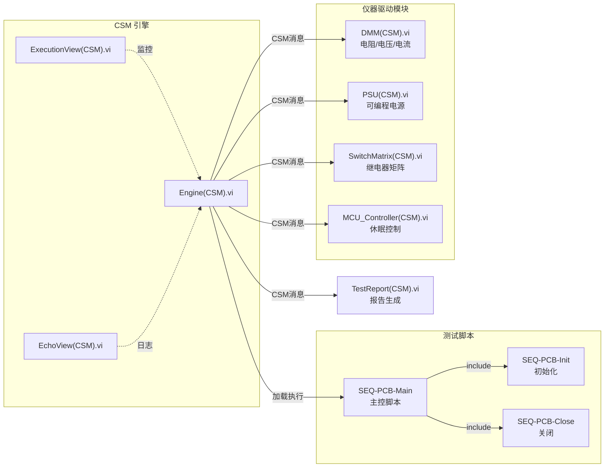

### 7.2 测试系统层次架构图

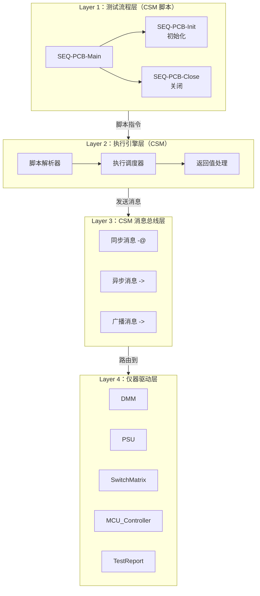

---

## 附录：测试配置说明

### 使用变量注入配置参数

通过 CSM 的变量空间功能，可以在启动时注入测试配置，无需修改脚本内容：

```c
// 从 INI 配置文件注入参数（在测试系统启动时配置）
INI_VAR_SPACE_ENABLE >> TRUE
INI_VAR_SPACE_PATH >> TestConfig.ini

// 之后脚本中的 ${UUT_SN}、${OPERATOR}、${DMM_RESOURCE} 等
// 将自动从 INI 配置文件中读取，无需硬编码到脚本中
```

**TestConfig.ini 示例：**

```ini
[LabVIEW]
UUT_SN = PCB_20260226_001
OPERATOR = TestEngineer
DMM_RESOURCE = GPIB::22::INSTR
PSU_RESOURCE = USB::0x2184::0x0018::INSTR
```

### 相关文档

- [返回值范围判断](#38-返回值范围判断) - 单行测量+判断语法详解
- [脚本引用功能](#311-脚本引用功能) - `<include>` 子脚本机制
- [锚点跳转](#37-锚点跳转) - 错误跳转和安全联锁
- [分支逻辑支持](#39-分支逻辑支持) - if/else 条件控制
- [变量空间支持](#34-变量空间支持) - INI 配置文件变量注入
- [扩充的指令集](#35-扩充的指令集) - WAIT/ECHO/AUTO_ERROR_HANDLE 等内置指令


---

## 5.2 总线类自动化测试（CAN/AI 同步采集）

本文档以一个 **锂电池管理系统（BMS）总线功能验证测试** 场景为例，演示如何使用 CSM 构建 CAN/AI 多源同步采集的自动化测试系统，涵盖从需求分析、模块设计、两级数据整合到离线分析报表的完整流程。

> **本案例的架构特点**：与 [PCB 电路板测试](#51-pcb-电路板自动化测试) 案例的主要区别在于，本案例的数据处理管线（采集→一次整合→二次整合→TDMS 存储）依靠**各 CSM 模块之间的订阅广播机制**自动驱动流转，脚本只负责配置连接关系、启动/停止硬件和等待采集完成，而不逐步同步驱动每个数据处理步骤。

---

## 1. 测试场景概述

### 被测单元 (UUT)

**某型锂电池管理系统（Battery Management System，BMS）**，主要特性：

- CAN 总线通信接口（500 kbps，CAN 2.0B）
- 管理 16 节串联锂电芯（额定电压 48 V 系统）
- 对外提供：总电压、各单体电压、电池温度、SOC、SOH、故障码等 CAN 报文
- 模拟量输出：总线电压（经分压器）、充放电电流（经霍尔传感器）
- 保护功能：过压、欠压、过温、过流、短路保护

### 测试目标

验证 BMS 在不同工况下的 CAN 通信响应与物理量测量的一致性和实时性，测试覆盖：

| 测试用例 | 测试项目 | 说明 |
| -------- | -------- | ---- |
| TC01 | CAN 通信协议基础验证 | 报文 ID、周期、数据帧格式正确性 |
| TC02 | 物理量数据一致性验证 | CAN 上报值与 AI 实测值的偏差是否在容差范围内 |
| TC03 | 过压保护触发时序验证 | 施加过压激励 → BMS 触发保护的响应时间 |
| TC04 | 过温保护触发时序验证 | 模拟过温激励 → BMS 触发保护的响应时间 |

### 数据采集架构

本测试系统采用 **CAN 作为物理触发主机（Hardware Trigger Master）** 的同步采集架构：

- **CAN 采集（触发主机）**：捕获 BMS 全部 CAN 报文。当特定 CAN 帧到达时，CAN 接口卡通过硬件引脚输出物理触发信号
- **AI 采集（触发从机）**：以 1 kHz 采样率连续采集，采集卡的触发输入端接 CAN 卡的触发输出，实现硬件级同步启动
- **同步机制**：CAN/AI 之间通过**物理触发线**（非软件广播）保证时间同步，触发时间戳偏差 < 1 ms
- **数据处理管线**：数据在模块间通过 **CSM 广播订阅**自动流转；CANAcq 采集到帧后广播，CANParser 订阅并自动解析，DataIntegrator 订阅 CANParser 和 AIAcq 的广播自动整合，TDMSManager 订阅 DataIntegrator 的广播自动保存
- **数据吞吐差异**：CAN 事件帧（10 ms/帧）vs AI 采样（1 ms/采样），须通过两级整合统一处理

```
物理硬件触发线（非CSM广播）
CAN 接口 ──── CANAcq(CSM).vi ──[硬件触发信号]──→ AIAcq(CSM).vi ──── DAQmx AI
                    │                                      │
           广播 NewFrames Event                   广播 NewData Event
                    ↓                                      │
           CANParser(CSM).vi                               │
           订阅 CANAcq 广播                                 │
           一次整合：字节→物理量                             │
           广播 ParsedSignals Event                         │
                    ↓                                      ↓
           DataIntegrator(CSM).vi ←────── 订阅 AIAcq 广播 ─┘
           订阅 CANParser 广播
           二次整合：CAN+AI 时间轴对齐合并
           广播 IntegrateCompleted Event
                    ↓
           TDMSManager(CSM).vi   →  TDMS 文件
           订阅 DataIntegrator 广播，自动保存
                    ↓（测试结束后，脚本主动触发）
           DataAnalysis(CSM).vi  →  PASS / FAIL + 测试报告
```

---

## 2. 测试需求细化

### 2.1 CAN 总线采集规格

| 通道 | 类型 | 报文 ID | 标称周期 | 主要信号 |
| ---- | ---- | ------- | -------- | -------- |
| CAN_BMS_STATUS | RX | 0x6B0 | 100 ms | SOC (%), SOH (%), 工作状态 |
| CAN_BMS_VOLTAGE | RX | 0x6B1 | 10 ms | 总电压 (V)、最高/最低单体电压 (mV) |
| CAN_BMS_CURRENT | RX | 0x6B2 | 10 ms | 充放电电流 (A)、瞬时功率 (W) |
| CAN_BMS_TEMP | RX | 0x6B3 | 100 ms | 最高/最低/平均温度 (℃) |
| CAN_BMS_FAULT | RX | 0x6B4 | 事件触发 | 故障码位域（过压/过温/过流等） |
| CAN_TCS_CMD | TX | 0x6A0 | 按需 | 充放电使能、目标电流 (A)、模拟激励控制 |

### 2.2 AI 模拟量采集规格

| 通道名 | 量程 | 采样率 | 传感器类型 | 被测物理量 |
| ------ | ---- | ------ | ---------- | ---------- |
| AI_PACK_VOLT | 0–60 V | 1 kHz | 分压器（60:1） | 电池包总电压 |
| AI_CHARGE_CURR | −200–+200 A | 1 kHz | 霍尔传感器 | 充放电电流 |
| AI_TEMP_AMB | −40–+85 ℃ | 1 kHz | 热电偶（J 型） | 环境温度 |
| AI_TEMP_CELL | −40–+85 ℃ | 1 kHz | 热电偶（J 型） | 代表电芯温度 |

### 2.3 测试判据规格

| 测试项目 | 判据说明 | 限值 |
| -------- | -------- | ---- |
| CAN 报文周期（0x6B1/0x6B2） | 实测帧间隔 | 9 ms ≤ 周期 ≤ 11 ms |
| 电压数据一致性 | CAN 上报值 vs AI 实测值相对偏差 | ≤ 0.5 % |
| 电流数据一致性 | CAN 上报值 vs AI 实测值相对偏差 | ≤ 1.0 % |
| 过压保护响应时间 | 过压激励发出 → 0x6B4 故障帧首次出现 | ≤ 200 ms |
| 过温保护响应时间 | 过温激励发出 → 0x6B4 故障帧首次出现 | ≤ 500 ms |

### 2.4 采集与整合流程约束

1. **同步精度**：CAN 与 AI 触发时间戳偏差 < 1 ms，通过**物理触发线**（CAN 卡触发输出 → AI 采集卡触发输入）实现，在模块初始化时通过硬件配置完成，非软件级协调
2. **触发主机**：CANAcq 模块在硬件初始化时配置为触发主机（`ConfigHwTrigger`），AIAcq 在硬件初始化时配置为触发从机（`SetHwTriggerInput`），两者通过物理信号线同步
3. **数据管线**：各模块通过 CSM 广播订阅构成自动数据流水线，CANAcq 每接收到新帧即广播，CANParser 和 DataIntegrator 订阅后自动处理；脚本层无需手动逐步传递数据
4. **一次整合（CAN 字节→物理量）**：CANParser 通过 DBC 信号定义，对 CANAcq 广播的原始帧自动完成 Factor/Offset 换算，实时输出物理量时序
5. **二次整合（CAN/AI 合并）**：DataIntegrator 订阅 CANParser 和 AIAcq 的广播，对稀疏 CAN 事件序列进行插值后与 AI 连续采样合并到统一时间轴
6. **TDMS 存储**：TDMSManager 订阅 DataIntegrator 的广播，整合数据到达即自动追加写入 TDMS，脚本通过 `GetSaveStatus` 轮询确认数据保存进度
7. **离线分析**：全部测试用例采集完成后统一由 DataAnalysis 模块加载 TDMS 进行判定，并直接生成报告，脚本不参与判据计算

---

## 3. CSM 模块设计

本测试系统由 **6 个 CSM 后台模块** 构成，分为采集层、整合层和存储分析层。各模块通过 CSM 消息和广播订阅相互连接，形成自驱动的数据处理管线；CSM 脚本作为统一调度者，只负责配置、启动和等待。

### 3.1 CANAcq 模块 `CANAcq(CSM).vi`

**职责**：管理 CAN 总线接口，完成报文的发送与接收，并作为**物理硬件触发主机**。模块将接收到的原始帧实时广播给 CANParser，驱动数据处理管线自动运行。

#### 消息(Message)

| 消息 | 说明 | 参数 | 返回值 |
| ---- | ---- | ---- | ------ |
| `"Open"` | 初始化 CAN 接口 | `Device:<设备名>;Bitrate:<波特率>` | N/A |
| `"Close"` | 释放 CAN 接口 | N/A | N/A |
| `"ConfigFilter"` | 配置报文接收过滤器 | `ID:<ID列表，逗号分隔>;Mask:<掩码>` | N/A |
| `"ConfigHwTrigger"` | 配置物理触发主机（指定触发帧 ID，到达时输出硬件触发脉冲） | `TriggerID:<报文ID>;TriggerOutput:<物理输出线>` | N/A |
| `"StartAcq"` | 开始采集，清空缓冲区 | N/A | N/A |
| `"StopAcq"` | 停止采集 | N/A | 接收帧数 |
| `"SendFrame"` | 发送一帧 CAN 报文 | `ID:<ID>;Data:<十六进制字节串>` | N/A |

#### 广播(Broadcast)

| 广播 | 说明 | 参数 |
| ---- | ---- | ---- |
| `"NewFrames Event"` | 新的 CAN 原始帧到达，通知 CANParser 自动解析 | 原始帧数组（含时间戳） |
| `"AcqStopped Event"` | 采集已停止 | 接收帧总数 |
| `"Error Occurred"` | CAN 接口通信错误 | 错误信息（ERRSTR） |

---

### 3.2 AIAcq 模块 `AIAcq(CSM).vi`

**职责**：管理 DAQmx 模拟量输入采集，配置为**物理硬件触发从机**（采集卡触发输入接 CAN 卡触发输出），由 CAN 硬件触发信号决定采集起点，实现微秒级时间同步。采集中实时广播新数据块，驱动 DataIntegrator 自动整合。

#### 消息(Message)

| 消息 | 说明 | 参数 | 返回值 |
| ---- | ---- | ---- | ------ |
| `"Open"` | 初始化 DAQmx 任务，配置采集通道 | `Device:<设备名>;Channels:<通道列表>;SampleRate:<Hz>` | N/A |
| `"Close"` | 释放 DAQmx 任务 | N/A | N/A |
| `"SetHwTriggerInput"` | 配置物理触发从机（指定 DAQmx 触发输入端子） | `TriggerLine:<DAQmx触发端子，例如 /Dev1/PFI0>` | N/A |
| `"StartAcq"` | 预备并启动采集（等待物理触发信号） | `Duration:<ms>` | N/A |
| `"StopAcq"` | 停止采集 | N/A | 已采集样本数 |
| `"GetSaveStatus"` | 查询当前已广播出去的样本数量 | N/A | 已广播样本数 |

#### 广播(Broadcast)

| 广播 | 说明 | 参数 |
| ---- | ---- | ---- |
| `"HwTriggered Event"` | 硬件触发信号已到达，采集开始 | 触发时间戳 |
| `"NewData Event"` | 新的 AI 采样数据块就绪，通知 DataIntegrator 自动整合 | 多通道数据块（含时间戳） |
| `"AcqStopped Event"` | 采集已停止 | 已采集样本数 |
| `"Error Occurred"` | DAQmx 采集错误 | 错误信息（ERRSTR） |

---

### 3.3 CANParser 模块 `CANParser(CSM).vi`（一次整合）

**职责**：将 CAN 原始帧字节数据解析为工程物理量（**一次整合**）。订阅 CANAcq 的 `"NewFrames Event"` 广播，自动对每批新帧完成 DBC 信号提取和 Factor/Offset 换算，输出带时间戳的物理量时序，并广播给 DataIntegrator。

#### 订阅(Subscribe)

| 订阅目标 | 广播事件 | 自动触发操作 |
| -------- | -------- | ------------ |
| `CANAcq` | `"NewFrames Event"` | 对新到帧自动执行 DBC 解析，完成后广播 `"ParsedSignals Event"` |

#### 消息(Message)

| 消息 | 说明 | 参数 | 返回值 |
| ---- | ---- | ---- | ------ |
| `"LoadDBC"` | 加载 DBC 信号定义文件 | `FilePath:<DBC路径>` | 已加载信号数量 |
| `"Reset"` | 清空解析缓冲区 | N/A | N/A |
| `"GetSignal"` | 按名称提取当前已解析的单路信号时间序列 | `SignalName:<信号名>` | 时间戳数组 + 数值数组 |

#### 广播(Broadcast)

| 广播 | 说明 | 参数 |
| ---- | ---- | ---- |
| `"ParsedSignals Event"` | 新一批 CAN 物理量解析完成，通知 DataIntegrator | 物理量信号时序数组 |
| `"Error Occurred"` | 解析错误（DBC 未加载、帧格式错误） | 错误信息（ERRSTR） |

---

### 3.4 DataIntegrator 模块 `DataIntegrator(CSM).vi`（二次整合）

**职责**：订阅 CANParser 和 AIAcq 的广播，自动对新到达的 CAN 物理量时序和 AI 采样数据进行时间轴对齐、重采样和合并（**二次整合**），解决两者数据率差异，并将整合结果广播给 TDMSManager。

#### 订阅(Subscribe)

| 订阅目标 | 广播事件 | 自动触发操作 |
| -------- | -------- | ------------ |
| `CANParser` | `"ParsedSignals Event"` | 缓存新到 CAN 物理量，触发整合 |
| `AIAcq` | `"NewData Event"` | 缓存新到 AI 数据块，触发整合 |

#### 消息(Message)

| 消息 | 说明 | 参数 | 返回值 |
| ---- | ---- | ---- | ------ |
| `"Config"` | 配置整合参数 | `ResampleRate:<Hz>;GroupName:<数据组名>` | N/A |
| `"Reset"` | 清空整合缓冲区，准备下一个测试用例 | N/A | N/A |

#### 广播(Broadcast)

| 广播 | 说明 | 参数 |
| ---- | ---- | ---- |
| `"IntegrateCompleted Event"` | 新一批整合数据就绪，通知 TDMSManager 保存 | 合并后时序数据块 |
| `"Error Occurred"` | 整合过程错误 | 错误信息（ERRSTR） |

---

### 3.5 TDMSManager 模块 `TDMSManager(CSM).vi`

**职责**：订阅 DataIntegrator 的广播，将整合后的数据自动追加写入 TDMS 文件，无需脚本逐步触发。提供 `GetSaveStatus` 接口供脚本轮询，确认当前测试用例数据是否已保存完毕。

#### 订阅(Subscribe)

| 订阅目标 | 广播事件 | 自动触发操作 |
| -------- | -------- | ------------ |
| `DataIntegrator` | `"IntegrateCompleted Event"` | 自动追加写入整合数据到当前 TDMS 通道组 |

#### 消息(Message)

| 消息 | 说明 | 参数 | 返回值 |
| ---- | ---- | ---- | ------ |
| `"Open"` | 创建或打开 TDMS 文件 | `FilePath:<路径>` | N/A |
| `"Close"` | 关闭并刷新 TDMS 文件 | N/A | N/A |
| `"SetGroup"` | 设置当前写入的通道组（切换测试用例时调用） | `GroupName:<组名>` | N/A |
| `"SetMetadata"` | 写入测试元数据 | `Key:<键>;Value:<值>` | N/A |
| `"GetSaveStatus"` | 查询当前已保存的数据块数量 | N/A | 已保存块数 |
| `"ReadChannels"` | 读取指定通道组数据（供 DataAnalysis 使用） | `GroupName:<组名>` | 时序数据集 |

#### 广播(Broadcast)

| 广播 | 说明 | 参数 |
| ---- | ---- | ---- |
| `"Error Occurred"` | 文件操作错误 | 错误信息（ERRSTR） |

---

### 3.6 DataAnalysis 模块 `DataAnalysis(CSM).vi`（专有模块，含报告生成）

**职责**：全部测试用例采集完成后，从 TDMS 文件加载数据，执行专有分析算法（协议一致性、时序响应、数据偏差等），汇总各测试用例通过/失败结果，并直接生成测试报告（HTML/CSV）。报告生成功能内聚在本模块，无需独立报告模块。

#### 消息(Message)

| 消息 | 说明 | 参数 | 返回值 |
| ---- | ---- | ---- | ------ |
| `"Init"` | 初始化，记录 UUT 信息 | `UUT_SN:<序列号>;Operator:<操作员>;TestType:BMS_BusTest` | N/A |
| `"LoadData"` | 从 TDMS 加载测试数据 | `FilePath:<TDMS路径>` | 数据集摘要（通道数、时长） |
| `"RunAnalysis"` | 运行全套分析算法 | `Config:<分析配置JSON>` | N/A |
| `"GetCaseResult"` | 获取指定测试用例的分析结果 | `CaseID:<用例ID>` | `PASS\|FAIL` + 关键指标 |
| `"GetSummary"` | 获取整体通过/失败汇总 | N/A | `PASS` 或 `FAIL` |
| `"GenerateReport"` | 生成并保存测试报告文件 | `FilePath:<路径>` | 实际保存路径 |

#### 广播(Broadcast)

| 广播 | 说明 | 参数 |
| ---- | ---- | ---- |
| `"AnalysisCompleted Event"` | 分析完成 | PASS/FAIL + 通过率 |
| `"Error Occurred"` | 分析或报告生成错误 | 错误信息（ERRSTR） |

---

## 4. 测试流程图

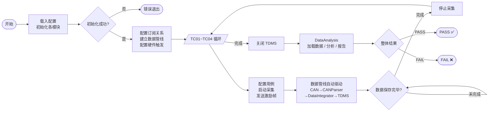

---

## 5. CSM 测试序列

本案例采用 **2 个子脚本（初始化/关闭）+ 1 个主脚本** 的结构。脚本只负责配置各模块并建立订阅关系，然后启动硬件并等待 TDMSManager 确认数据保存完成，内部数据流转完全由模块间广播订阅自动驱动。

### 5.1 硬件初始化子脚本 `SEQ-BUS-Init.csm`

```c
// ============================================================
// SEQ-BUS-Init.csm
// 硬件初始化公共脚本 - 被主脚本通过 <include> 引用
// ============================================================

echo >> [INIT] 开始初始化总线采集硬件...

// 初始化 CAN 采集模块
Open >> Device:${CAN_DEVICE:CAN0};Bitrate:${CAN_BITRATE:500000} -@ CANAcq ?? goto >> <init_error>
// 配置 CAN 为物理触发主机（指定触发帧 ID 到达时输出物理触发脉冲）
ConfigHwTrigger >> TriggerID:0x6B1;TriggerOutput:${CAN_TRIG_OUT:RTSI0} -@ CANAcq ?? goto >> <init_error>
echo >> [INIT] CAN 采集接口初始化完成（物理触发主机已配置）

// 加载 DBC 信号定义（CAN 字节→物理量映射）
LoadDBC >> FilePath:${DBC_PATH:BMS.dbc} -@ CANParser ?? goto >> <init_error>
echo >> [INIT] DBC 文件加载完成

// 初始化 AI 采集模块
Open >> Device:${AI_DEVICE:Dev1};Channels:${AI_CHANNELS:ai0,ai1,ai2,ai3};SampleRate:1000 -@ AIAcq ?? goto >> <init_error>
// 配置 AI 为物理触发从机（采集卡触发输入端接 CAN 卡触发输出的物理信号线）
SetHwTriggerInput >> TriggerLine:${AI_TRIG_IN:/Dev1/PFI0} -@ AIAcq ?? goto >> <init_error>
echo >> [INIT] AI 采集通道初始化完成（物理触发从机已配置）

// 创建 TDMS 文件并写入元数据
Open >> FilePath:${TDMS_PATH:TestData.tdms} -@ TDMSManager ?? goto >> <init_error>
SetMetadata >> Key:UUT_SN;Value:${UUT_SN:SN_UNKNOWN} -@ TDMSManager
SetMetadata >> Key:TestType;Value:BMS_BusTest -@ TDMSManager
SetMetadata >> Key:Operator;Value:${OPERATOR:AutoTest} -@ TDMSManager
echo >> [INIT] TDMS 文件已创建，元数据已写入

echo >> [INIT] 所有硬件初始化成功
goto >> <init_done>

<init_error>
echo >> [INIT] *** 硬件初始化失败，终止测试 ***

<init_done>
```

---

### 5.2 硬件关闭子脚本 `SEQ-BUS-Close.csm`

```c
// ============================================================
// SEQ-BUS-Close.csm
// 硬件资源释放公共脚本 - 被主脚本通过 <include> 引用
// ============================================================

echo >> [CLOSE] 关闭所有硬件连接...

Close >> -@ CANAcq
Close >> -@ AIAcq

echo >> [CLOSE] 所有硬件连接已关闭
```

---

### 5.3 主测试脚本 `SEQ-BUS-Main.csm`

```c
// ============================================================
// SEQ-BUS-Main.csm
// BMS 总线功能验证测试 - 主控脚本
//
// 注：数据处理管线（采集→解析→整合→TDMS）依靠 CSM 模块间广播
// 订阅自动驱动，脚本层只负责配置、启动/停止和等待完成。
// ============================================================

AUTO_ERROR_HANDLE_ENABLE >> TRUE
AUTO_ERROR_HANDLE_ANCHOR >> <emergency_stop>

echo >> ============================================================
echo >> BMS 总线功能验证测试系统
echo >> ============================================================

// ============================================================
// 阶段 0：硬件初始化
// ============================================================
echo >> [MAIN] 阶段 0：硬件初始化
<include SEQ-BUS-Init.csm>

// ---- 初始化 DataAnalysis ----
Init >> UUT_SN:${UUT_SN:SN_UNKNOWN};Operator:${OPERATOR:AutoTest};TestType:BMS_BusTest -@ DataAnalysis

// ============================================================
// 配置模块间订阅关系（数据管线）
// CANAcq → CANParser → DataIntegrator → TDMSManager
// AIAcq → DataIntegrator
// 各模块在收到订阅广播后自动处理，脚本无需手动传递数据
// ============================================================
echo >> [MAIN] 配置模块间订阅数据管线...
// (订阅关系由各模块初始化时根据配置自动建立，此处 echo 仅做说明)
echo >> [MAIN] 数据管线就绪：CANAcq→CANParser→DataIntegrator→TDMSManager

// ============================================================
// TC01：CAN 通信协议基础验证（采集时长 1200ms）
// ============================================================
<tc01>
echo >> [MAIN] ---- TC01: CAN 通信协议基础验证 ----

// 配置 CAN 过滤器和本测试用例的 TDMS 数据组
ConfigFilter >> ID:0x6B0,0x6B1,0x6B2,0x6B3,0x6B4;Mask:0x7F0 -@ CANAcq
SetGroup >> GroupName:TC01 -@ TDMSManager
Config >> ResampleRate:1000;GroupName:TC01 -@ DataIntegrator

// 启动 AI（配置为等待物理触发信号）
StartAcq >> Duration:1500 -@ AIAcq
// 启动 CAN 采集（CAN 接口卡等待到 TriggerID:0x6B1 后自动输出物理触发脉冲）
StartAcq >> -@ CANAcq

// 发送激励帧（使能 BMS 正常工作模式）
SendFrame >> ID:0x6A0;Data:01 00 00 00 00 00 00 00 -@ CANAcq
echo >> [TC01] 激励帧已发送，等待数据保存完成...

// 轮询 TDMSManager 确认数据保存完毕（目标：1200ms 数据 = 1200 个整合数据块）
<tc01_wait>
GetSaveStatus >> -@ TDMSManager => tc01_saved_count
echo >> [TC01] 已保存数据块: ${tc01_saved_count}
<if tc01_saved_count < 6>
    wait >> 200ms
    goto >> <tc01_wait>
<end_if>

// 停止采集
StopAcq >> -@ CANAcq => tc01_can_frames
StopAcq >> -@ AIAcq => tc01_ai_samples
echo >> [TC01] TC01 采集完成  CAN帧: ${tc01_can_frames}  AI样本: ${tc01_ai_samples}

// ============================================================
// TC02：物理量数据一致性验证（采集时长 2200ms）
// ============================================================
<tc02>
echo >> [MAIN] ---- TC02: 物理量数据一致性验证 ----

ConfigFilter >> ID:0x6B1,0x6B2;Mask:0x7FE -@ CANAcq
SetGroup >> GroupName:TC02 -@ TDMSManager
Config >> ResampleRate:1000;GroupName:TC02 -@ DataIntegrator

StartAcq >> Duration:2500 -@ AIAcq
StartAcq >> -@ CANAcq

// 发送使能帧（100A 放电）
SendFrame >> ID:0x6A0;Data:01 64 00 00 00 00 00 00 -@ CANAcq
echo >> [TC02] 激励帧已发送，等待数据保存完成...

<tc02_wait>
GetSaveStatus >> -@ TDMSManager => tc02_saved_count
<if tc02_saved_count < 11>
    wait >> 200ms
    goto >> <tc02_wait>
<end_if>

StopAcq >> -@ CANAcq => tc02_can_frames
StopAcq >> -@ AIAcq => tc02_ai_samples
echo >> [TC02] TC02 采集完成  CAN帧: ${tc02_can_frames}  AI样本: ${tc02_ai_samples}

// ============================================================
// TC03：过压保护触发时序验证（采集时长 3000ms，等待故障帧）
// ============================================================
<tc03>
echo >> [MAIN] ---- TC03: 过压保护触发时序验证 ----

ConfigFilter >> ID:0x6B1,0x6B4;Mask:0x7FD -@ CANAcq
SetGroup >> GroupName:TC03 -@ TDMSManager
Config >> ResampleRate:1000;GroupName:TC03 -@ DataIntegrator

StartAcq >> Duration:3500 -@ AIAcq
StartAcq >> -@ CANAcq

// 发送模拟过压激励控制帧
SendFrame >> ID:0x6A0;Data:02 FF 00 00 00 00 00 00 -@ CANAcq
echo >> [TC03] 过压激励已发送，等待数据保存完成...

<tc03_wait>
GetSaveStatus >> -@ TDMSManager => tc03_saved_count
<if tc03_saved_count < 15>
    wait >> 200ms
    goto >> <tc03_wait>
<end_if>

StopAcq >> -@ CANAcq => tc03_can_frames
StopAcq >> -@ AIAcq => tc03_ai_samples
echo >> [TC03] TC03 采集完成  CAN帧: ${tc03_can_frames}  AI样本: ${tc03_ai_samples}

// ============================================================
// TC04：过温保护触发时序验证（采集时长 5000ms）
// ============================================================
<tc04>
echo >> [MAIN] ---- TC04: 过温保护触发时序验证 ----

ConfigFilter >> ID:0x6B3,0x6B4;Mask:0x7FE -@ CANAcq
SetGroup >> GroupName:TC04 -@ TDMSManager
Config >> ResampleRate:1000;GroupName:TC04 -@ DataIntegrator

StartAcq >> Duration:5500 -@ AIAcq
StartAcq >> -@ CANAcq

// 发送过温模拟激励控制帧
SendFrame >> ID:0x6A0;Data:03 00 00 00 00 00 00 00 -@ CANAcq
echo >> [TC04] 过温激励已发送，等待数据保存完成...

<tc04_wait>
GetSaveStatus >> -@ TDMSManager => tc04_saved_count
<if tc04_saved_count < 25>
    wait >> 200ms
    goto >> <tc04_wait>
<end_if>

StopAcq >> -@ CANAcq => tc04_can_frames
StopAcq >> -@ AIAcq => tc04_ai_samples
echo >> [TC04] TC04 采集完成  CAN帧: ${tc04_can_frames}  AI样本: ${tc04_ai_samples}

// ============================================================
// 关闭 TDMS，启动离线分析
// ============================================================
<analysis>
echo >> [MAIN] 所有测试用例采集完成，关闭 TDMS，开始离线分析...
Close >> -@ TDMSManager

// 加载 TDMS，运行专有分析算法
LoadData >> FilePath:${TDMS_PATH:TestData.tdms} -@ DataAnalysis
RunAnalysis >> Config:{"AnalysisVersion":"1.2","CheckConsistency":true} -@ DataAnalysis

// 获取各用例分析结果
GetCaseResult >> CaseID:TC01 -@ DataAnalysis => tc01_result
GetCaseResult >> CaseID:TC02 -@ DataAnalysis => tc02_result
GetCaseResult >> CaseID:TC03 -@ DataAnalysis => tc03_result
GetCaseResult >> CaseID:TC04 -@ DataAnalysis => tc04_result

echo >> [MAIN] TC01 分析结果: ${tc01_result}
echo >> [MAIN] TC02 分析结果: ${tc02_result}
echo >> [MAIN] TC03 分析结果: ${tc03_result}
echo >> [MAIN] TC04 分析结果: ${tc04_result}

// 生成最终报告
GenerateReport >> FilePath:Report_${UUT_SN:SN_UNKNOWN}.html -@ DataAnalysis
GetSummary >> -@ DataAnalysis => final_result

echo >> [MAIN] ===================================================
<if final_result == PASS>
    echo >> [MAIN] ===== 测试通过 PASS ✅ =====
<else>
    echo >> [MAIN] ===== 测试失败 FAIL ❌ =====
<end_if>
echo >> [MAIN] 测试结果: ${final_result}
goto >> <done>

// ============================================================
// 紧急停止（异常安全联锁）
// ============================================================
<emergency_stop>
echo >> [MAIN] *** 紧急停止触发，执行安全联锁 ***
StopAcq >> -@ CANAcq
StopAcq >> -@ AIAcq
Close >> -@ TDMSManager
echo >> [MAIN] 安全联锁已执行，所有采集已停止

// ============================================================
// 清理和结束
// ============================================================
<done>
<include SEQ-BUS-Close.csm>
echo >> ============================================================
echo >> 测试完成
echo >> ============================================================
```

---

## 6. CSM 优势说明

### 6.1 CSM 优势

在 CAN/AI 多源同步采集的总线测试场景中，CSM 具有以下优势：

| CSM 优势 | 说明 |
| -------------- | ---- |
| **模块解耦** | 各功能模块独立，通过 CSM 广播订阅松耦合连接，数据管线配置灵活 |
| **数据管线自动化** | 模块间订阅广播驱动数据自动流转，脚本只需配置连接关系 |
| **精确采集等待** | `GetSaveStatus` + 轮询循环，以实际保存进度为准，无需估算等待时长 |
| **多模块统一调度** | 脚本顺序指令化，任意异常通过 `<emergency_stop>` 统一兜底 |
| **离线分析解耦** | 分析模块通过 TDMS 完全解耦，任何时候均可重新调用 `RunAnalysis` |
| **测试用例管理简便** | 每个 TC 对应脚本一段，增删改只需编辑文本文件 |
| **限值与配置灵活** | 限值和硬件配置通过 INI 文件注入，零修改部署 |
| **版本管理友好** | `.csm` 纯文本，Git diff 清晰，Code Review 友好 |

### 6.2 关键功能应用亮点

- **[返回值保存传递](#33-返回值保存传递)**：`StopAcq >> -@ CANAcq => tc01_can_frames` 将采集帧数存入变量，用于日志输出和后续判断
- **[锚点跳转](#37-锚点跳转)**：`AUTO_ERROR_HANDLE_ANCHOR >> <emergency_stop>` 保证任何异常都触发安全停止，防止数据丢失
- **[循环支持](#310-循环支持)**：`<tc01_wait>` + `goto` 构成轮询等待循环，以 TDMSManager 实际保存进度为退出条件
- **[分支逻辑支持](#39-分支逻辑支持)**：`<if final_result == PASS>` 测试结束后根据结果分别输出通过/失败提示
- **[变量空间支持](#34-变量空间支持)**：`${CAN_DEVICE}`、`${DBC_PATH}`、`${TDMS_PATH}` 通过 INI 文件外部注入，同一脚本适配不同测试台位
- **[脚本引用功能](#311-脚本引用功能)**：`<include>` 将硬件初始化/关闭封装为子脚本，主脚本专注于测试用例逻辑
- **[扩充的指令集](#35-扩充的指令集)**：`wait`、`echo`、`AUTO_ERROR_HANDLE` 等内置指令大幅简化脚本编写

---

## 7. 模块架构图

### 7.1 系统模块关系图

下图展示各 CSM 模块的层次和通信关系，以及数据在采集 → 整合 → 存储 → 分析各阶段的流向。**实线箭头**表示 CSM 消息（脚本主动调用），**虚线广播箭头**表示 CSM 模块间订阅广播（自动数据流转），**粗实线**表示物理硬件触发信号。

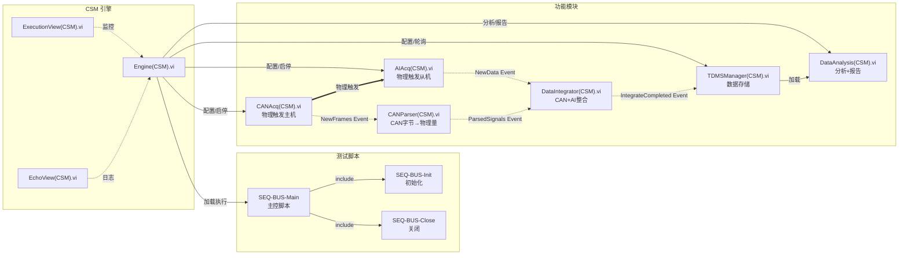

### 7.2 数据流向与两级整合架构图

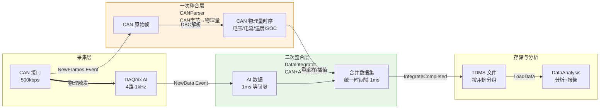

### 7.3 测试系统层次架构图

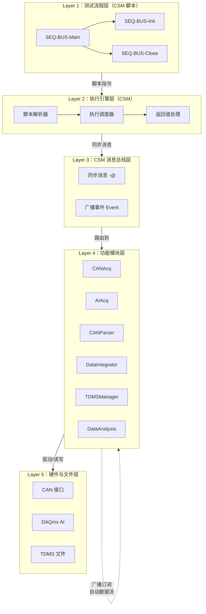

---

## 附录：测试配置说明

### INI 配置文件注入测试参数

通过 CSM 的变量空间功能，从 INI 文件读取硬件资源和路径配置，无需修改脚本：

```c
INI_VAR_SPACE_ENABLE >> TRUE
INI_VAR_SPACE_PATH >> TestConfig.ini
```

**TestConfig.ini 示例：**

```ini
[LabVIEW]
UUT_SN         = BMS_20260226_001
OPERATOR       = TestEngineer
CAN_DEVICE     = CAN0
CAN_BITRATE    = 500000
CAN_TRIG_OUT   = RTSI0
AI_DEVICE      = Dev1
AI_CHANNELS    = ai0,ai1,ai2,ai3
AI_TRIG_IN     = /Dev1/PFI0
DBC_PATH       = C:\TestConfig\BMS.dbc
TDMS_PATH      = C:\TestData\BMS_20260226_001.tdms
```

> **注**：`CAN_TRIG_OUT` 和 `AI_TRIG_IN` 为物理触发线配置，需根据实际硬件连接填写。CAN 卡的触发输出引脚通过信号线连接到 DAQmx AI 采集卡的 PFI 触发输入端，实现硬件级时间同步。

### 相关文档

- [返回值保存传递](#33-返回值保存传递) - 采集结果存入变量并用于日志输出
- [脚本引用功能](#311-脚本引用功能) - `<include>` 子脚本机制
- [锚点跳转](#37-锚点跳转) - 错误安全联锁和跳转控制
- [循环支持](#310-循环支持) - `<if>` + `goto` 轮询等待数据保存完成
- [分支逻辑支持](#39-分支逻辑支持) - 测试结果通过/失败的条件分支
- [变量空间支持](#34-变量空间支持) - INI 配置文件变量注入
- [扩充的指令集](#35-扩充的指令集) - wait / echo / AUTO_ERROR_HANDLE 等内置指令


---

## 5.3 泵出厂测试（实时状态驱动 + 多场景脚本）

本文档以一个 **工业离心泵出厂检验** 场景为例，演示如何在**围绕实时状态（全局 TagDB）进行模块设计**的架构中使用 CSM 管理多个独立的测试场景。各功能模块围绕**全局 TagDB 内存缓存**设计（基于 [LabVIEW-TagDB](https://github.com/NEVSTOP-LAB/LabVIEW-TagDB)）：VirtualPump 模块通过 TCP 与下位机通信并持续更新全局 TagDB，MonitorUI 和 TDMSManager 等功能模块直接读取 TagDB 中的数据，无需通过广播互相沟通；CSM Engine 内置了一套 **TAGDB 系列指令**（`TAGDB_WAIT_FOR_EXPRESSION`、`TAGDB_START_MONITOR_EXPRESSION`、`TAGDB_SWEEP` 等），使脚本可以直接以 TagDB 中的实时物理量为条件进行流程控制——这也是专门设计本场景的原因。

> **与 [CAN/AI 总线测试](#52-总线类自动化测试canai-同步采集) 的对比**：CAN/AI 案例的数据管线由 CSM 广播订阅自动驱动，脚本通过 `echo` 推送状态到 EchoView 显示，测试逻辑以"采集→解析→存储"为主线。本案例的核心是**围绕全局 TagDB 的实时状态驱动**：所有模块共享同一份内存数据，测试逻辑以"等待实际物理量达标"（`TAGDB_WAIT_FOR_EXPRESSION`）和"物理量渐变"（`TAGDB_SWEEP`）为主线；MonitorUI 直接读取 TagDB 自主刷新，与测试脚本完全解耦；后台安全监控（`TAGDB_START_MONITOR_EXPRESSION`）随时保护测试过程。每个测试场景有独立的子脚本文件，可单独运行或通过 `<include>` 按需组合。

---

## 1. 测试场景概述

### 被测设备（UUT）

**某型工业离心泵**，出厂参数如下：

| 参数 | 额定值 |
| ---- | ------ |
| 额定流量 | 50 m³/h |
| 额定扬程 | 30 m（≈ 3.0 bar） |
| 额定转速 | 1450 rpm |
| 电机功率 | 7.5 kW |
| 壳体设计压力 | 6.0 bar |
| 介质 | 清水（20°C） |

出厂测试覆盖三个维度，每个维度有独立的测试场景：

| 场景 | 测试项目 | 说明 |
| ---- | -------- | ---- |
| SC01 | 密封耐压测试 | 施加 1.5× 额定压力（4.5 bar），保压 5 分钟，验证壳体和密封件完整性 |
| SC02 | 脉冲冲击测试 | 施加 100 次快速压力脉冲（0→3.5 bar，上升时间≤0.5s），验证结构抗冲击耐久性，采集冲击波形 |
| SC03 | 额定工况性能测试 | 额定转速（1450 rpm）下运行 30 分钟，验证流量（≥48 m³/h）、效率（≥65%）和电机温升（≤75°C） |

### 系统总体架构

```
┌─────────────────────────────────────────────────────────────────┐
│                  上位机（Windows PC + LabVIEW）                  │
│                                                                  │
│  ┌──────────────────────────────────────────────────────────┐  │
│  │               全局 TagDB（内存共享缓存）                   │  │
│  │   反馈 Tag：PRESSURE_IN/OUT / FLOW_RATE / MOTOR_TEMP /   │  │
│  │             BEARING_TEMP / PUMP_SPEED / ALARM_STATUS     │  │
│  │   设定点 Tag：PRESSURE_SETPOINT / SPEED_SETPOINT         │  │
│  │   （脚本通过 TAGDB_SWEEP 写入 → VirtualPump 转发到下位机） │  │
│  └──────────┬──────────────────────┬────────────────────────┘  │
│             │  直接读               │  周期读 Tag                │
│             ▼                      ▼                            │
│    MonitorUI(CSM).vi        TDMSManager(CSM).vi                 │
│    （自刷新，独立于流程）      （周期读 TagDB + 订阅原始波形帧）    │
│                                    ↑                            │
│  VirtualPump(CSM).vi ─── 原始波形帧广播 ─────────────────────── │
│  （TCP 客户端，程序启动后自动连接，持续写入反馈 Tag，              │
│   监控设定点 Tag 并自动转发到下位机）                              │
│                                                                  │
│  ┌─────────────────────────────────────────────────────────┐   │
│  │  CSM 引擎  |  SEQ-PUMP-SC01/SC02/SC03.csm    │  │
│  │  TAGDB 指令集：TAGDB_SWEEP / TAGDB_WAIT_FOR_EXPRESSION   │  │
│  │                TAGDB_START_MONITOR_EXPRESSION / ...      │  │
│  └─────────────────────────────────────────────────────────┘   │
└─────────────────────────────────────────┬───────────────────────┘
                                          │ TCP/IP (192.168.1.0/24)
┌─────────────────────────────────────────▼───────────────────────┐
│                  下位机（NI CompactRIO / 工控机）                 │
│                                                                  │
│  Modbus TCP/RTU 控制层                  TCP Server（端口 9090）  │
│  ├─ 变频器（VFD）——控制转速             ├─ 接收控制命令          │
│  ├─ 电动调压阀——控制出口压力            ├─ 定时推送 Tag 数据帧   │
│  ├─ 压力传感器（0~10 bar，4~20mA）     └─ 开启时推送波形数据块  │
│  ├─ 温度传感器（PT100）                                         │
│  ├─ 电磁流量计（Modbus）                安全保护（固化在下位机）  │
│  └─ 高速采集卡（冲击压力，最高10kHz）   ├─ 超压（>6.0 bar）     │
│                                         ├─ 超温（>80°C）        │
│                                         └─ 干运行（流量<0.5m³/h）│
└─────────────────────────────────────────────────────────────────┘
```

---

## 2. 测试需求细化

### 2.1 SC01 密封耐压测试

**背景**：泵壳体和密封件在铸造或装配过程中可能存在微小缺陷，密封耐压测试通过施加超额静压来检测这些缺陷。

| 参数 | 值 |
| ---- | -- |
| 试验压力 | 4.5 bar（1.5× 额定压力 3.0 bar） |
| 升压方式 | 分步升压（0.5→1.5→3.0→4.5 bar），每步间隔 60 s |
| 保压时长 | 5 分钟 |
| 合格标准 | 保压期间出口压力下降 ≤ 0.1 bar（无显著泄漏） |
| 温度监控 | 水温及电机温度持续记录（异常触发下位机报警） |
| 安全阈值 | 下位机超压保护 >6.0 bar 自动动作 |

**测量数据类型**：全部为 Tag 数据（1 Hz），由 VirtualPump 写入全局 TagDB，MonitorUI 直接读取实时显示。

### 2.2 SC02 脉冲冲击测试

**背景**：泵在实际运行中频繁启停会产生水锤效应，本测试通过模拟快速压力脉冲验证泵体结构的抗冲击耐久性。

| 参数 | 值 |
| ---- | -- |
| 脉冲幅值 | 0→3.5 bar（超额定压力约 17%，模拟启动水锤） |
| 脉冲上升时间 | ≤ 0.5 s |
| 脉冲次数 | 100 次 |
| 脉冲间隔 | 约 3 s（0.8 s 升压保持 + 2.2 s 泄压等待） |
| 单次峰值压力判据 | 峰值 ≤ 4.2 bar（超过则表明水锤过强，需调整阀门速率） |
| 耐久性判据 | 100 次后密封完好（无下位机报警） |
| 冲击波形采样率 | 2000 Hz（捕获瞬态压力上升和振荡波形） |

**测量数据类型**：
- Tag 数据（1 Hz）：温度、平均压力、脉冲计数——由 VirtualPump 写入全局 TagDB，MonitorUI 直接读取显示
- 连续波形（2 kHz）：冲击压力瞬态波形——由 VirtualPump 广播原始帧，TDMSManager 订阅后保存；高速传感器的最新采样点同步写入 TagDB（`PRESSURE_SHOCK`）

### 2.3 SC03 额定工况性能测试

**背景**：验证泵在额定工况下的水力性能是否符合铭牌参数。

| 参数 | 值 |
| ---- | -- |
| 转速 | 1450 rpm（额定转速） |
| 出口压力设定 | 3.0 bar（额定扬程工况） |
| 运行时长 | 30 分钟（稳态运行验证温升） |
| 流量合格范围 | 48–52 m³/h |
| 效率合格标准 | 水力效率 ≥ 65% |
| 温升合格标准 | 电机绕组温度（30 分钟末）≤ 75°C |
| 采样策略 | 每 5 分钟快照一次关键 Tag 值并保存至 TDMS |

**测量数据类型**：全部为 Tag 数据（1 Hz + 5 分钟快照），由 VirtualPump 写入全局 TagDB，TDMSManager 周期读取并保存 Tag 时序。

### 2.4 测试安全约束

1. **下位机安全自治**：超压（>6.0 bar）、超温（>80°C）、干运行保护固化在下位机，不依赖上位机网络
2. **上位机后台监控**：脚本通过 `TAGDB_START_MONITOR_EXPRESSION` 后台监控 `ALARM_STATUS`，下位机报警时自动触发上位机紧急停止逻辑
3. **测试顺序约束**：SC01 失败不执行后续场景，避免在密封不良的泵上继续冲击测试

---

## 3. 下位机概述

下位机由工业控制器（NI CompactRIO 或工控机 + NI-DAQ）实现，主要功能如下：

- **设备控制**：通过 Modbus TCP/RTU 控制变频器（VFD）调节泵转速（0–1500 rpm）、控制电动调压阀设定出口压力（0–6 bar）
- **数据采集**：采集压力传感器（量程 0–10 bar，精度 ±0.1% FS）、PT100 温度传感器（±0.5°C）、电磁流量计（量程 0–100 m³/h，精度 ±0.5%）；高速压力通道（量程 0–10 bar，最高 10 kHz 采样率，用于冲击波形采集）
- **安全保护**：超压自动触发电动调压阀泄压并停泵；超温停机保护；干运行检测（泵转动但流量 < 0.5 m³/h 时停机）。**安全保护逻辑固化在下位机，不依赖上位机网络**
- **TCP 服务端**：作为 TCP 服务器（端口 9090），接受上位机控制命令，以 1 Hz 主动推送全量 Tag 数据包；开启波形采集模式后，按块推送高速波形数据；下位机报警时在下一帧 Tag 数据包中更新 `ALARM_STATUS` 字段

> **说明**：下位机的具体实现不是本文档的重点。上位机通过 `VirtualPump(CSM).vi` 封装的 TCP 抽象接口与其交互，所有泵控制逻辑和安全保护均由下位机独立完成。

---

## 4. 上位机 CSM 模块设计

上位机的所有功能模块围绕**全局 TagDB 内存缓存**（[LabVIEW-TagDB](https://github.com/NEVSTOP-LAB/LabVIEW-TagDB)）设计。TagDB 是应用程序级的全局共享内存，不是一个独立的 CSM 消息处理模块——各模块直接读写 TagDB，无需通过 CSM 广播互相传递数据。上位机由以下功能模块构成：

| 模块 | 职责简述 |
| ---- | -------- |
| `VirtualPump(CSM).vi` | TCP 客户端，程序启动后自动连接下位机，持续将收到的所有数据写入全局 TagDB，并广播原始波形帧供 TDMSManager 订阅 |
| `TDMSManager(CSM).vi` | 周期性直接读取全局 TagDB（Tag 数据），同时订阅 VirtualPump 的原始波形帧；开始保存后，将所有数据写入 TDMS 文件 |
| `MonitorUI(CSM).vi` | 实时监控界面，配置需要显示的 TagDB Tag 名称后，**完全独立运行**，自主从全局 TagDB 读取数据并刷新界面，不参与脚本流程控制 |

---

### 4.1 VirtualPump 模块 `VirtualPump(CSM).vi`

**职责**：作为下位机的上位机代理（Virtual Pump）。程序启动后自动连接下位机，全程持续接收下位机推送的数据并写入**全局 TagDB**，即使没有在运行测试，也在实时监控设备状态。高速波形数据除最新一个数据点写入 TagDB 外，还会将原始数据帧广播给 TDMSManager 存储。脚本通过 `SendCmd` 消息控制下位机离散命令（启停泵等）；渐变控制（压力/转速斜坡）则通过 `TAGDB_SWEEP` 写入 `PRESSURE_SETPOINT`/`SPEED_SETPOINT` Tag，由 VirtualPump 监测这两个 Tag 变化并自动转发到下位机。

#### 消息(Message)

| 消息 | 说明 | 参数 | 返回值 |
| ---- | ---- | ---- | ------ |
| `"SendCmd"` | 向下位机发送控制命令 | 命令字符串，例如 `START_PUMP`、`STOP_PUMP` | N/A |
| `"StartWaveformAcq"` | 通知下位机启动高速波形采集模式（下位机开始按块推送波形数据） | `SampleRate:<Hz>;Channel:<通道名>` | N/A |
| `"StopWaveformAcq"` | 通知下位机停止高速波形采集 | N/A | 已接收波形样本总数 |

#### 广播(Broadcast)

| 广播 | 说明 | 参数 |
| ---- | ---- | ---- |
| `"WaveformData Event"` | 新一批原始波形帧到达，TDMSManager 订阅后自动保存 | 波形块（时间戳 + 采样值数组） |
| `"Error Occurred"` | TCP 通信错误（写入 TagDB 中的 ALARM_STATUS） | 错误信息（ERRSTR） |

> **说明**：VirtualPump 模块在程序启动时即自动建立 TCP 连接（内部重连机制，无需脚本调用）。所有 Tag 数据（1 Hz 刷新）和高速波形数据的最新采样点，均直接写入全局 TagDB。**VirtualPump 同时监控 TagDB 中的 `PRESSURE_SETPOINT` 和 `SPEED_SETPOINT`——当脚本通过 `TAGDB_SWEEP` 改变这两个 Tag 时，VirtualPump 自动向下位机发送对应的 SET_PRESSURE / SET_SPEED 命令**，实现渐变斜坡控制。

---

### 4.2 全局 TagDB（内存共享缓存）

**TagDB 是整个上位机的全局共享内存**，不是一个独立的 CSM 消息处理模块。VirtualPump、TDMSManager、MonitorUI 以及 CSM Engine 都直接访问同一个 TagDB，无需经过消息路由。

#### 主要数据条目

| Tag 名称 | 类型 | 说明 | 单位 | 更新来源 |
| -------- | ---- | ---- | ---- | -------- |
| `PRESSURE_IN` | Tag | 进口压力 | bar | VirtualPump（1 Hz） |
| `PRESSURE_OUT` | Tag | 出口压力 | bar | VirtualPump（1 Hz） |
| `FLOW_RATE` | Tag | 流量 | m³/h | VirtualPump（1 Hz） |
| `MOTOR_TEMP` | Tag | 电机绕组温度 | °C | VirtualPump（1 Hz） |
| `BEARING_TEMP` | Tag | 轴承温度 | °C | VirtualPump（1 Hz） |
| `WATER_TEMP` | Tag | 介质水温 | °C | VirtualPump（1 Hz） |
| `MOTOR_CURR` | Tag | 电机电流 | A | VirtualPump（1 Hz） |
| `PUMP_SPEED` | Tag | 泵转速（反馈） | rpm | VirtualPump（1 Hz） |
| `ALARM_STATUS` | Tag | 报警状态（0=正常，非0=报警码） | — | VirtualPump（事件触发） |
| `PRESSURE_SHOCK` | Tag | 冲击压力传感器**最新采样点**（高速波形数据的当前值） | bar | VirtualPump（波形帧更新时） |
| `PEAK_PRESSURE_MAX` | Tag | SC02 单次脉冲峰值压力最大值（下位机统计并更新） | bar | VirtualPump（事件触发） |
| `PULSE_COUNT` | Tag | SC02 已完成脉冲次数（由脚本通过 `TAGDB_SET_VALUE` 回写） | — | 脚本 |
| `PRESSURE_SETPOINT` | Tag | 压力设定点（脚本通过 `TAGDB_SWEEP` 写入，VirtualPump 监测并转发到下位机） | bar | 脚本（TAGDB_SWEEP） |
| `SPEED_SETPOINT` | Tag | 转速设定点（脚本通过 `TAGDB_SWEEP` 写入，VirtualPump 监测并转发到下位机） | rpm | 脚本（TAGDB_SWEEP） |
| `PRESSURE_SHOCK` | Waveform | 冲击压力高速波形（2 kHz，SC02 期间持续采集） | bar | VirtualPump（`WaveformData Event`）→ TDMSManager 存储 |

> **注**：`PRESSURE_SHOCK` 在 TagDB 中既有 **Tag 类型**（最新采样点，供脚本实时判断）也有 **Waveform 类型**（完整高速波形，通过 VirtualPump 广播由 TDMSManager 存储到 TDMS）。

---

### 4.3 TDMSManager 模块 `TDMSManager(CSM).vi`

**职责**：负责将测试数据保存到 TDMS 文件。**Tag 数据**通过直接周期性读取全局 TagDB 获得；**波形数据**通过订阅 VirtualPump 的 `"WaveformData Event"` 广播获得。未调用 `StartSave` 时，收到的数据被丢弃；调用 `StartSave` 后，所有数据持续保存到指定的 TDMS 文件。

#### 订阅(Subscribe)

| 订阅目标 | 广播事件 | 自动触发操作 |
| -------- | -------- | ------------ |
| `VirtualPump` | `"WaveformData Event"` | 若当前处于保存中状态，将波形块追加写入 TDMS 波形数据组；否则丢弃 |

#### 消息(Message)

| 消息 | 说明 | 参数 | 返回值 |
| ---- | ---- | ---- | ------ |
| `"StartSave"` | 开始保存：指定文件路径和数据分组名，开启 Tag 周期读取和波形块追加写入 | `FilePath:<路径>;GroupName:<分组名>` | N/A |
| `"StopSave"` | 停止保存并将文件缓冲刷新到磁盘 | N/A | N/A |
| `"GetSaveStatus"` | 查询已保存的波形数据块数量（用于轮询确认写入完成） | N/A | 已保存波形块数 |

---

### 4.4 MonitorUI 模块 `MonitorUI(CSM).vi`

**职责**：提供实时监控界面，在配置好需要显示的 Tag 名称后**完全自主运行**——独立地以固定频率读取全局 TagDB 并刷新界面上的各个显示控件。MonitorUI **不参与脚本流程控制**，脚本无需向其发送消息来驱动界面刷新。界面上还提供"启动单场景测试"和"启动全部测试"的按钮入口。

---

## 5. CSM 测试序列

本案例采用 **3 个独立场景脚本** 的结构。每个场景脚本完全自包含（包含 TAGDB 变量空间设置、TDMS 保存、后台安全监控和紧急停止处理），可单独运行，也可通过 `<include>` 按需组合。**不需要单独的初始化/关闭子脚本**——VirtualPump 在程序启动时已自动连接下位机并持续更新全局 TagDB，TagDB 数据随时就绪。

### 5.1 SC01 密封耐压测试 `SEQ-PUMP-SC01.csm`

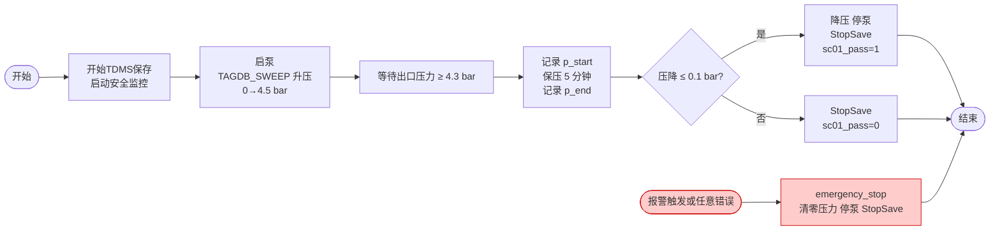

```c
// ============================================================
// SEQ-PUMP-SC01.csm - 密封耐压测试（可单独运行）
// 分步升压 → 保压 5 分钟 → 压降判定
// ============================================================

// 读取 INI 配置（含嵌套变量模板 TDMS_PATH）
INI_VAR_SPACE_ENABLE >> TRUE
INI_VAR_SPACE_PATH >> PumpTestConfig.ini

// 弹出对话框收集本次测试信息（写入临时变量空间，优先级高于 INI，用于拼接 TDMS 路径）
INPUT_DIALOG >> {Label:泵型号;Name:PUMP_TYPE;Prompt:示例型号},{Label:批次号;Name:BATCH;Prompt:2026-02},{Label:操作员;Name:OPERATOR;Prompt:TestEngineer}

// 开启全局 TagDB 变量空间（TagDB 是全局共享内存，VirtualPump 已自动维护最新值）
TAGDB_VAR_SPACE_ENABLE >> TRUE
TAGDB_VAR_SPACE_NAME >> TagDB

// 开启自动错误处理（任意指令出错自动跳转到 <sc01_emergency_stop>）
AUTO_ERROR_HANDLE_ENABLE >> TRUE
AUTO_ERROR_HANDLE_ANCHOR >> <sc01_emergency_stop>

// 开始 TDMS 保存（${TDMS_PATH} 由 INI 嵌套变量解析，自动含泵型号/批次/操作员）
StartSave >> FilePath:${TDMS_PATH};GroupName:SC01_PressureHold -@ TDMSManager

// 启动后台安全监控（在后台持续运行；若 ALARM_STATUS 非零，当前正在执行的 wait 或
// TAGDB_WAIT_FOR_EXPRESSION 会立即报错，AUTO_ERROR_HANDLE 自动跳转到 emergency_stop）
TAGDB_START_MONITOR_EXPRESSION >> exp:ALARM_STATUS != 0

// --- 启泵并使用 TAGDB_SWEEP 将压力从 0 渐变到 4.5 bar（每步 1.5 bar，间隔 1 分钟）---
SendCmd >> START_PUMP -@ VirtualPump
TAGDB_SWEEP >> tag:PRESSURE_SETPOINT; Start:0; Stop:4.5; Step:1.5; interval:1min

// --- 等待出口压力到达 4.3 bar 并稳定 10s（直接以 TagDB 实时值为条件，最长等待 3 分钟）---
TAGDB_WAIT_FOR_EXPRESSION >> exp:PRESSURE_OUT >= 4.3; timeout:3min; settlingTime:10s => sc01_pressurized

// --- 记录保压开始时的出口压力，保压 5 分钟，记录末压力 ---
TAGDB_GET_VALUE >> tag:PRESSURE_OUT => sc01_p_start
wait >> 5min
TAGDB_GET_VALUE >> tag:PRESSURE_OUT => sc01_p_end

// --- 压降判定 ---
expression >> sc01_p_start - sc01_p_end => sc01_pressure_drop
expression >> sc01_pressure_drop <= 0.1 && sc01_pressurized == 1 => sc01_pass

// --- 安全降压至 0 ---
TAGDB_SWEEP >> tag:PRESSURE_SETPOINT; Start:4.5; Stop:0; Step:1.5; interval:30s
SendCmd >> STOP_PUMP -@ VirtualPump

// 停止后台安全监控，停止 TDMS 保存
TAGDB_STOP_MONITOR_EXPRESSION >> exp:ALARM_STATUS != 0
StopSave >> -@ TDMSManager
goto >> <sc01_done>

// --- 紧急停止（后台安全监控触发或脚本错误） ---
<sc01_emergency_stop>
TAGDB_SET_VALUE >> tag:PRESSURE_SETPOINT; value:0
SendCmd >> STOP_PUMP -@ VirtualPump
StopSave >> -@ TDMSManager

<sc01_done>
```

---

### 5.2 SC02 脉冲冲击测试 `SEQ-PUMP-SC02.csm`

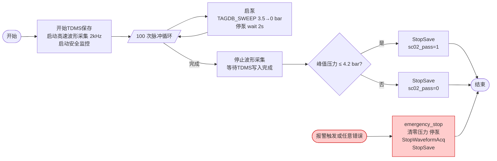

```c
// ============================================================
// SEQ-PUMP-SC02.csm - 脉冲冲击测试（可单独运行）
// 100 次快速压力脉冲 + 2 kHz 冲击波形采集
// ============================================================

// 读取 INI 配置（含嵌套变量模板 TDMS_PATH）
INI_VAR_SPACE_ENABLE >> TRUE
INI_VAR_SPACE_PATH >> PumpTestConfig.ini

// 弹出对话框收集本次测试信息（写入临时变量空间，优先级高于 INI，用于拼接 TDMS 路径）
INPUT_DIALOG >> {Label:泵型号;Name:PUMP_TYPE;Prompt:示例型号},{Label:批次号;Name:BATCH;Prompt:2026-02},{Label:操作员;Name:OPERATOR;Prompt:TestEngineer}

TAGDB_VAR_SPACE_ENABLE >> TRUE
TAGDB_VAR_SPACE_NAME >> TagDB
AUTO_ERROR_HANDLE_ENABLE >> TRUE
AUTO_ERROR_HANDLE_ANCHOR >> <sc02_emergency_stop>

// 开始 TDMS 保存，启动高速波形采集（${TDMS_PATH} 由 INI 嵌套变量解析）
StartSave >> FilePath:${TDMS_PATH};GroupName:SC02_ImpactShock -@ TDMSManager
StartWaveformAcq >> SampleRate:2000;Channel:PRESSURE_SHOCK -@ VirtualPump

// 启动后台安全监控（在后台持续运行，全程保护；出错时 wait 会立即报错跳转）
TAGDB_START_MONITOR_EXPRESSION >> exp:ALARM_STATUS != 0

// --- 初始化脉冲计数器（写入全局 TagDB，MonitorUI 自动显示进度）---
expression >> 0 => sc02_pulse_count
TAGDB_SET_VALUE >> tag:PULSE_COUNT; value:0

// --- 执行 100 次脉冲：使用 TAGDB_SWEEP 将压力从 3.5 bar 扫描到 0（上升/下降各 1 步）---
<while sc02_pulse_count < 100>
    SendCmd >> START_PUMP -@ VirtualPump
    TAGDB_SWEEP >> tag:PRESSURE_SETPOINT; Start:3.5; Stop:0; Points:2; interval:200ms
    SendCmd >> STOP_PUMP -@ VirtualPump
    wait >> 2s

    expression >> sc02_pulse_count + 1 => sc02_pulse_count
    TAGDB_SET_VALUE >> tag:PULSE_COUNT; value:${sc02_pulse_count}
<end_while>

// --- 停止波形采集，等待 TDMS 写入完成 ---
StopWaveformAcq >> -@ VirtualPump => sc02_wave_samples
<while 1>
    GetSaveStatus >> -@ TDMSManager => sc02_saved_blocks
    <if sc02_saved_blocks >= sc02_pulse_count>
        BREAK
    <end_if>
    wait >> 500ms
<end_while>

// --- 判定 ---
TAGDB_GET_VALUE >> tag:PEAK_PRESSURE_MAX => sc02_peak_pressure
expression >> sc02_peak_pressure <= 4.2 && sc02_pulse_count == 100 => sc02_pass

TAGDB_STOP_MONITOR_EXPRESSION >> exp:ALARM_STATUS != 0
StopSave >> -@ TDMSManager
goto >> <sc02_done>

<sc02_emergency_stop>
TAGDB_SET_VALUE >> tag:PRESSURE_SETPOINT; value:0
SendCmd >> STOP_PUMP -@ VirtualPump
StopWaveformAcq >> -@ VirtualPump
StopSave >> -@ TDMSManager

<sc02_done>
```

---

### 5.3 SC03 额定工况性能测试 `SEQ-PUMP-SC03.csm`

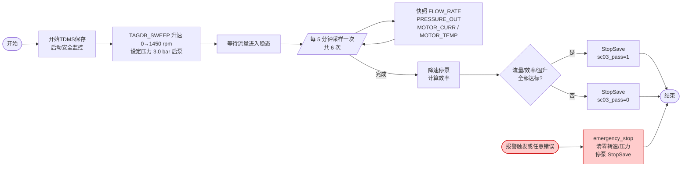

```c
// ============================================================
// SEQ-PUMP-SC03.csm - 额定工况性能测试（可单独运行）
// 1450 rpm 运行 30 分钟，验证流量/效率/温升
// ============================================================

// 读取 INI 配置（含嵌套变量模板 TDMS_PATH）
INI_VAR_SPACE_ENABLE >> TRUE
INI_VAR_SPACE_PATH >> PumpTestConfig.ini

// 弹出对话框收集本次测试信息（写入临时变量空间，优先级高于 INI，用于拼接 TDMS 路径）
INPUT_DIALOG >> {Label:泵型号;Name:PUMP_TYPE;Prompt:示例型号},{Label:批次号;Name:BATCH;Prompt:2026-02},{Label:操作员;Name:OPERATOR;Prompt:TestEngineer}

TAGDB_VAR_SPACE_ENABLE >> TRUE
TAGDB_VAR_SPACE_NAME >> TagDB
AUTO_ERROR_HANDLE_ENABLE >> TRUE
AUTO_ERROR_HANDLE_ANCHOR >> <sc03_emergency_stop>

// 开始 TDMS 保存（${TDMS_PATH} 由 INI 嵌套变量解析，自动含泵型号/批次/操作员）
StartSave >> FilePath:${TDMS_PATH};GroupName:SC03_RatedPerf -@ TDMSManager

// 启动后台安全监控（在后台持续运行，全程保护）
TAGDB_START_MONITOR_EXPRESSION >> exp:ALARM_STATUS != 0

// --- 使用 TAGDB_SWEEP 将转速从 0 渐变到 1450 rpm，同时设定额定出口压力 ---
TAGDB_SWEEP >> tag:SPEED_SETPOINT; Start:0; Stop:1450; Points:3; interval:30s
SendCmd >> START_PUMP -@ VirtualPump
TAGDB_SET_VALUE >> tag:PRESSURE_SETPOINT; value:3.0

// --- 等待流量进入稳态 ---
TAGDB_WAIT_FOR_STABLE >> tag:FLOW_RATE; timeout:2min; Period:10s

// --- 每 5 分钟采集一次快照，运行 30 分钟（共 6 次）---
expression >> 0 => sc03_sample_count
<while sc03_sample_count < 6>
    wait >> 5min
    TAGDB_GET_VALUE >> tag:FLOW_RATE => sc03_flow
    TAGDB_GET_VALUE >> tag:PRESSURE_OUT => sc03_pressure
    TAGDB_GET_VALUE >> tag:MOTOR_CURR => sc03_current
    TAGDB_GET_VALUE >> tag:MOTOR_TEMP => sc03_temp
    // η ≈ Q[m³/h] × P[bar] × 4.97 / I[A]
    expression >> sc03_flow * sc03_pressure * 4.97 / sc03_current => sc03_efficiency
    expression >> sc03_sample_count + 1 => sc03_sample_count
<end_while>

// --- 停泵降速 ---
TAGDB_SWEEP >> tag:SPEED_SETPOINT; Start:1450; Stop:0; Points:3; interval:30s
SendCmd >> STOP_PUMP -@ VirtualPump

// --- 判定 ---
expression >> sc03_flow >= 48 && sc03_flow <= 52 => sc03_flow_pass
expression >> sc03_temp <= 75 => sc03_temp_pass
expression >> sc03_efficiency >= 65 => sc03_eff_pass
expression >> sc03_flow_pass && sc03_temp_pass && sc03_eff_pass => sc03_pass

TAGDB_STOP_MONITOR_EXPRESSION >> exp:ALARM_STATUS != 0
StopSave >> -@ TDMSManager
goto >> <sc03_done>

<sc03_emergency_stop>
TAGDB_SET_VALUE >> tag:SPEED_SETPOINT; value:0
TAGDB_SET_VALUE >> tag:PRESSURE_SETPOINT; value:0
SendCmd >> STOP_PUMP -@ VirtualPump
StopSave >> -@ TDMSManager

<sc03_done>
```

---

## 6. CSM 优势说明

### 6.1 CSM 优势

| CSM 优势 | 说明 |
| -------------- | ---- |
| **多场景管理灵活** | 每个场景独立一个子脚本，`<include>` 灵活组合，新增/删除场景只需添加/删除文件 |
| **参数调整便捷** | 参数直接写在脚本中或通过 INI 文件注入，修改即生效，无需重新编译 |
| **内存数据驱动 UI** | 全局 TagDB 作为共享内存，MonitorUI 直接读取自主刷新，新增显示项无需改脚本 |
| **精确条件等待** | `TAGDB_WAIT_FOR_EXPRESSION`、`TAGDB_WAIT_FOR_STABLE`、`TAGDB_SWEEP` 以实际物理量为等待和渐变条件 |
| **后台安全监控** | `TAGDB_START_MONITOR_EXPRESSION` 一行启动后台监控，异常自动跳到 `<emergency_stop>` |
| **通信封装解耦** | VirtualPump 模块封装所有 TCP 细节并持续自动重连，脚本只调用语义化消息 |
| **可读性强** | 脚本接近自然语言，工艺工程师可直接阅读和调整测试参数 |
| **版本管理友好** | 纯文本脚本，Git diff 清晰，支持 Code Review |

### 6.2 关键功能应用亮点

- **[脚本引用功能](#311-脚本引用功能)**：3 个场景脚本各自完全独立，可按测试阶段单独运行；也可通过 `<include>` 自由组合为任意顺序的测试流程，新增/删除场景只需添加/删除文件
- **[循环支持](#310-循环支持)**：`<while sc02_pulse_count < 100>` 实现精确的 100 次脉冲循环；`<while 1> ... BREAK` 实现数据写入进度等待
- **[变量空间支持](#34-变量空间支持)**：`TAGDB_VAR_SPACE_ENABLE` 开启后，脚本通过全局 TagDB 变量空间直接访问 VirtualPump 实时写入的物理量；`INI_VAR_SPACE_ENABLE` 支持配置文件注入
- **[扩充的指令集](#35-扩充的指令集)**：`TAGDB_WAIT_FOR_EXPRESSION`（等待压力达到目标值）、`TAGDB_WAIT_FOR_STABLE`（等待流量进入稳态）、`TAGDB_SWEEP`（压力/转速渐变斜坡控制）、`TAGDB_START_MONITOR_EXPRESSION`（后台报警安全监控）
- **[分支逻辑支持](#39-分支逻辑支持)**：各场景脚本内部用 `<if>` 判断测试结果，异常时通过 `goto >> <emergency_stop>` 立即进入应急路径
- **[表达式判断支持](#36-表达式支持)**：`expression >>` 内联计算压降（`sc01_p_start - sc01_p_end`）、水力效率（`flow × pressure × 4.97 / current`）等复合条件
- **[锚点跳转](#37-锚点跳转)**：`AUTO_ERROR_HANDLE_ANCHOR >> <emergency_stop>` 配合 `TAGDB_START_MONITOR_EXPRESSION` 实现"下位机报警即停机"的全自动安全保护

---

## 7. 模块架构图

### 7.1 系统模块关系图

下图展示各功能模块之间的关系。**全局 TagDB** 是核心的共享内存缓存，VirtualPump 持续写入（从下位机读取数据 + 监控脚本写入的设定点），MonitorUI、TDMSManager 和 CSM Engine 直接读取。功能模块之间不通过广播互相通信。

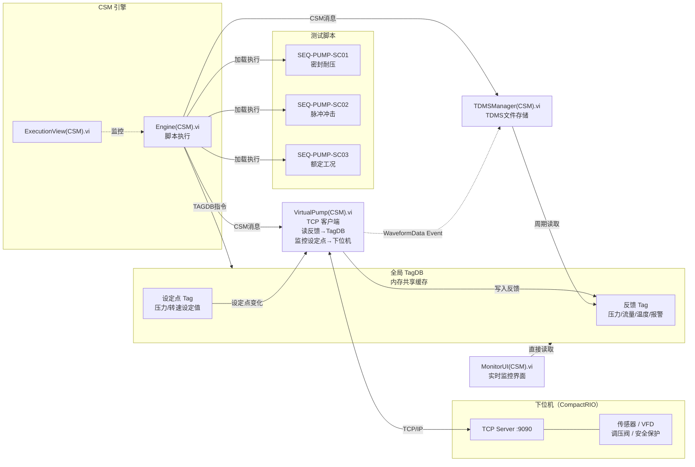

### 7.2 TagDB 数据流

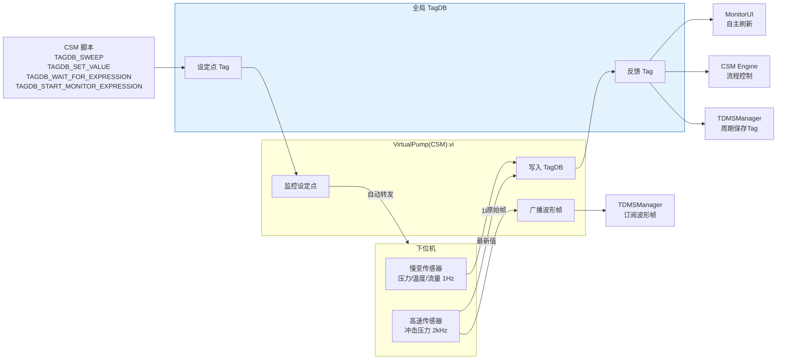

---

## 附录：测试配置说明

### 动态 TDMS 路径：INPUT_DIALOG + INI 嵌套变量

利用 CSM 内置的 `INPUT_DIALOG` 指令，让测试人员在测试开始前输入泵型号、批次和操作员信息，再通过 [CSM-INI-Static-Variable-Support](https://github.com/NEVSTOP-LAB/CSM-INI-Static-Variable-Support?tab=readme-ov-file#nested-variables) 的**嵌套变量**功能，将上述输入自动拼接成本次测试专属的 TDMS 文件路径：

**PumpTestConfig.ini（含嵌套变量模板）：**

```ini
[LabVIEW]
; 以下三项由 INPUT_DIALOG 收集后写入，或直接在此填写默认值
PUMP_TYPE = 示例型号
BATCH     = 2026-02
OPERATOR  = TestEngineer
; 嵌套变量：${PUMP_TYPE}、${BATCH}、${OPERATOR} 在运行时自动解析
TDMS_PATH = C:\TestData\${PUMP_TYPE}\${BATCH}\${OPERATOR}.tdms
```

**脚本中的用法（在各 SC 脚本最开头）：**

```c
// 开启配置变量空间（读取 INI 模板）
INI_VAR_SPACE_ENABLE >> TRUE
INI_VAR_SPACE_PATH >> PumpTestConfig.ini

// 弹出对话框让测试人员输入本次测试信息（存入临时变量空间）
INPUT_DIALOG >> {Label:泵型号;Name:PUMP_TYPE;Prompt:示例型号},{Label:批次号;Name:BATCH;Prompt:2026-02},{Label:操作员;Name:OPERATOR;Prompt:TestEngineer}

// ${TDMS_PATH} 由 INI 嵌套变量自动解析：先读取 TDMS_PATH 的值
// 再将其中的 ${PUMP_TYPE}、${BATCH}、${OPERATOR} 替换为 INPUT_DIALOG 收集到的值
// 最终生成：C:\TestData\示例型号\2026-02\TestEngineer.tdms
StartSave >> FilePath:${TDMS_PATH};GroupName:SC01_PressureHold -@ TDMSManager
```

> **说明**：`INPUT_DIALOG` 收集的结果写入临时变量空间，优先级高于 INI 配置变量空间，因此 INI 模板中的 `${PUMP_TYPE}` 等会优先使用测试人员本次的输入值，无需每次修改 INI 文件。

### 相关文档

- [脚本引用功能](#311-脚本引用功能) - `<include>` 多场景子脚本组合机制
- [循环支持](#310-循环支持) - `<while>` 循环控制脉冲计数和轮询等待
- [变量空间支持](#34-变量空间支持) - TagDB 变量空间和 INI 配置注入
- [扩充的指令集](#35-扩充的指令集) - TAGDB_SWEEP / TAGDB_WAIT_FOR_EXPRESSION / TAGDB_WAIT_FOR_STABLE / TAGDB_START_MONITOR_EXPRESSION
- [分支逻辑支持](#39-分支逻辑支持) - 场景失败跳转控制
- [表达式判断支持](#36-表达式支持) - 压降、效率等复合条件计算
- [锚点跳转](#37-锚点跳转) - AUTO_ERROR_HANDLE_ANCHOR 紧急停止锚点


# 附录

## 附录 A: 文档变更历史

| 版本    | 日期 | 说明                                                   |
| ------- | ---- | ------------------------------------------------------ |
| 0.3.2   | 2026 | 新增第一章操作系统支持章节（1.3 节）                   |
| 0.3.1   | 2026 | 新增脚本结构章节，介绍预定义区域与脚本区域；新增配置覆盖逻辑说明；更新各章节中有关预定义区域初始化的 NOTE 说明；新增 TS: Highlight Exec 消息说明；补充界面组件广播表；新增 CSMApp 截图；修正 3.6 节函数表格（移除不可用的 rnd 函数，新增 WARNING 说明）；修正 EnableDebugWindow 配置项描述；新增授权说明 OS 支持说明（仅支持 Windows，Linux/NI RT 需定制） |
| 0.3.0   | 2026 | 将项目名称从 CSMStand 更名为 CSM；同步更新所有文档引用；新增 CSMApp 配置项章节；更新泵出厂测试章节标题；修正案例章节 mermaid 流程图换行符格式 |
| 0.2.0.1 | 2026 | 为各章节间隐含引用添加内部跳转链接；版本对比表格功能名称添加章节跳转链接；新增第五章案例（PCB自动化测试、总线类自动化测试、泵出厂测试） |
| 0.2.0   | 2026 | 新增CSM接口参考、授权说明、界面显示章节；新增执行界面和ECHO信息窗口文档；新增RANDOM/TAGDB数据操作指令文档；完善返回值保存传递、扩充指令集等章节；为各章节间隐含引用添加内部跳转链接 |
| 0.1.2   | 2026 | 初始版本，包含所有已完成的功能文档                     |

## 附录 B: 参考资料

- [CSM框架文档](https://github.com/NEVSTOP-LAB/Communicable-State-Machine)
- [CSM-INI-Static-Variable-Support](https://github.com/NEVSTOP-LAB/CSM-INI-Static-Variable-Support)
- [muparser文档](https://beltoforion.de/en/muparser/)

---

**本手册结束**

[📖 Wiki Home](https://github.com/NEVSTOP-LAB/CSM/wiki) | [🏠 CSM Repo](https://github.com/NEVSTOP-LAB/CSM) | [🏢 NEVSTOP-LAB](https://github.com/NEVSTOP-LAB) | [⚙️ CSM Framework](https://github.com/NEVSTOP-LAB/Communicable-State-Machine) | [📚 CSM Wiki](https://github.com/NEVSTOP-LAB/Communicable-State-Machine/wiki) | [🔑 授权说明](https://github.com/NEVSTOP-LAB/CSM/wiki/engine-license)

_Powered by CSM, NEVSTOP-LAB_

_CSM 用户手册 - 版本 0.3.2_
_Copyright © 2026 NEVSTOP-LAB_
