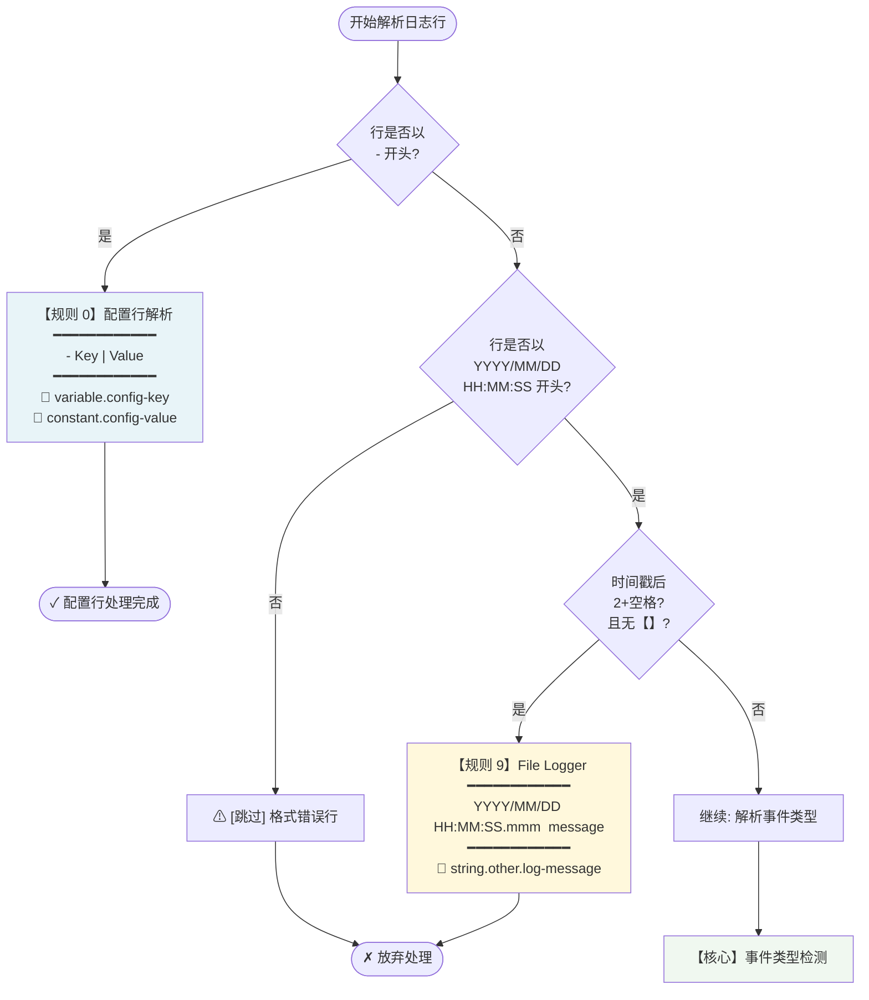
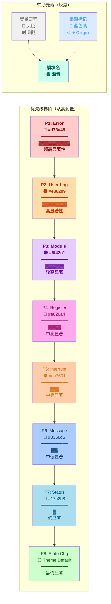
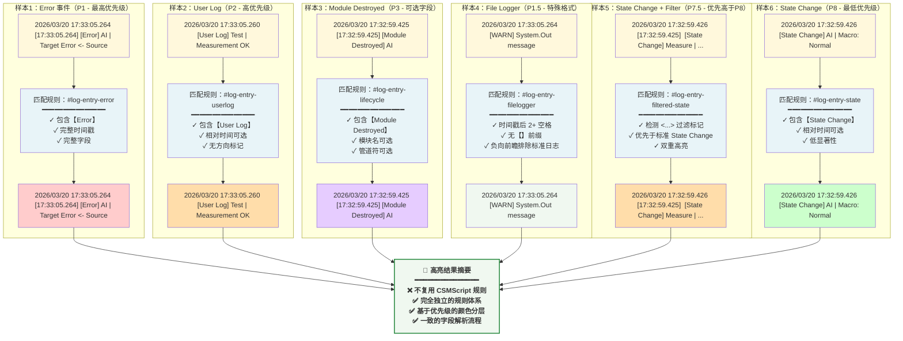

# CSMLog 高亮显示设计文档

> **功能：** .csmlog 文件语法高亮的独立规则设计
> **关联设计：** [csmlog-support-design.md](./csmlog-support-design.md)
> **创建日期：** 2026-03-29
> **状态：** 🚧 进行中

---

## 目录

1. [设计目标](#1-设计目标)
2. [高亮策略](#2-高亮策略)
3. [独立规则体系](#3-独立规则体系)
4. [规则匹配流程](#4-规则匹配流程)
5. [颜色配置](#5-颜色配置)
6. [实现细节](#6-实现细节)
7. [测试用例](#7-测试用例)

---

## 1. 设计目标

### 1.1 核心需求

- **独立于 CSMScript**：完全不复用 `csmscript.tmLanguage.json` 的规则
- **优先级驱动**：根据日志事件优先级进行着色分层
- **模块化规则**：易于维护和扩展
- **可视化设计流程**：用流程图清晰表达规则匹配逻辑

### 1.2 设计原则

| 原则 | 说明 |
|-----|------|
| **优先级分层** | 不同事件类型使用不同颜色，优先级越高越显著 |
| **结构化匹配** | 从行首匹配时间戳开始，按字段顺序递进 |
| **完全独立** | 日志内容的任何代码片段不需要 CSMScript 语法高亮 |
| **简化认知** | 用户只需关注事件优先级和日志内容，不需理解代码语法细节 |

---

## 2. 高亮策略

### 2.1 层级架构

```
┌─────────────────────────────────────────────────────┐
│          CSMLog 高亮层级架构                          │
├─────────────────────────────────────────────────────┤
│                                                      │
│  第1层：行类型识别（配置行 vs 日志行）              │
│  └─ 配置行：^- Key | Value                          │
│  └─ 日志行：具有时间戳结构的日志                    │
│                                                      │
│  第2层：事件类型匹配（按优先级）                    │
│  ├─ [Error]  → Priority 1（最显著）               │
│  ├─ [User Log] → Priority 2                        │
│  ├─ [Module Created/Destroyed] → Priority 3        │
│  ├─ [Register/Unregister] → Priority 4             │
│  ├─ [Interrupt] → Priority 5                        │
│  ├─ [Sync/Async Message] → Priority 6              │
│  ├─ [Status] → Priority 7                          │
│  └─ [State Change] → Priority 8（最不显著）        │
│                                                      │
│  第3层：字段高亮（时间戳、模块名、内容）          │
│  ├─ 绝对时间戳：YYYY/MM/DD HH:MM:SS.mmm           │
│  ├─ 相对时间戳：[HH:MM:SS.mmm]                    │
│  ├─ 模块名：[事件类型] 之后的标识符                │
│  ├─ 日志内容：管道符 | 之后的文本                  │
│  └─ 源标记：<- ModuleName 格式                     │
│                                                      │
└─────────────────────────────────────────────────────┘
```

### 2.2 规则作用域

| 规则范围 | 复杂度 | 说明 |
|---------|--------|------|
| **配置行** | 低 | 简单的 Key\|Value 格式，无子规则 |
| **日志标头** | 高 | 时间戳+事件类型+模块名，需精确匹配 |
| **日志内容** | 中 | 纯文本处理，无 CSMScript 语法依赖 |
| **参数键前缀** | 低 | `key:` / `key2:` 前缀（含 `;` 分隔与 `{}` 包裹）使用粗斜体强调 |

---

## 3. 独立规则体系

### 3.1 配置行规则

**匹配模式：**
```regex
^-\s+([^|]+)\s+\|\s+(.+)$
```

**捕获组：**
- Group 1：配置键（Config Key）— `variable.other.config-key.csmlog`
- Group 2：配置值（Config Value）— `constant.other.config-value.csmlog`

**示例匹配：**
```csmlog
- PeriodicLog.Enable | 1
┌──────────────────────┘ ┌──────┘
    Config Key         Config Value
```

---

### 3.2 日志行规则体系

#### 规则1：Error 事件（Priority 1）

**模式：**
```regex
^(\d{4}/\d{2}/\d{2}\s+\d{2}:\d{2}:\d{2}\.\d{3})\s+(\[\d{2}:\d{2}:\d{2}\.\d{3}\])\s+(\[Error\])\s+([^|]+?)\s+\|
```

**捕获组：**
| 组 | 名称 | Token 类型 | 说明 |
|---|------|-----------|------|
| 1 | 绝对时间戳 | `comment.line.timestamp.date.csmlog` | YYYY/MM/DD HH:MM:SS.mmm |
| 2 | 相对时间戳 | `comment.line.timestamp.time.csmlog` | [HH:MM:SS.mmm] |
| 3 | 事件类型 | `invalid.illegal.event-type.error.csmlog` | **[Error]** —亮红色 |
| 4 | 模块名 | `entity.name.namespace.module.csmlog` | 模块标识符 |

**可视化示例：**
```
2026/03/20 17:33:05.264 [17:33:05.264] [Error] AI | Target Error
│                       │                 │        │
└─ Group 1(时间戳)     └─ Group 2        │       └─ Group 4(模块名)
                         [相对时间]     └─ Group 3([Error])

着色效果：
- Group 1,2：灰色（时间背景信息）
- Group 3：亮红色加粗（错误优先级最高）
- Group 4：深青色加粗（模块标识）
- 内容：默认（Black）
```

---

#### 规则2：User Log 事件（Priority 2）

**模式：**
```regex
^(\d{4}/\d{2}/\d{2}\s+\d{2}:\d{2}:\d{2}\.\d{3})(?:\s+(\[\d{2}:\d{2}:\d{2}\.\d{3}\]))?\s+(\[User Log\])\s+([^|]+?)\s+\|
```

**捕获组：**
| 组 | 名称 | Token 类型 | 说明 |
|---|------|-----------|------|
| 1 | 绝对时间戳 | `comment.line.timestamp.date.csmlog` | YYYY/MM/DD HH:MM:SS.mmm |
| 2 | 相对时间戳 | `comment.line.timestamp.time.csmlog` | [HH:MM:SS.mmm]（可选） |
| 3 | 事件类型 | `markup.changed.event-type.userlog.csmlog` | **[User Log]** —橙红色加粗 |
| 4 | 模块名 | `entity.name.namespace.module.csmlog` | 模块标识符 |

**特殊处理：** 相对时间戳字段可能缺失（Pattern 中使用 `(?:...)?` 非捕获组）

---

#### 规则3：Module 生命周期事件（Priority 3）

**模式：**
```regex
^(\d{4}/\d{2}/\d{2}\s+\d{2}:\d{2}:\d{2}\.\d{3})(?:\s+(\[\d{2}:\d{2}:\d{2}\.\d{3}\]))?\s+(\[(?:Module Created|Module Destroyed)\])(?:\s+([^|]+?)(?:\s+\||$))?
```

**捕获组：**
| 组 | 名称 | Token 类型 | 说明 |
|---|------|-----------|------|
| 1 | 绝对时间戳 | `comment.line.timestamp.date.csmlog` | YYYY/MM/DD HH:MM:SS.mmm |
| 2 | 相对时间戳 | `comment.line.timestamp.time.csmlog` | [HH:MM:SS.mmm]（可选） |
| 3 | 事件类型 | `keyword.control.event-type.lifecycle.csmlog` | **[Module Created/Destroyed]** —紫色加粗 |
| 4 | 模块名 | `entity.name.namespace.module.csmlog` | 模块标识符（Module Destroyed 时可选） |

**特殊处理：** Module Destroyed 可能没有模块名和管道符字段

---

#### 规则4：Register/Unregister 事件（Priority 4）

**模式：**
```regex
^(\d{4}/\d{2}/\d{2}\s+\d{2}:\d{2}:\d{2}\.\d{3})\s+(\[\d{2}:\d{2}:\d{2}\.\d{3}\])\s+(\[(?:Register|Unregister)\])\s+([^|]+?)\s+\|
```

**捕获组：**
| 组 | 名称 | Token 类型 | 说明 |
|---|------|-----------|------|
| 1 | 绝对时间戳 | `comment.line.timestamp.date.csmlog` | YYYY/MM/DD HH:MM:SS.mmm |
| 2 | 相对时间戳 | `comment.line.timestamp.time.csmlog` | [HH:MM:SS.mmm] |
| 3 | 事件类型 | `storage.type.event-type.register.csmlog` | **[Register/Unregister]** —洋红色 |
| 4 | 模块名 | `entity.name.namespace.module.csmlog` | 模块标识符 |

---

#### 规则5：Interrupt 事件（Priority 5）

**模式：**
```regex
^(\d{4}/\d{2}/\d{2}\s+\d{2}:\d{2}:\d{2}\.\d{3})\s+(\[\d{2}:\d{2}:\d{2}\.\d{3}\])\s+(\[Interrupt\])\s+([^|]+?)\s+\|
```

**捕获组：**
| 组 | 名称 | Token 类型 | 说明 |
|---|------|-----------|------|
| 1 | 绝对时间戳 | `comment.line.timestamp.date.csmlog` | YYYY/MM/DD HH:MM:SS.mmm |
| 2 | 相对时间戳 | `comment.line.timestamp.time.csmlog` | [HH:MM:SS.mmm] |
| 3 | 事件类型 | `keyword.control.event-type.interrupt.csmlog` | **[Interrupt]** —琥珀色 |
| 4 | 模块名 | `entity.name.namespace.module.csmlog` | 模块标识符 |

---

#### 规则6：Message 事件（Priority 6）

**模式：**
```regex
^(\d{4}/\d{2}/\d{2}\s+\d{2}:\d{2}:\d{2}\.\d{3})\s+(\[\d{2}:\d{2}:\d{2}\.\d{3}\])\s+(\[(?:Sync Message|Async Message|No-Rep Async Message)\])\s+([^|]+?)\s+\|
```

**捕获组：**
| 组 | 名称 | Token 类型 | 说明 |
|---|------|-----------|------|
| 1 | 绝对时间戳 | `comment.line.timestamp.date.csmlog` | YYYY/MM/DD HH:MM:SS.mmm |
| 2 | 相对时间戳 | `comment.line.timestamp.time.csmlog` | [HH:MM:SS.mmm] |
| 3 | 事件类型 | `keyword.other.event-type.message.csmlog` | **[Sync/Async Message]** —蓝色 |
| 4 | 模块名 | `entity.name.namespace.module.csmlog` | 消息 ID / 模块名 |

---

#### 规则7：Status 事件（Priority 7）

**模式：**
```regex
^(\d{4}/\d{2}/\d{2}\s+\d{2}:\d{2}:\d{2}\.\d{3})\s+(\[\d{2}:\d{2}:\d{2}\.\d{3}\])\s+(\[Status\])\s+([^|]+?)\s+\|
```

**捕获组：**
| 组 | 名称 | Token 类型 | 说明 |
|---|------|-----------|------|
| 1 | 绝对时间戳 | `comment.line.timestamp.date.csmlog` | YYYY/MM/DD HH:MM:SS.mmm |
| 2 | 相对时间戳 | `comment.line.timestamp.time.csmlog` | [HH:MM:SS.mmm] |
| 3 | 事件类型 | `entity.name.tag.event-type.status.csmlog` | **[Status]** —青色 |
| 4 | 模块名 | `entity.name.namespace.module.csmlog` | 模块标识符 |

---

#### 规则8：State Change 事件（Priority 8 — 标准）

**模式：**
```regex
^(\d{4}/\d{2}/\d{2}\s+\d{2}:\d{2}:\d{2}\.\d{3})(?:\s+(\[\d{2}:\d{2}:\d{2}\.\d{3}\]))?\s*(\[State Change\])\s*([^|]+?)\s*\|
```

**捕获组：**
| 组 | 名称 | Token 类型 | 说明 |
|---|------|-----------|------|
| 1 | 绝对时间戳 | `meta.log.event-type.state.csmlog` | YYYY/MM/DD HH:MM:SS.mmm（与事件同 scope） |
| 2 | 相对时间戳 | `meta.log.event-type.state.csmlog` | [HH:MM:SS.mmm]（可选，与事件同 scope） |
| 3 | 事件类型 | `meta.log.event-type.state.csmlog` | **[State Change]** —默认颜色（不专门着色） |
| 4 | 模块名 | `entity.name.namespace.module.csmlog` | 模块标识符 |

---

#### 规则8.5：State Change 事件（Priority 7.5 — 带过滤标记）

**用途：** 优先级高于标准 State Change，用于区分带 `<...>` 过滤标记的日志

**模式：**
```regex
^(\d{4}/\d{2}/\d{2}\s+\d{2}:\d{2}:\d{2}\.\d{3})(?:\s+(\[\d{2}:\d{2}:\d{2}\.\d{3}\]))?\s*(<[^>]+>)\s*(\[State Change\])\s*([^|]+?)\s*\|
```

**捕获组：**
| 组 | 名称 | Token 类型 | 说明 |
|---|------|-----------|------|
| 1 | 绝对时间戳 | `meta.log.event-type.state.csmlog` | YYYY/MM/DD HH:MM:SS.mmm（与事件同 scope） |
| 2 | 相对时间戳 | `meta.log.event-type.state.csmlog` | [HH:MM:SS.mmm]（可选，与事件同 scope） |
| 3 | 过滤标记 | `meta.log.event-type.state.csmlog` | `<filter-name>` —默认颜色（与 State Change 一致） |
| 4 | 事件类型 | `meta.log.event-type.state.csmlog` | **[State Change]** —默认颜色（不专门着色） |
| 5 | 模块名 | `entity.name.namespace.module.csmlog` | 模块标识符 |

**示例：**
```csmlog
2026/03/20 17:32:59.426 [17:32:59.425] <initialize> [State Change] AI | Macro: Initialize
                                        └────┬────┘
                                     Group 3: 过滤标记
```

---

#### 规则9：File Logger 条目（Priority 1.5）

**用途：** 匹配 CSM 内部 File Logger 直接写入的日志（无 [EventType] 字段）

**模式：**
```regex
^(\d{4}/\d{2}/\d{2}\s+\d{2}:\d{2}:\d{2}\.\d{3})\s{2,}(?!\[)(.+)$
```

**说明：**
- 时间戳后跟 **2个或更多空格**
- 负向前瞻 `(?!\[)` 确保不匹配正常的 `[HH:MM:SS.mmm]` 或 `[EventType]`

**捕获组：**
| 组 | 名称 | Token 类型 | 说明 |
|---|------|-----------|------|
| 1 | 绝对时间戳 | `comment.line.timestamp.date.csmlog` | YYYY/MM/DD HH:MM:SS.mmm |
| 2 | 日志消息 | `string.other.log-message.filelogger.csmlog` | File Logger 消息 |

---

#### 规则10：未知事件类型（Fallback）

**用途：** 捕获日志对象能够识别的任何未来类型或自定义事件

**模式：**
```regex
^(\d{4}/\d{2}/\d{2}\s+\d{2}:\d{2}:\d{2}\.\d{3})(?:\s+(\[\d{2}:\d{2}:\d{2}\.\d{3}\]))?\s+(\[[^\]]+\])(?:\s+([^|]+?)(?:\s+\||$))?
```

**捕获组：**
| 组 | 名称 | Token 类型 | 说明 |
|---|------|-----------|------|
| 1 | 绝对时间戳 | `comment.line.timestamp.date.csmlog` | YYYY/MM/DD HH:MM:SS.mmm |
| 2 | 相对时间戳 | `comment.line.timestamp.time.csmlog` | [HH:MM:SS.mmm]（可选） |
| 3 | 事件类型 | `support.type.event-type.other.csmlog` | **[Unknown Type]** —中立色 |
| 4 | 模块名 | `entity.name.namespace.module.csmlog` | 模块标识符 |

---

### 3.3 日志内容 Marker 规则

#### 规则：源标记（Origin Marker）

**用途：** 突出日志链路追踪中的来源标记

**模式：**
```regex
(<-)\s+(.+)$
```

**捕获组：**
| 组 | 名称 | Token 类型 | 说明 |
|---|------|-----------|------|
| 1 | 方向符 | `keyword.operator.direction.origin.csmlog` | `<-` —浅蓝色加粗 |
| 2 | 源标识 | `variable.other.log-origin.csmlog` | 来源模块/消息 ID —浅蓝色 |

**示例：**
```
2026/03/20 17:33:05.264 [17:33:05.264] [Error] AI | Target Error <- MeasureModule
                                                                      ├──┬──┤ └────────────┘
                                                                   Group 1  Group 2
```

---

## 4. 规则匹配流程

### 4.1 高层流程图——行类型分类



### 4.2 中层流程图——事件类型优先级匹配

```mermaid
flowchart TD
    start([该行是日志条目<br/>需要检测事件类型]) --> checkError{是否<br/>[Error]}

    checkError -->|✓ 是| rule1["P1【规则 1】<br/>━━━━━━━━━━<br/>invalid.illegal.event-type.error<br/>🔴 Red #d73a49<br/>▓▓▓▓▓▓ Bold"]

    checkError -->|✗ 否| checkUserLog{是否<br/>[User Log]}

    checkUserLog -->|✓ 是| rule2["P2【规则 2】<br/>━━━━━━━━━━<br/>markup.changed.event-type.userlog<br/>🟠 Orange #e36209<br/>▓▓▓▓▓ Bold"]

    checkUserLog -->|✗ 否| checkLifecycle{是否<br/>[Module Created<br/>Destroyed]}

    checkLifecycle -->|✓ 是| rule3["P3【规则 3】<br/>━━━━━━━━━━<br/>keyword.control.event-type.lifecycle<br/>🟣 Purple #6f42c1<br/>▓▓▓▓ Bold"]

    checkLifecycle -->|✗ 否| checkRegister{是否<br/>[Register<br/>Unregister]}

    checkRegister -->|✓ 是| rule4["P4【规则 4】<br/>━━━━━━━━━━<br/>storage.type.event-type.register<br/>🔴 Magenta #a626a4"]

    checkRegister -->|✗ 否| checkInterrupt{是否<br/>[Interrupt]}

    checkInterrupt -->|✓ 是| rule5["P5【规则 5】<br/>━━━━━━━━━━<br/>keyword.control.event-type.interrupt<br/>🟠 Amber #ca7601"]

    checkInterrupt -->|✗ 否| checkMessage{是否<br/>[Sync/Async<br/>Message]}

    checkMessage -->|✓ 是| rule6["P6【规则 6】<br/>━━━━━━━━━━<br/>keyword.other.event-type.message<br/>🔵 Blue #0366d6"]

    checkMessage -->|✗ 否| checkStatus{是否<br/>[Status]}

    checkStatus -->|✓ 是| rule7["P7【规则 7】<br/>━━━━━━━━━━<br/>entity.name.tag.event-type.status<br/>🔷 Cyan #17a2b8"]

    checkStatus -->|✗ 否| checkFilterMarker{是否<br/><...><br/>[State Change]}

    checkFilterMarker -->|✓ 是| rule8_5["P7.5【规则 8.5】<br/>━━━━━━━━━━<br/>meta.log.event-type.state（含过滤标记）<br/>⚪ Default"]

    checkFilterMarker -->|✗ 否| checkState{是否<br/>[State Change]}

    checkState -->|✓ 是| rule8["P8【规则 8】<br/>━━━━━━━━━━<br/>meta.log.event-type.state<br/>⚪ Default (Theme)"]

    checkState -->|✗ 否| checkUnknown{是否<br/>任意【】<br/>格式}

    checkUnknown -->|✓ 是| ruleFallback["P∞【规则 10】<br/>━━━━━━━━━━<br/>support.type.event-type.other<br/>💨 Gray #6a737d"]

    checkUnknown -->|✗ 否| ruleSkip["⚠【规则 11】<br/>━━━━━━━━━━<br/>无法识别，跳过"]

    rule1 --> done([✓ 匹配完成])
    rule2 --> done
    rule3 --> done
    rule4 --> done
    rule5 --> done
    rule6 --> done
    rule7 --> done
    rule8_5 --> done
    rule8 --> done
    ruleFallback --> done
    ruleSkip --> done

    style rule1 fill:#ffcccc
    style rule2 fill:#ffddaa
    style rule3 fill:#e6ccff
    style rule4 fill:#ffaaee
    style rule5 fill:#ffccaa
    style rule6 fill:#aaccff
    style rule7 fill:#aaddee
    style rule8_5 fill:#ffddaa,stroke:#ff6600
    style rule8 fill:#ccffcc
    style ruleFallback fill:#e6e6e6
    style ruleSkip fill:#ffeeee
```

### 4.3 细粒度流程图——时间戳与字段解析

```mermaid
flowchart LR
    A["YYYY/MM/DD<br/>HH:MM:SS.mmm"] -->|Group 1<br/>comment.timestamp.date| B["⏰<br/>绝对时间<br/>处理时间<br/>灰色斜体"]

    B --> C{相对时间<br/>存在?}

    C -->|有| D["[HH:MM:SS.mmm]<br/>Group 2<br/>comment.timestamp.time<br/>源时间<br/>浅灰色"]

    C -->|无| D

    D --> E{检测到<br/>【EventType】?}

    E -->|是| F["[Event Type]<br/>Group 3<br/>event-type.xxx<br/>根据优先级着色"]

    E -->|否| G["⚠ File Logger<br/>Path → 规则9"]

    F --> H["ModuleName<br/>Group 4<br/>entity.name.namespace.module<br/>深青色加粗"]

    G --> H

    H --> I{管道符存在?}

    I -->|有| J["| Content<br/>无高亮<br/>默认黑色<br/>═════════════<br/>检测源标记 <-"]

    I -->|否| K["⚠ 行尾"]

    J --> L{含 <-?}

    L -->|有| M["<- Origin<br/>keyword.operator<br/>蓝色"]

    L -->|否| N["ℹ 普通内容"]

    M --> O([✓ 字段解析完毕])
    N --> O
    K --> O

    style A fill:#e8f4f8,color:#000
    style B fill:#f0f0f0,color:#666
    style D fill:#f5f5f5,color:#888
    style F fill:#fff8dc,color:#000
    style H fill:#e8f5e9,color:#00695c
    style J fill:#ffffff,color:#000
    style M fill:#f0f0f0,color:#888

### 4.4 完整示例：日志行的完整高亮流程

```mermaid
flowchart TD
    input["📝 输入日志行:<br/>2026/03/20 17:33:05.264 [17:33:05.264] [Error] AI | Target Error <- MeasureModule"]

    input --> step1["✅ 步骤 1：行类型识别<br/>━━━━━━━━━━━━━━━━━<br/>检测：行以 YYYY/MM/DD 开头<br/>结论：日志行（非配置行）"]

    step1 --> step2["✅ 步骤 2：File Logger 检查<br/>━━━━━━━━━━━━━━━━━<br/>时间戳后是 1 个空格 + [...]<br/>不匹配 File Logger（不是 2+ 空格）"]

    step2 --> step3["✅ 步骤 3：事件优先级匹配<br/>━━━━━━━━━━━━━━━━━<br/>检测字符串 '[Error]'<br/>优先级 P1 - 【规则 1】"]

    step3 --> match["🎯 【规则 1】Error 匹配成功"]

    match --> capture1["📌 Group 1：绝对时间戳<br/>━━━━━━━━━━━━━━━━━<br/>匹配: 2026/03/20 17:33:05.264<br/>Token: comment.line.timestamp.date.csmlog<br/>着色: 💨 灰色 #6a737d 斜体"]

    capture1 --> capture2["📌 Group 2：相对时间戳<br/>━━━━━━━━━━━━━━━━━<br/>匹配: [17:33:05.264]<br/>Token: comment.line.timestamp.time.csmlog<br/>着色: 💨 浅灰色 #7c8389"]

    capture2 --> capture3["📌 Group 3：事件类型<br/>━━━━━━━━━━━━━━━━━<br/>匹配: [Error]<br/>Token: invalid.illegal.event-type.error.csmlog<br/>着色: 🔴 亮红色 #d73a49 加粗"]

    capture3 --> capture4["📌 Group 4：模块名<br/>━━━━━━━━━━━━━━━━━<br/>匹配: AI<br/>Token: entity.name.namespace.module.csmlog<br/>着色: 🟢 深青色 #00838f 加粗"]

    capture4 --> step4["✅ 步骤 4：日志内容处理<br/>━━━━━━━━━━━━━━━━━<br/>内容: Target Error <- MeasureModule<br/>不应用规则 1~10（无附加高亮）<br/>但检测源标记 <- "]

    step4 --> step5["✅ 步骤 5：源标记检测<br/>━━━━━━━━━━━━━━━━━<br/>检测模式: (<-)\\s+(.+)<br/>匹配: <- MeasureModule"]

    step5 --> capture5["📌 Group 5：源标记操作符<br/>━━━━━━━━━━━━━━━━━<br/>匹配: <-<br/>Token: keyword.operator.direction.origin.csmlog<br/>着色: 🔵 浅蓝色 #58a6ff 加粗"]

    capture5 --> capture6["📌 Group 6：源标识<br/>━━━━━━━━━━━━━━━━━<br/>匹配: MeasureModule<br/>Token: variable.other.log-origin.csmlog<br/>着色: 🔷 浅蓝色 #58a6ff"]

    capture6 --> output["📤 最终输出：<br/>━━━━━━━━━━━━━━━━━<br/><gray-italic>2026/03/20 17:33:05.264</gray-italic> <light-gray>[17:33:05.264]</light-gray> <red-bold>[Error]</red-bold> <teal-bold>AI</teal-bold> | Target Error <blue-bold><-</blue-bold> <blue>MeasureModule</blue>"]

    output --> done(["✨ 高亮完成"])

    style input fill:#fff8dc,color:#000,stroke:#ca7601,stroke-width:2px
    style step1 fill:#e8f4f8
    style step2 fill:#e8f4f8
    style step3 fill:#e8f4f8
    style step4 fill:#e8f4f8
    style step5 fill:#e8f4f8
    style match fill:#ffcccc,color:#c00,font-weight:bold
    style capture1 fill:#f0f0f0
    style capture2 fill:#f0f0f0
    style capture3 fill:#ffcccc
    style capture4 fill:#ccffcc
    style capture5 fill:#f0f0f0
    style capture6 fill:#f0f0f0
    style output fill:#ffffcc,color:#000,border:2px dashed #ca7601
    style done fill:#ccffcc,color:#000,font-weight:bold
```

### 4.5 规则检测决策树

```mermaid
graph TD
    A["【起点】行已确认为<br/>标准日志行"]
    A --> B{<br/>包含【Error】?}

    B -->|YES| R1["✅ 规则1<br/>P1: Error<br/>invalid.illegal<br/>🔴"]
    B -->|NO| C{包含【User Log】?}

    C -->|YES| R2["✅ 规则2<br/>P2: User Log<br/>markup.changed<br/>🟠"]
    C -->|NO| D{包含【Module Created<br/>Destroyed】?}

    D -->|YES| R3["✅ 规则3<br/>P3: Lifecycle<br/>keyword.control<br/>🟣"]
    D -->|NO| E{包含【Register<br/>Unregister】?}

    E -->|YES| R4["✅ 规则4<br/>P4: Register<br/>storage.type<br/>🔴"]
    E -->|NO| F{包含【Interrupt】?}

    F -->|YES| R5["✅ 规则5<br/>P5: Interrupt<br/>keyword.control<br/>🟠"]
    F -->|NO| G{包含【Sync/Async<br/>Message】?}

    G -->|YES| R6["✅ 规则6<br/>P6: Message<br/>keyword.other<br/>🔵"]
    G -->|NO| H{包含【Status】?}

    H -->|YES| R7["✅ 规则7<br/>P7: Status<br/>entity.name.tag<br/>🔷"]
    H -->|NO| I{包含 <...><br/>【State Change】?}

    I -->|YES| R85["✅ 规则8.5<br/>P7.5: State+Filter<br/>keyword.control<br/>meta.log<br/>🟠+🟢"]
    I -->|NO| J{包含【State Change】?}

    J -->|YES| R8["✅ 规则8<br/>P8: State Change<br/>meta.log<br/>⚪ Default"]
    J -->|NO| K{包含任意<br/>【[^\]]+】?}

    K -->|YES| R10["✅ 规则10<br/>P∞: Unknown<br/>support.type<br/>💨"]
    K -->|NO| R11["❌ 规则11<br/>无法识别<br/>跳过处理"]

    R1 --> END["检查源标记<br/>所有规则→检验 <- "]
    R2 --> END
    R3 --> END
    R4 --> END
    R5 --> END
    R6 --> END
    R7 --> END
    R85 --> END
    R8 --> END
    R10 --> END
    R11 --> END

    END --> L{是否<br/>包含 <-?}
    L -->|YES| ORIGIN["✅ 源标记规则<br/>keyword.operator<br/>variable.other<br/>🔵"]
    L -->|NO| FINAL["完成"]
    ORIGIN --> FINAL

    style A fill:#e8f4f8,stroke:#0366d6,stroke-width:2px
    style B fill:#fff0f5
    style C fill:#fff0f5
    style D fill:#fff0f5
    style E fill:#fff0f5
    style F fill:#fff0f5
    style G fill:#fff0f5
    style H fill:#fff0f5
    style I fill:#fff0f5
    style J fill:#fff0f5
    style K fill:#fff0f5

    style R1 fill:#ffcccc
    style R2 fill:#ffddaa
    style R3 fill:#e6ccff
    style R4 fill:#ffaaee
    style R5 fill:#ffccaa
    style R6 fill:#aaccff
    style R7 fill:#aaddee
    style R85 fill:#ffddaa,stroke:#ff6600,stroke-width:2px
    style R8 fill:#ccffcc
    style R10 fill:#e6e6e6
    style R11 fill:#ffeeee,stroke:#ff0000,stroke-width:2px

    style END fill:#f0f8f0,stroke:#22863a,stroke-width:2px
    style L fill:#fff0f5
    style ORIGIN fill:#f0f0f0
    style FINAL fill:#ccffcc,stroke:#22863a,stroke-width:2px,font-weight:bold

| 序 | 规则名称 | 优先级 | 触发条件 | Token 类型 | 颜色 |
|----|---------|--------|---------|-----------|------|
| 0 | 配置行 | — | `^-\s+...\|` | config-key/value | 灰色 |
| 1 | Error | P1 | `[Error]` | invalid.illegal | 🔴 亮红色 |
| 1.5 | File Logger | P1.5 | 时间戳+2+空格+无【】 | string.other | 📝 默认 |
| 2 | User Log | P2 | `[User Log]` | markup.changed | 🟠 橙红色 |
| 3 | Module 生命周期 | P3 | `[Module Created\|Destroyed]` | keyword.control.lifecycle | 🟣 紫色 |
| 4 | Register/Unregister | P4 | `[Register\|Unregister]` | storage.type | 🔴 洋红色 |
| 5 | Interrupt | P5 | `[Interrupt]` | keyword.control.interrupt | 🟠 琥珀色 |
| 6 | Message | P6 | `[Sync\|Async Message]` | keyword.other | 🔵 蓝色 |
| 7 | Status | P7 | `[Status]` | entity.name.tag | 🔷 青色 |
| 7.5 | State Change + Filter | P7.5 | `<...>[State Change]` | meta.log.event-type.state | ⚪ 默认颜色 |
| 8 | State Change | P8 | `[State Change]` | meta.log.event-type.state | ⚪ 默认颜色 |
| 10 | 未知类型 | P∞ | `[[^\]]+]` | support.type | 灰色 |
| — | 源标记 | — | `<-\s+.+` | keyword.operator | 🔵 蓝色 |

---

### 4.3 规则冲突解决

**问题**：同一行可能匹配多个规则

**解决方案**：
1. TextMate 规则采用**顺序优先级** — 规则数组中靠前的规则优先匹配
2. 规则设计时使用**精确匹配**（带特定事件类型的正则）
3. Fallback 规则放在最后，捕获未分类的日志

**示例**：
```
规则顺序：
[Error] → [User Log] → [Lifecycle] → ... → [Unknown] ← Fallback

首行匹配的规则生效，后续规则不再评估该行
```

---

## 5. 颜色配置

### 5.1 完整颜色方案

所有颜色通过 `package.json` 中的 `configurationDefaults.editor.tokenColorCustomizations.textMateRules` 配置。

**不依赖自定义主题**，使用 VS Code 标准颜色表示法。

#### 颜色权重可视化流程图



### 5.2 颜色对比与易读性矩阵

```mermaid
xychart-beta
    title "事件优先级 vs 视觉显著性"
    x-axis [Error, UserLog, Module, Register, Interrupt, Message, Status, StateChg]
    y-axis "显著性权重(%)" 100, 90, 80, 70, 60, 50, 40, 30, 20, 10
    line [90, 80, 70, 60, 50, 40, 30, 20]
```

### 5.3 完整颜色表

所有颜色通过 `package.json` 中的 `configurationDefaults.editor.tokenColorCustomizations.textMateRules` 配置。

**不依赖自定义主题**，使用 VS Code 标准颜色表示法。


|-----------|---------|-----|--------|--------|---------|
| `invalid.illegal.event-type.error.csmlog` | `#d73a49` | Error Red | **Bold** | 最高 | 🔴 鲜红+加粗 |
| `markup.changed.event-type.userlog.csmlog` | `#e36209` | Orange-Red | **Bold** | 很高 | 🟠 橙红+加粗 |
| `keyword.control.event-type.lifecycle.csmlog` | `#6f42c1` | Purple | **Bold** | 高 | 🟣 紫色+加粗 |
| `storage.type.event-type.register.csmlog` | `#a626a4` | Magenta | Normal | 中高 | 🔴 洋红 |
| `keyword.control.event-type.interrupt.csmlog` | `#ca7601` | Amber | Normal | 中 | 🟠 琥珀 |
| `keyword.other.event-type.message.csmlog` | `#0366d6` | Blue | Normal | 中低 | 🔵 蓝色 |
| `entity.name.tag.event-type.status.csmlog` | `#17a2b8` | Cyan | Normal | 低 | 🔷 青色 |
| `meta.log.event-type.state.csmlog` | Theme Default | Default | Normal | 最低 | ⚪ 默认颜色 |
| `entity.name.namespace.module.csmlog` | `#00838f` | Teal | **Bold** | — | 深青+加粗 |
| `comment.line.timestamp.date.csmlog` | `#6a737d` | Gray | *Italic* | 背景 | 💨 灰色斜体 |
| `comment.line.timestamp.time.csmlog` | `#7c8389` | Light Gray | Normal | 背景 | 💨 浅灰 |
| `variable.other.config-key.csmlog` | `#586069` | Dark Gray | Normal | — | 深灰 |
| `constant.other.config-value.csmlog` | `#6f7d8c` | Blue-Gray | Normal | — | 蓝灰 |
| `keyword.operator.direction.origin.csmlog` | `#58a6ff` | Light Blue | **Bold** | — | 🔵 浅蓝色加粗 |
| `variable.other.log-origin.csmlog` | `#58a6ff` | Light Blue | Normal | — | 🔷 浅蓝色 |
| `support.type.event-type.other.csmlog` | `#6a737d` | Gray | Normal | Fallback | 💨 中立灰 |
| `string.other.log-message.filelogger.csmlog` | `#000000` | Black | Normal | — | 默认文本 |

### 5.2 颜色优先级矩阵

```
可视化权重分布：
┌────────────────────────────────────────────┐
│         事件类型颜色权重矩阵                 │
├────────────────────────────────────────────┤
│                                            │
│  P1  Error            ████████████ (12)   │
│  P2  User Log         ██████████ (10)     │
│  P3  Module Lifecycle ████████ (8)        │
│  P4  Register         ██████ (6)          │
│  P5  Interrupt        ████ (4)            │
│  P6  Message          ██ (2)              │
│  P7  Status           ██ (2)              │
│  P8  State Change     █ (1)               │
│                                            │
│  配置背景信息（灰色）：始终低调             │
│  模块名标识（深青+粗）：强对比亮度          │
│                                            │
└────────────────────────────────────────────┘
```

---

## 6. 实现细节

### 6.1 TextMate 规则结构

```json
{
  "$schema": "https://raw.githubusercontent.com/martinring/tmlanguage/master/tmlanguage.json",
  "name": "CSMLog",
  "scopeName": "source.csmlog",
  "patterns": [
    { "include": "#config-line" },
    { "include": "#log-line" }
  ],
  "repository": {
    "config-line": {
      "comment": "Configuration lines: - Key | Value",
      "match": "...",
      "captures": { ... }
    },
    "log-line": {
      "patterns": [
        { "include": "#log-entry-error" },
        { "include": "#log-entry-filelogger" },
        ...
        { "include": "#log-origin-with-detail" }
      ]
    },
    "log-entry-error": { ... },
    ...
  }
}
```

### 6.2 关键技术细节

#### 通过 Negative Lookahead 区分 File Logger

```regex
^(\d{4}/\d{2}/\d{2}\s+\d{2}:\d{2}:\d{2}\.\d{3})\s{2,}(?!\[)(.+)$
                                                          └─ 负向前瞻
                                                          不匹配后续 [...]
```

**为什么必要？**
- 普通日志：`2026/03/20 HH:MM:SS.mmm [HH:MM:SS.mmm] [Event]`
- File Logger：`2026/03/20 HH:MM:SS.mmm  message（2+空格直接消息）`

#### 可选字段处理（非捕获组）

```regex
(?:\s+(\[\d{2}:\d{2}:\d{2}\.\d{3}\]))?
└─ 非捕获 (?:...)，内部捕获 (...)
   使字段存在性可选，但被捕获时保留编号
```

#### 模块名字段的宽松匹配

```regex
\s+([^|]+?)\s+\|
└─ [^|]+? 非贪婪匹配任何非 | 字符
   支持模块名中的空格和特殊字符
```

---

### 6.3 性能考虑

| 因素 | 影响 | 优化策略 |
|-----|------|---------|
| 规则数量 | 中等 | 10 条规则（含 Fallback），VS Code 可高效处理 |
| 正则复杂度 | 低 | 避免复杂反向引用，使用直接匹配 |
| 行处理 | 高速 | 单次行扫描，无多行规则 |
| 内存占用 | 极低 | 纯 TextMate 规则，无额外数据结构 |

---

## 7. 测试用例

### 7.1 规则应用对比流程图



### 7.1 边界情况测试

| 用例 | 输入 | 预期输出 | 备注 |
|-----|------|---------|------|
| 标准 Error 行 | `2026/03/20 17:33:05.264 [17:33:05.264] [Error] AI \| 错误` | P1 高亮 | 完整字段 |
| 缺少相对时间的 User Log | `2026/03/20 17:33:05.260 [User Log] Test \| 消息` | P2 高亮 | 相对时间可选 |
| Module Destroyed 无内容 | `2026/03/20 17:32:59.425 [17:32:59.425] [Module Destroyed] AI` | P3 高亮 | 无模块名/管道 |
| File Logger 条目 | `2026/03/20 17:33:05.264  [File.log] 消息` | File Logger 高亮 | 2+空格+无【】 |
| 含源标记的日志 | `2026/03/20 ... [Error] ... \| 内容 <- Source` | Error + Origin | 源标记追加高亮 |
| 含过滤标记的 State Change | `2026/03/.../[State Change] ... \| ... \| Macro: <initialize>` | 高亮+过滤标记 | Priority 7.5 |
| 未知事件类型 | `2026/03/20 ... [Custom Type] Module \| 内容` | Fallback 高亮 | 灰色中立 |

### 7.2 样本日志高亮验证

```csmlog
- PeriodicLog.Enable | 1
配置行→灰色处理

2026/03/20 17:32:59.425 [17:32:59.425] [Module Created] AI |  > HAL-AI.vi:5990002
│              │         │              │        │          │
时间(灰)  时间(灰)  事件(紫+粗)  模块(青+粗) 管道符 └─ 内容(黑)

2026/03/20 17:33:05.264 [17:33:05.264] [Error] AI | Target Error <- MeasureModule
│              │         │        │    │                       │
时间(灰)  时间(灰)  事件(红+粗) 模块(青+粗) 管道符               源标记(灰)

2026/03/20 17:32:59.426 [17:32:59.425] <initialize> [State Change] Measure | ...
│              │         │             │              │
时间(灰)  时间(灰)    过滤标记(琥珀)   事件(绿)   模块(青+粗)
```

---

## 附录：规则设计演变

| 版本 | 关键变化 | 原因 |
|-----|---------|------|
| v0 | 复用 CSMScript 规则 | 初期设计 |
| v1（本版本） | 完全独立规则体系 | 简化用户认知，避免代码语法高亮的干扰 |
| 未来扩展 | 可扩展过滤标记类型 | 支持更多日志分类标记 |

