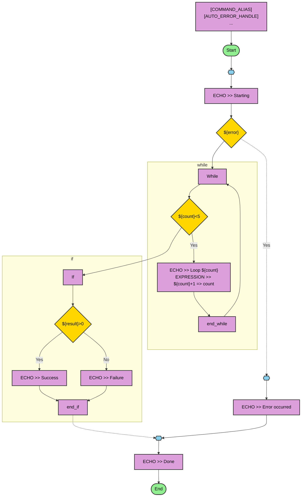

# 流程可视化预览设计文档

> **功能：** CSM 流程可视化预览（流程图 + 通讯泳道图）
> **关联 Issue：** [流程可视化预览](https://github.com/nevstop/CSM-vsc-Support/issues/74)
> **创建日期：** 2026-03-25
> **状态：** ✅ 已完成
> **参考资料：** [Mermaid 官方文档](https://mermaid.js.org/)

---

## 目录

1. [目标与范围](#1-目标与范围)
2. [设计原则](#2-设计原则)
3. [架构设计](#3-架构设计)
4. [流程转换规则](#4-流程转换规则)
5. [Mermaid 映射规则](#5-mermaid-映射规则)
6. [预览面板设计](#6-预览面板设计)
7. [测试策略](#7-测试策略)
8. [通讯泳道图设计](#8-通讯泳道图设计)
9. [未来扩展](#9-未来扩展)

---

## 1. 目标与范围

### 1.1 目标

- 为 CSM 文件提供类似 Markdown 预览的流程可视化功能
- 使用 Mermaid 流程图清晰展示脚本执行流程
- 支持实时更新（编辑 CSM 文件时自动刷新预览）
- 正确处理控制流结构（if/else、while、foreach、do_while）
- 使用虚线标识 GOTO 跳转，突出可能的执行路径

### 1.2 范围

**包含：**
- CSM 到 Mermaid flowchart 的转换逻辑
- Webview 预览面板（side-by-side 布局）
- 自动更新机制（监听文件编辑和切换）
- 单元测试（14 个测试用例）

**不包含：**
- 交互式流程编辑
- 流程图导出为图片（用户可通过浏览器右键保存 SVG）
- 性能分析或调试功能
- 与外部工具的集成

### 1.3 设计理念

CSM 是基于状态机的脚本语言，流程可视化应：
1. **简洁清晰**：避免节点过多，将连续语句合并为块
2. **突出控制流**：if/while/foreach 等控制结构使用条件节点表示
3. **标识跳转**：GOTO 使用虚线，区别于顺序执行的实线
4. **即时反馈**：类似 Markdown 预览，支持 side-by-side 实时编辑

---

## 2. 设计原则

### 2.1 逐行转换原则

采用逐行分析 CSM 并转换为 Mermaid 的策略，而非传统的 AST 构建方式。理由：
- CSM 语法简单，逐行处理即可满足需求
- 避免复杂的解析器实现
- 易于维护和调试

### 2.2 语句分组原则

将连续的普通语句合并为一个节点（block），减少节点数量，提升图表可读性。

**分隔条件（创建新节点）：**
1. 遇到锚点（anchor）：`<entry>`、`<cleanup>` 等
2. 遇到 GOTO 语句：`GOTO >> <target>`
3. 遇到控制流标签：`<if>`、`<while>`、`<foreach>`、`<do_while>` 等
4. 遇到空行（将连续语句切分为独立块）

**示例：**
```csm
<entry>
ECHO >> Step 1
ECHO >> Step 2
ECHO >> Step 3
<cleanup>
ECHO >> Done
```

转换结果：
- `<entry>` → anchor 节点
- "ECHO >> Step 1\nECHO >> Step 2\nECHO >> Step 3" → 1 个 block 节点（显示为 "3 statements"）
- `<cleanup>` → anchor 节点
- "ECHO >> Done" → 1 个 block 节点

### 2.3 配置分组原则

将 PREDEF 区域（`[COMMAND_ALIAS]`、`[AUTO_ERROR_HANDLE]`、`[INI_VAR_SPACE]`、`[TAGDB_VAR_SPACE]`）合并为单个 `predef` 节点，显示实际内容，放在流程图顶部（Start 节点之前），并以琥珀色（#FFD580）高亮显示。

**锚点优先原则：** 如果 PREDEF 区域内出现锚点（如 `<entry>`），则该锚点及后续内容不再属于 PREDEF 区域。

---

## 3. 架构设计

### 3.1 模块划分

```
src/
├── flowParser.ts              # CSM → FlowGraph 转换
│   ├── TextDocumentLike       # VS Code 文档抽象接口
│   ├── FlowNode               # 流程图节点定义
│   ├── FlowEdge               # 流程图边定义
│   ├── FlowSubgraph           # 控制流子图定义（支持嵌套）
│   ├── FlowGraph              # 完整流程图定义（含 subgraphs）
│   └── parseFlowGraph()       # 主解析函数
│
├── mermaidGenerator.ts        # FlowGraph → Mermaid 代码生成
│   ├── escapeMermaidLabel()   # 最小化转义（仅 # 和 "）
│   ├── getMermaidNodeShape()  # 节点形状映射（双引号语法）
│   ├── generateSubgraphLines() # 递归生成 subgraph 块（含 direction TB）
│   └── generateMermaidDiagram() # 主生成函数
│
└── flowVisualizationPanel.ts # Webview 面板管理
    ├── createOrShow()         # 创建/显示面板
    ├── _update()              # 更新内容（含去重渲染）
    └── _getHtmlForWebview()   # 生成 HTML（mermaid.render() + 交互脚本）
```

### 3.2 数据流

```
CSM 文档
    ↓
[flowParser.ts] parseFlowGraph()
    ↓
FlowGraph { nodes, edges, subgraphs }
    ↓
[mermaidGenerator.ts] generateMermaidDiagram()
    ↓
Mermaid flowchart 代码（字符串）
    ↓
[flowVisualizationPanel.ts] _getHtmlForWebview()
    ↓
HTML + JSON.stringify(mermaidCode) + mermaid.render() 脚本
    ↓
VS Code Webview 渲染
```

---

## 4. 流程转换规则

### 4.1 节点类型映射

| CSM 元素 | FlowNode.type | 说明 |
|---------------|---------------|------|
| `<entry>`, `<cleanup>` | `anchor` | 锚点（跳转目标） |
| `<if>`, `<while>`, `<foreach>`, `?expr? goto` | `condition` | 条件判断节点 |
| 连续的普通语句 | `block` | 语句块（空行触发新块） |
| `[COMMAND_ALIAS]` 等配置区域 | `predef` | 配置块（label: 实际内容），置于 Start 之前，琥珀色高亮 |
| 流程开始 | `start` | 开始节点 |
| 流程结束 | `end` | 结束节点 |
| `While`/`end_while`、`Foreach`/`end_foreach`、`Do_while`/`end_do_while`、`If`/`end_if` | `block` | 控制流子图边界节点，由解析器自动生成 |

### 4.2 边类型映射

| 边类型 | FlowEdge 属性 | Mermaid 语法 | 说明 |
|-------|--------------|-------------|------|
| 顺序执行 | `dashed: false` 或未设置 | `A --> B` | 实线 |
| GOTO 跳转 | `dashed: true` | `A -.-> B` | 虚线，标识可能的跳转 |
| 条件真分支 | `label: 'Yes'` | `A -->|Yes| B` | if 条件为真 |
| 条件假分支 | `label: 'No'` | `A -->|No| B` | if 条件为假/else 路径 |
| 循环回边 | 无 label | `A --> loopStart` | while/foreach/do_while 循环体结束回到边界起始节点 |

### 4.3 控制流处理

所有控制流结构均使用 Mermaid `subgraph` 包裹（虚线边框），并在子图内创建**边界节点**。这些边界节点在可视化上代表控制结构的入口和出口，使所有控制流内部的边都保持在子图范围内。

#### 4.3.1 if/else/end_if

```csm
<if ${x}>0>
  ECHO >> Positive
<else>
  ECHO >> Not positive
<end_if>
```

转换逻辑：
1. `<if ${x}>0>` → 创建 `If` 边界节点 + `condition` 节点（label: `${x}>0`），`If` 连接到 `condition`
2. "ECHO >> Positive" → 创建 block 节点（if-true 分支，Yes 边从 condition 到 block）
3. `<else>` → 开始 else 分支（No 边从 condition）
4. "ECHO >> Not positive" → 创建 block 节点（else 分支）
5. `<end_if>` → 两个分支（或条件无 else 时条件的 No 路径）汇合至 `end_if` 边界节点，子图结束，后续节点从 `end_if` 开始

#### 4.3.2 while/end_while

```csm
<while ${counter}<5>
  ECHO >> Loop
<end_while>
```

转换逻辑：
1. `<while ${counter}<5>` → 创建 `While` 边界节点 + `condition` 节点（label: `${counter}<5`），`While` 连接到 `condition`
2. "ECHO >> Loop" → 创建 block 节点（Yes 边从 condition 进入）
3. `<end_while>` → 创建 `end_while` 边界节点，block 连接到 `end_while`，`end_while` 回边至 `While`（循环），condition 的 No 路径跳出子图

#### 4.3.3 foreach/end_foreach

```csm
<foreach station in ${stationList}>
  ECHO >> ${station}
<end_foreach>
```

转换逻辑（同 while，使用 `Foreach`/`end_foreach` 边界节点）：
1. `<foreach station in ${stationList}>` → `Foreach` 边界节点 + condition（label: `station in ${stationList}`）
2. "ECHO >> ${station}" → block 节点
3. `<end_foreach>` → `end_foreach` 边界节点，回边至 `Foreach`

#### 4.3.4 do_while/end_do_while

```csm
<do_while>
  ECHO >> Do something
<end_do_while ${condition}>
```

转换逻辑：
1. `<do_while>` → 创建 `Do_while` 边界节点（循环体入口）
2. "ECHO >> Do something" → block 节点（从 `Do_while` 连接进入）
3. `<end_do_while ${condition}>` → 创建 condition 节点（label: `${condition}`），block 连接到 condition；condition Yes 边回至 `Do_while`（循环），condition No 路径连接到 `end_do_while` 边界节点，子图结束

### 4.4 GOTO 处理

#### 4.4.1 无条件 GOTO

```csm
GOTO >> <cleanup>
```

转换逻辑：
- 从当前节点到 `anchor_cleanup` 创建 dashed edge
- 中断顺序流（previousNodeId = null）

#### 4.4.2 条件 GOTO

```csm
?${error}? goto >> <error_handler>
```

转换逻辑：
- 创建 condition 节点（label: `${error}`）
- 创建 dashed edge（condition → `anchor_error_handler`，label: 'yes'）
- 继续顺序流（previousNodeId = condition）

#### 4.4.3 错误条件 GOTO

```csm
?? goto >> <error_handler>
```

转换逻辑：
- 创建 condition 节点（label: `error`）
- 创建 dashed edge（condition → `anchor_error_handler`，label: 'yes'）

### 4.5 未定义锚点处理

如果 GOTO 跳转到未定义的锚点，自动创建占位符节点：
- label: `<anchor_name>\n(undefined)`
- 避免 Mermaid 渲染错误

---

## 5. Mermaid 映射规则

### 5.1 节点形状映射

| FlowNode.type | Mermaid 形状 | 语法示例 |
|--------------|-------------|---------|
| `start` / `end` | 圆角矩形 | `start1(["Start"])` |
| `anchor` | 六边形 | `anchor_entry{{"<entry>"}}` |
| `condition` | 菱形（带双引号）| `cond_0{"${x}>0"}` |
| `block` | 矩形 | `node_0["ECHO >> Test"]` |

### 5.2 标签转义

由于 Mermaid 使用 `htmlLabels: true` 渲染标签，且节点形状使用 `{`/`}` 等分隔符，标签中的特殊字符需要转义：

| 字符 | 转义结果 | 原因 |
|------|---------|------|
| `#` | `#35;` | Mermaid 实体语法前缀 |
| `&` | `&amp;` | HTML 实体前缀（`htmlLabels: true`） |
| `<` | `&lt;` | 避免被 HTML 渲染器当作标签（如 `<entry>`） |
| `>` | `&gt;` | 与 `<` 对称转义 |
| `"` | `#quot;` | 标签以双引号 `"..."` 包裹 |
| `{` | `#123;` | 避免破坏 Mermaid 菱形 `{"..."}` / 六边形 `{{"..."}}` 形状解析 |
| `}` | `#125;` | 避免破坏 Mermaid 形状分隔符（如条件中的 `${var}` 变量） |

所有节点标签均以 Mermaid 双引号语法包裹（如 `["..."]`、`{"..."}`）。

### 5.3 样式定义

Mermaid 样式定义（在 flowchart 中使用，所有规则均含 `color:#000` 以保证节点文字可读性）：

```
classDef startEnd fill:#90EE90,stroke:#333,stroke-width:2px,color:#000;
classDef anchor fill:#87CEEB,stroke:#333,stroke-width:2px,color:#000;
classDef condition fill:#FFD700,stroke:#333,stroke-width:2px,color:#000;
classDef block fill:#DDA0DD,stroke:#333,stroke-width:2px,color:#000;
```

颜色说明：
- **开始/结束**：浅绿色（#90EE90）
- **锚点**：天蓝色（#87CEEB）
- **条件**：金黄色（#FFD700）
- **语句块**：浅紫色（#DDA0DD）

子图样式：`stroke-dasharray:5`（虚线边框）。

---

## 6. 预览面板设计

### 6.1 布局策略

模仿 Markdown 预览：
- 使用 `vscode.ViewColumn.Beside` 在右侧打开
- 不抢夺焦点（`reveal(column, false)`）
- 保持单例（同一时间只有一个预览面板）

### 6.2 自动更新机制

监听以下事件触发 `_update()`：
1. `window.onDidChangeActiveTextEditor` → 切换到另一个 CSM 文件时更新
2. `workspace.onDidChangeTextDocument` → 编辑当前文件时实时更新
3. `panel.onDidChangeViewState` → 面板从隐藏变为可见时更新
4. `window.onDidChangeTextEditorSelection` → 光标行变化时，将预览图滚动并高亮到最近节点（蓝色发光效果）

跳过重复渲染：`_lastRenderedUri`/`_lastRenderedVersion` 记录最近一次渲染的文档，对同一未更改文档的多次激活不触发重渲染。

### 6.3 功能按钮与交互

Webview 顶部工具栏提供：
- **Zoom In** / **Zoom Out** / **100%** / **Fit Width** / **Fit Height** / **Fit Both**：缩放图表（工具栏按钮）
- **Export SVG**：导出为 SVG 文件
- **操作提示栏**："Ctrl+Scroll: Zoom | Drag: Pan | Scroll: Move"

鼠标/键盘交互：
- **Ctrl+鼠标滚轮**：缩放图表（范围 0.1x–5x）
- **鼠标滚轮（无 Ctrl）**：垂直平移
- **左键拖拽**：平移图表（grab/grabbing 光标反馈）
- **首次渲染自适应**：自动计算缩放比使图表适应视口宽度（最大 1x）

Mermaid 源码区：
- 默认折叠，点击工具栏按钮展开/收起
- 字体大小 11px
- "复制"按钮将源码复制至剪贴板，并显示 "Copied!" 反馈

所有工具栏按钮均使用 `addEventListener`（非内联 `onclick`）以符合 Content Security Policy nonce 限制。

### 6.4 安全策略

Content Security Policy (CSP)：
```html
<meta http-equiv="Content-Security-Policy"
      content="default-src 'none';
               style-src ${webview.cspSource} 'unsafe-inline';
               script-src 'nonce-${nonce}' https://cdn.jsdelivr.net;
               img-src ${webview.cspSource} data:;">
```

Mermaid 配置（使用编程式 API，非 `startOnLoad`）：
```javascript
mermaid.initialize({
    startOnLoad: false,   // 改用 mermaid.render() 编程式渲染
    theme: 'default',
    securityLevel: 'loose',
    flowchart: {
        useMaxWidth: false,
        htmlLabels: true,
        curve: 'basis'
    }
});
// Mermaid 代码通过 JSON.stringify() 注入为 JS 字符串，避免 HTML 实体被浏览器预解码
const diagram = await mermaid.render('flow-diagram', /* JSON.stringify() 注入的代码 */);
```

### 6.5 Mermaid CDN

使用固定版本（非浮动 major 版本）：
```html
<script type="module" nonce="${nonce}">
    import mermaid from 'https://cdn.jsdelivr.net/npm/mermaid@11.4.1/dist/mermaid.esm.min.mjs';
</script>
```

---

## 7. 测试策略

### 7.1 单元测试（14 个测试用例）

位置：`src/test/flowVisualization.test.ts`

| 测试用例 | 验证内容 |
|---------|---------|
| `parseFlowGraph should extract anchors` | 锚点识别 |
| `parseFlowGraph should detect GOTO commands` | GOTO 跳转 + 虚线标记 |
| `parseFlowGraph should detect conditional jumps` | 条件 GOTO |
| `parseFlowGraph should support hyphenated anchor names` | 支持带连字符的锚点（如 `<error-handler>`） |
| `generateMermaidDiagram should create valid Mermaid syntax` | Mermaid 语法正确性 |
| `parseFlowGraph should handle control flow tags` | if/else 控制流（含 Yes/No 边标签） |
| `parseFlowGraph should skip section headers` | 配置区域分组 + 锚点优先 + PREDEF 前置 |
| `parseFlowGraph should handle while loops` | while 循环 + 边界节点 + 回边 |
| `escapeMermaidLabel should use minimal escaping` | 最小化转义（仅 # 和 "） |
| `parseFlowGraph should group statements into blocks` | 语句合并为块 |
| `parseFlowGraph should use dashed lines for GOTO` | GOTO 虚线渲染 |
| `parseFlowGraph should split blocks on empty lines` | 空行分割语句块 |
| `parseFlowGraph should create subgraph for control flow` | 控制流 subgraph 创建 |
| `generateMermaidDiagram should include subgraph in output` | subgraph 出现在 Mermaid 输出中 |

### 7.2 测试辅助函数

```typescript
function makeDoc(content: string): TextDocumentLike {
    const lines = content.split('\n');
    return {
        lineCount: lines.length,
        lineAt: (n: number) => ({ text: lines[n] ?? '' }),
    };
}
```

使用轻量级 stub 代替 `vscode.workspace.openTextDocument()`，无需 VS Code 依赖即可运行测试。

### 7.3 测试覆盖率

- **flowParser.ts**：所有主要函数（isAnchor、isGotoLine、getControlFlowType、parseFlowGraph），包括 subgraph 生成、空行分割、PREDEF 前置、边界节点
- **mermaidGenerator.ts**：escapeMermaidLabel（最小化转义）、getMermaidNodeShape（双引号语法）、generateMermaidDiagram（含 subgraph 输出）
- **边界情况**：未定义锚点、嵌套控制流、特殊字符（最小化转义验证）

---

## 8. 通讯泳道图设计

### 8.1 目标

将 CSM 脚本中的模块间通讯指令转换为 Mermaid `sequenceDiagram`（序列图），直观展示：
- 脚本执行引擎（**Engine**，位于最左侧泳道）与各目标模块的交互顺序
- 不同通讯模式（同步/异步/fire-forget/订阅/广播）的区别
- 所有涉及的模块参与者（按首次出现顺序排列）

### 8.2 架构模块

```
src/swimlaneParser.ts      # CSM → SwimlaneGraph 解析器
src/swimlaneGenerator.ts   # SwimlaneGraph → Mermaid sequenceDiagram 生成器
```

### 8.3 SwimlaneGraph 数据结构

```typescript
interface SwimlaneGraph {
    participants: string[];       // 参与者列表（Engine 始终第一）
    messages: SwimlaneMessage[];  // 按行顺序排列的通讯消息
}

interface SwimlaneMessage {
    type: MessageType;    // 消息类型（见下表）
    from: string;         // 发送方（通常为 'Engine'）
    to: string;           // 接收方（模块名）
    label: string;        // 消息标签（API 调用语句）
    returnLabel?: string; // 返回值名称（可选）
    lineNumber: number;   // 源码行号（0-based）
}

type MessageType =
    | 'sync'               // -@  同步调用
    | 'async'              // ->  异步调用（等待响应）
    | 'fire-forget'        // ->| 无应答异步
    | 'subscribe'          // -><register>
    | 'subscribe-interrupt'// -><register as interrupt>
    | 'subscribe-status'   // -><register as status>
    | 'unsubscribe';       // -><unregister>
```

### 8.4 解析规则（swimlaneParser.ts）

解析器逐行扫描 CSM 文档，按以下优先级匹配模式：

| 优先级 | 模式 | 识别正则 | 生成消息类型 |
|--------|------|---------|------------|
| 1 | 配置段头 | `/^\[.+\]$/` | 跳过，并跳过段内所有行（直到下一段头或锚点） |
| 2 | 控制流标签 | `/<(if\|while\|...)>/i` | 跳过 |
| 3 | 锚点定义 | `/<[A-Za-z][A-Za-z0-9_-]*>$/` | 跳过 |
| 4 | 订阅/取消 | `Event@Module >> Handler -><register\|unregister>` | `subscribe*` / `unsubscribe` |
| 5 | fire-and-forget | `->|` | `fire-forget` |
| 6 | 同步调用 | `-@ Module [=> result]` | `sync` |
| 7 | 异步调用 | `-> Module [=> result]` | `async` |

> **注意**：`->|` 必须在 `->` 之前检测，避免误识别。

### 8.5 Mermaid 映射规则（swimlaneGenerator.ts）

#### 8.5.1 参与者声明

```
sequenceDiagram
    participant Engine
    participant ModuleA
    participant Worker_Module   ← 名称中的连字符被替换为下划线
```

参与者名中的非单词字符（如 `-`）通过 `toParticipantId()` 替换为 `_`，生成合法的 Mermaid 标识符。

#### 8.5.2 消息箭头与颜色编码

每条消息使用 `rect` 块包裹，以背景颜色区分通讯类型：

| 消息类型 | 背景颜色 | 请求箭头 | 返回箭头 |
|---------|---------|---------|---------|
| `sync`（-@） | 🔵 蓝色 `rgba(70,130,180,0.15)` | `->>` | `-->>` |
| `async`（->） | 🟢 绿色 `rgba(60,179,113,0.15)` | `-)` | `--)` |
| `fire-forget`（->|） | 🟠 橙色 `rgba(255,140,0,0.15)` | `-)` | 无 |
| `subscribe*` / `unsubscribe` | 🟣 紫色 `rgba(147,112,219,0.15)` | `->>` | 无 |

**Mermaid 输出示例：**
```
    rect rgba(70,130,180,0.15)
        Engine->>Fixture: API: Boot >> ${deviceId}
        Fixture-->>Engine: bootCode
    end
    rect rgba(60,179,113,0.15)
        Engine-) Worker: API: Prepare >> ${bootCode}
        Worker--) Engine: prepResult
    end
    rect rgba(255,140,0,0.15)
        Engine-) Logger: API: Trace >> start
    end
    rect rgba(147,112,219,0.15)
        Engine->>Worker: [subscribe] StatusChanged → API: OnStatus
    end
```

#### 8.5.3 空脚本处理

当 SwimlaneGraph 无任何消息时，生成一条 `note over Engine:` 说明：

```
sequenceDiagram
    participant Engine
    
    note over Engine: No inter-module communication found
```

### 8.6 视图切换机制

`FlowVisualizationPanel` 新增 `_viewMode: 'flow' | 'swimlane'` 状态字段：

1. 工具栏渲染 `⇄ Swimlane`（当前为流程图）或 `⇄ Flowchart`（当前为泳道图）按钮
2. 按钮点击时 Webview 向 Extension Host 发送 `{ command: 'switchView', view: 'swimlane' | 'flow' }` 消息
3. Extension Host 收到消息后更新 `_viewMode`，调用 `_update()` 重新生成对应 HTML
4. 视图切换不重建 WebviewPanel（保持面板位置和缩放状态之外的 JS 状态）

### 8.7 测试策略

位置：`src/test/swimlaneVisualization.test.ts`（24 个测试用例）

**解析器测试（parseSwimlaneGraph）：**

| 测试用例 | 验证内容 |
|---------|---------|
| Engine 始终为第一参与者 | `participants[0] === 'Engine'` |
| 检测同步调用（-@） | `type === 'sync'`，含 `returnLabel` |
| 检测异步调用（->） | `type === 'async'`，含 `returnLabel` |
| 检测 fire-and-forget（->|） | `type === 'fire-forget'`，无返回值 |
| 不混淆 ->| 与 -> | 两条消息类型各不同 |
| 检测订阅（-><register>） | `type === 'subscribe'` |
| 检测中断订阅（-><register as interrupt>） | `type === 'subscribe-interrupt'` |
| 检测状态订阅（-><register as status>） | `type === 'subscribe-status'` |
| 检测取消订阅（-><unregister>） | `type === 'unsubscribe'` |
| 跳过配置段头 | 段内行不生成任何消息 |
| 参与者插入顺序 | 按首次出现顺序，Engine 始终第一 |
| 行号记录 | `lineNumber` 与文档行号（0-based）对应 |

**生成器测试（generateSwimlaneDiagram）：**

| 测试用例 | 验证内容 |
|---------|---------|
| 以 `sequenceDiagram` 开头 | Mermaid 指令正确 |
| 声明所有参与者 | 每个参与者有 `participant` 声明 |
| 同步使用 ->> 箭头 | 请求 `->>` + 返回 `-->>` |
| 异步使用 -) 箭头 | 请求 `-)` + 返回 `--)` |
| fire-forget 无返回箭头 | 只有一条箭头行 |
| 空消息时显示 note | 包含 `note over Engine:` |
| 连字符参与者名被净化 | `Worker-Module` → `Worker_Module` |
| 完整多消息类型样例 | 包含全部消息类型的箭头语法 |
| 同步调用包裹蓝色 rect | `rect rgba(70,130,180,0.15)` |
| 异步调用包裹绿色 rect | `rect rgba(60,179,113,0.15)` |
| fire-forget 包裹橙色 rect | `rect rgba(255,140,0,0.15)` |
| 订阅包裹紫色 rect | `rect rgba(147,112,219,0.15)` |

### 8.8 完整示例（泳道图）

**输入（CSM 片段）：**

```csm
API: Boot >> ${deviceId} -@ FixtureController => bootCode
API: Prepare >> ${bootCode} -> WorkerModule => prepResult
API: Trace >> start ->| Logger
StatusChanged@WorkerModule >> API: OnStatus -><register>
```

**输出（Mermaid sequenceDiagram）：**

```
sequenceDiagram
    participant Engine
    participant FixtureController
    participant WorkerModule
    participant Logger

    rect rgba(70,130,180,0.15)
        Engine->>FixtureController: API: Boot >> ${deviceId}
        FixtureController-->>Engine: bootCode
    end
    rect rgba(60,179,113,0.15)
        Engine-) WorkerModule: API: Prepare >> ${bootCode}
        WorkerModule--) Engine: prepResult
    end
    rect rgba(255,140,0,0.15)
        Engine-) Logger: API: Trace >> start
    end
    rect rgba(147,112,219,0.15)
        Engine->>WorkerModule: [subscribe] StatusChanged → API: OnStatus
    end
```

---

## 9. 未来扩展

### 9.1 性能优化

- 大文件（>1000 行）时考虑虚拟滚动或分页渲染
- Debounce 编辑事件（避免频繁重新渲染）

### 9.2 增强功能

- **点击节点跳转到源码**：点击 Mermaid 节点时定位到 CSM 对应行
- **导出为图片**：支持 PNG/PDF 导出（需要 Mermaid CLI 或第三方库）
- **主题切换**：支持 dark/light/neutral Mermaid 主题

### 9.3 交互式编辑

- 拖拽节点调整布局
- 右键菜单（折叠/展开分支）

### 9.4 与调试器集成

- 运行时高亮当前执行节点
- 显示变量值

---

## 附录 A：完整示例

### 输入（CSM）

```csm
[COMMAND_ALIAS]
TestCmd = API: Test >> ${x} -@ Module

<entry>
ECHO >> Starting
?${error}? goto >> <error_handler>

<while ${count}<5>
  ECHO >> Loop ${count}
  EXPRESSION >> ${count}+1 => count
<end_while>

<if ${result}>0>
  ECHO >> Success
<else>
  ECHO >> Failure
<end_if>

GOTO >> <cleanup>

<error_handler>
ECHO >> Error occurred

<cleanup>
ECHO >> Done
```

### 输出（Mermaid，反映当前实现）



---

**文档版本：** 1.1
**最后更新：** 2026-03-25
**维护者：** Claude Agent
